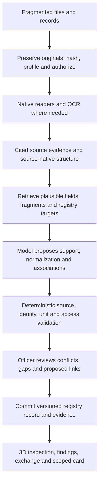

# BhuAayam / 3D ULPIN: product and ML approach for external review

**Snapshot: 4 October 2026; pinned commits below.** This document explains the intended product, the implementation we have, the experiments that failed, and the decisions for which we need outside advice. It is a technical review brief, not a claim of release readiness.

**Current conclusion:** we have substantial backend ingestion and evidence-management code, and we have executed local training and adapter reloads. **We have not demonstrated a useful fine-tuned model for the current task, nor an accurate end-to-end document-to-building/floor linker.** One narrow pretrained candidate-selection experiment passed; subsequent request-conditioned support experiments still fail. No learned adapter has been promoted into the application.

Read this on **`review/project-ml-20261004`**, which combines the operational backend, ML coordinator, learner and teacher histories, the returned planar correction, and the current raster/point code checkpoint. Experimental code is included for inspection, without qualifying it for production use. `staging` remains the accepted backend integration branch; the ML lane and these two backend checkpoints were not accepted/wired there at this cutoff. Worker changes after the listed commits are outside this snapshot.

| Component | Snapshot commit | Meaning |
| --- | --- | --- |
| Backend staging | `bd0ef1296bc30e9d9893431bc5d786ba105e4ad3` | Latest integrated backend and generated API contracts |
| ML coordinator | `887266726c3ad22e64c5fff1abb409c388dd9e57` | Balanced code/correction accepted; first native phase dispatched |
| ML learner | `393f058fae9eff61429a2fa53d04b97f919e31ab` | Fixed execution checkpoint for that first balanced phase; no new quality result |
| ML teacher | `36102c84` | Training-only support examples and their authorship history |
| Last measured binary adapter reload | `9e1782a98252542d02440022f8680535f4ee0080` | Technical reload passed; useful selection quality failed |
| Planar worker | `6d94edac558762ea4086d13d4c7abce0e41bd8a6` | Returned DXF/GeoParquet sufficiency and outage correction; lead wiring/qualification pending |
| Raster/point worker | `de7855a3cea86486cb1bbf7fa48d00433d8a5f5d` | Returned sufficiency adapters and handoff; lead wiring/qualification pending |

The review branch uses merge commits to retain these histories. It does not flatten them into a report-only repository. The learner versions of five overlapping ML runtime files and its subsequent reader correction are retained as its latest checkpoint; both the original defect and correction remain inspectable in history. Historical runtime receipts bind their original execution commits, not this combined review branch.

## 1. Problem statement and intended outcome

The repository records Smart India Hackathon problem statement **SIH26011, “3D ULPIN Generation.”** Our adopted interpretation is to extend parcel-oriented land identification into evidence-supported vertical property: buildings, floors, flats, basements, shared spaces and relevant underground or elevated infrastructure. The supplied-statement summary is recorded in [H23](docs/usp-agent-handoffs/23-india-data-and-delivery-plan.md); this report does not present that summary as a verbatim transcription of the external statement.

The practical problem is fragmented evidence. A deed, parcel layer, sanctioned drawing, survey, BIM model and image may describe overlapping parts of a property, use different names or units, omit key fields, refer to different revisions, or disagree. An officer currently has to reconcile them. A visually convincing 3D model alone does not establish which source supports a particular building, floor, unit, measurement or right.

We want an officer to submit evidence, obtain reviewable building/floor/space candidates, inspect the exact source behind every claim, resolve or retain disagreements, and commit an auditable revision with a scoped evidence artifact/property card. The product is organized as **Identify → Prove → Govern**. Fragmented-input integration and useful officer decisions have equal priority.

The full requirements cover parcel GIS, tables, deeds and plans, scans/images, CAD/BIM, semantic and graphics 3D models, point clouds, elevation rasters, survey/control reports, utility information and mixed archives. Supporting a container format does not mean it contains usable property geometry or identifiers. “Accept all sorts of data” means retaining, inspecting and routing varied supported inputs, with explicit limits and recovery, rather than promising that every file can be understood.

Expected outputs include:

- Source-linked claims about projects, buildings, towers, floors, spaces, literal fields and units, with exact page/region/row/cell/entity/span references.
- Suggested associations to actual registry targets, including multiple possible targets, conflicts and abstentions where evidence is insufficient.
- Qualified geometry and quantities only where the source and reference frame support them.
- Reviewed, immutable registry revisions; proposed application identifiers; exchange files; explainable findings; private evidence exports and revision-linked cards.

An application building/floor/space identifier is **not official parcel ULPIN issuance or title**. A building can span parcels; a unit can span floors; a floor is not necessarily a unit. Unknown, absent, explicit null, withheld and conflicting remain distinct. Missing evidence in a supplied excerpt does not prove absence in the property or whole document. See [H26](docs/usp-agent-handoffs/26-identifiers-and-standard-exchange.md), [H27](docs/usp-agent-handoffs/27-domain-ai-and-cadastral-checks.md) and [H30](docs/usp-agent-handoffs/30-reference-scene-and-incomplete-data.md).

## 2. Intended architecture and the role of ML



This diagram is the **target flow**. Several backend sections exist, but the learned normalization/association path is not integrated or qualified end to end.

The backend uses modular NestJS/TypeScript, domain services, visible SQL with `pg` and PostgreSQL/PostGIS, private object storage, and the existing dispatcher/Redis/Celery/Python processing stack. The frontend lane uses React/Vite/TypeScript and Three.js/`3d-tiles-renderer`. We are extending existing job, registry and provider authorities, not creating a second registry or letting a model directly write records.

The selected ML strategy is **adapt a pretrained open model**, not train a foundation model from scratch. Parsers retain their deterministic responsibilities. A model should interpret variable language/layout/meaning, identify relevant support and suggest associations; verified code handles conversions, citations, identifiers, source integrity and writes.

There are three distinct ML workstreams in the requirements:

| Workstream | Intended capability | Current relationship to this experiment |
| --- | --- | --- |
| Adaptive schema mapping | Map unfamiliar source fields into constrained application meanings/operations | Earlier E5/Qwen experiments; they are not building/floor linkers |
| Evidence normalization and association | Interpret cited fragments, preserve uncertainty, link evidence to the correct source-native scope and eventually actual registry targets | Current dedicated teacher/student lane; presently narrowed to fragment support |
| Domain extraction | Learned building-mask extraction and plan segmentation; evidence-supported vertical delineation and topology checks | Separate H27 requirements; not delivered by the current support adapter |

Successful fragment selection would only be an intermediate component. It would not establish correct floor segmentation, geometry, canonical identity, rights or source-to-property correspondence.

## 3. What is actually built — brief inventory

The backend has bounded intake/original retention, jobs/retry/checkpoints, native document/table/GIS/CAD/BIM/model/raster/point inspection, private source-context assembly, cited evidence selection, review/history, committed evidence exports and packet/card plumbing. Format-specific capabilities and qualifications vary; [the source index](docs/api/real-sources.md) and [dataset catalogue](docs/api/datasets.json) preserve those distinctions.

Recent integrated increments include ODS evidence, typed LP360 survey reports, IFC/mesh/XML sufficiency guidance, mixed reviewed PDF/image packets and private committed text/CSV citation downloads. The published catalogue records **275 API operations and 308 named schemas**. Those counts indicate interface coverage, not release or ML accuracy.

Two boundaries are especially relevant to an ML reviewer:

1. [Source fusion](packages/server/src/modules/usp/ingestion/source-fusion.ts) can assemble selected authorized native evidence. Its projection explicitly leaves association, matching, reference alignment, geometry and rights `not_assessed`. Placing two sources in one context does not prove they concern the same building/floor.
2. [Association proposals](packages/server/src/modules/usp/ingestion/source-fusion-associations.ts) provide constrained native/OCR/IFC proposal seams through the governed gateway, with validation and abstention. Several other context families are excluded from generic proposals. Existing controlled checks do not establish live model accuracy or authentic cross-source linkage.

The local CLI/model experiment is separate from these application routes. Its adapter is not registered as a qualified gateway/API inference provider. New backend contracts are published for frontend consumption; complete frontend consumption and real officer journeys are not established by backend checks.

The [release manifest](docs/usp-agent-handoffs/release-plan.json) still has **GF0 as the next gate**, and GF0–GF5 are pending. The release sequence is data/contracts/current runtime → identities/exchange → domain AI/spaces/recovery/streaming → readiness/findings → card/privacy → integrated rehearsal. Full-product learning, public release, assistance, rendering, scale and deployment have additional gates.

## 4. The current ML task, precisely

The original lane goal, in [ML-DISTILL-01](docs/orchestration/ML_DISTILL_01.md), is parsers/OCR → common cited evidence → candidate retrieval → local student normalization/association → deterministic validation → officer review. Early student outputs attempted structured source-native claims: project/building/tower/floor scopes, literal fields/units, supporting citations, conflicts and abstentions. Canonical links remained empty where actual target records/crosswalks were unavailable.

After repeated semantic failures, the current task became smaller:

> Given a request, a complete supplied source context and one focus fragment, determine whether that fragment directly supports the request. Score every supplied candidate, then return the supported subset or an explicit context-limited empty result.

This task tests **evidence relevance/support**, not conversion of arbitrary files or matching documents to real registry buildings/floors. The runtime uses already-extracted text, candidate IDs and locators. It does not process raw PDFs, images, point clouds or meshes inside this fine-tune.

### Current student and recipe

| Item | Actual implemented choice |
| --- | --- |
| Student checkpoint | `Qwen/Qwen2.5-0.5B-Instruct` |
| Revision | `7ae557604adf67be50417f59c2c2f167def9a775` |
| Weight SHA-256 | `fdf756fa7fcbe7404d5c60e26bff1a0c8b8aa1f72ced49e7dd0210fe288fb7fe` |
| Recorded licence | Apache-2.0; acquisition provenance retained |
| Adaptation | Ordinary LoRA on `q_proj`/`v_proj`, rank 8, alpha 16, dropout 0.05 |
| Trainable state | 540,672 parameters in 96 adapter tensors; 290 original base tensors preserved |
| Optimizer | AdamW, learning rate `2e-4`, weight decay 0, betas `(0.9, 0.999)`, epsilon `1e-8` |
| Schedule | Six seed-17 epochs, no warmup; gradient clipping 1.0 |
| Numerics | FP16 base/autocast, FP32 adapters/loss; GradScaler starts at 128, actual growth interval 2,000 |
| Context | Full supplied context; fit cap 4,096 tokens, scoring cap 2,048 tokens; no truncation or silent row exclusion |
| Binary score | Last-prompt-position `logit(1) - logit(0)`; both logits cast to FP32 |
| Decision | Select iff margin is strictly greater than zero; tie means abstain |
| Loss | Two-label negative log likelihood, sequential candidate forward/backward; one optimizer step per complete parent context |
| Existing weighting | Each candidate has weight `1 / (10 × number_of_candidates_in_its_parent)` |
| Fit size | 60 complete-parent updates and 342 candidate contributions |
| Hardware/runtime | Local RTX 3070; Torch 2.8.0+cu128, Transformers 4.57.6, PEFT 0.17.1, Accelerate 1.10.1, safetensors 0.8.0 |

The margin is not a calibrated probability. The binary route has a fixed decision rule; no top-k, minimum-selection fallback, threshold sweep or semantic repair was used to conceal failures. Because its prompt/objective/output route changed from generative JSON, it received a **new original-base binary baseline**. Generative and binary results are not an unchanged-policy comparison.

This small causal instruction checkpoint was selected for the original structured-generation task and local hardware fit. It was then reused as the task narrowed to support scoring. We have not demonstrated that it is the best base for that new task, or compared it against a purpose-trained support classifier/reranker on an equivalent association dataset. Model capacity/task alignment is therefore a review question, alongside data and loss; the current choice is not justified by a broad benchmark win.

The teacher and orchestrator are development agents, not the student checkpoint. They author and coordinate examples/code here; no paid teacher API training service was used. This is supervised adaptation from provisional teacher-authored demonstrations, not transfer of an assistant's entire knowledge or hidden reasoning. Current resumed worker continuations request GPT-6.1 Sol/xhigh; their effort setting does not change the student's parameters or training objective. Standard/default speed is required, but the chat dispatch API does not expose actual per-turn service tier.

### Data, provenance and splits

- The original structured teacher seed contained **11 examples and 62 cited claims**, plus conflict/abstention examples. A later citation-view batch had 22 rows but reused those claims; expansion was not new independent data.
- The current support dataset has **10 parent requests, 57 candidate appearances, 12 positive labels, 45 negative labels and three empty-selection parents**. Six original parents were supplemented by four training-only examples addressing support versus missing qualifiers.
- The retained diagnosis counts **23 unique fragments from six originals: five PDFs and one HTML source**. Repeated appearances and six epochs are not 342 independent examples.
- Training comes from two project/source families: Haryana RERA project 2831 and Bihar Magnolia Residency. Labels remain `provisional_synthetic_supervision` / `needs_independent_review`. Syntax, source hashes, exact quotes and consistency checks do not independently qualify every semantic label.
- Development consists of two related buildingSMART IFC certification examples in **one family**. Current request-conditioned tests contain **seven candidates and one expected positive**. Training PDF/HTML fragments and development native IFC attributes differ in representation and domain; the effect of that shift has not been isolated.
- [The family freeze](docs/evidence/usp/ml-distillation/family-freeze.json) groups related sheets/revisions/variants. Teachers are blind to protected evaluation. Earlier mapping evaluations remain closed; the current model has no successful held-out generalization result. This review preparation did not reopen held-out data or original protected expectations.
- Public-source origin does not automatically establish semantic truth, operational authority or unrestricted redistribution. Sarvam-derived outputs are excluded from this training route. Original bytes, model weights, full datasets/checkpoints and large receipts stay outside Git.

One [tracked teacher example](docs/evidence/usp/ml-distillation/teacher/example-floor02.json) shows the supervision structure and lineage. Full training publications are pinned private artifacts, not reconstructed from this report.

## 5. What we tried and where it failed

### Earlier field-mapping experiments — separate from association

| Approach | Recorded result | Implication |
| --- | --- | --- |
| E5-based schema mapping, V7 | Completed CPU fit/reload, but useful calibration failed; deployed-policy fallback abstained on all 11 training and seven calibration positives | No useful accepted mapping coverage; not a building/floor model |
| Pretrained Qwen3-Reranker-0.6B, V7 | At saved global cutoff `0.9736446738243103`, accepted 5/7 calibration positives with zero incorrect accepts; training accepted 5/11 and neither training key | A narrow calibration result, with important recall gaps; not generalization |
| Qwen3 reranker LoRA, V8 | 44 fields/132 training pairs, 14 positives, ten training families; 51 updates completed. No global cutoff retained zero incorrect accepts and coverage of every target | A county polygon scored above correct keys/names. Technical training succeeded, useful operating point failed |
| Fixed weight-1 follow-up | Retained incomplete/resource-rejected attempt | No useful accepted model result; not an ongoing sweep |

The reranker is **Qwen3-Reranker-0.6B**, distinct from the current **Qwen2.5-0.5B-Instruct** student. E5 is not the current distillation student. Primary history is in [V7 fit](docs/evidence/usp/v7-fit-handoff.md), [V7 Qwen comparison](docs/evidence/usp/v7-reranker-comparison-handoff.md), [V8 LoRA](docs/evidence/usp/v8-lora-handoff.md) and [weight-1 handoff](docs/evidence/usp/v8-weight1-handoff.md).

### Current association/support lane — progression

| Approach | What changed or ran | Measured outcome and why we moved on |
| --- | --- | --- |
| Structured cited JSON baseline | Pretrained current Qwen on two IFC examples | 0/2 usable outputs, 0/6 accepted expected claims; malformed output and semantic errors |
| Structured SFT LoRA | Initial memory/loss/attention repairs; eventually 66 updates | Adapter save/reload worked; still 0/2 usable and 0/6 accepted claims |
| Citation-view SFT | 22 related rows, 132 updates | Exact reload passed, development remained 0/2 valid and 0/6 accepted claims; no new independent source coverage |
| Compact selectors and constrained decoding | Select ranges/roles with grammar, then deterministic expansion | Grammar produced 2/2 schema/range-valid outputs, but 0/2 semantically usable and 0/6 accepted correct claims. Legal source pointers did not imply correct meanings |
| Pretrained parser-supplied candidate selector, STUDENT-14 | Model chose candidate IDs; parser/projector supplied facts/citations/states | **2/2 valid, 6/6 accepted source signatures** on two related IFC examples. All supplied candidates were supported; this did not test discrimination against irrelevant fragments, canonical matching or an adapter gain |
| Request-conditioned fragment baseline | Request plus candidate fragments, with irrelevant/unsupported possibilities | 2/2 valid, exact sets 1/2, positive recall 0/1, unsupported-request false positives 0 |
| Fragment-support LoRA v1 | Six rows × six epochs = 36 updates | Exact sets 1/2, precision 1/3, recall 1/1, unsupported-request false positives 2; relevance/qualifier failure |
| Fragment-support LoRA v2 | Four training-only support/abstention examples added; ten rows, 60 updates | 2/2 valid, exact sets **0/2**, precision **1/4**, recall 1/1; two unsupported elevation selections plus an extra name-request fragment |
| Binary original-base baseline | One focus at a time, full context, fixed positive-margin decision | 2/2 valid vectors, exact sets 1/2, selected 0, positive recall 0/1, unsupported-request false positives 0 |
| Binary parent-mean LoRA | 60 updates/342 contributions, completed through three resumable phases; exact reload | Same 1/2 exact sets and zero selections; positive recall still 0/1. All seven development margins became more negative. **Quality rejected** |
| Class-balanced binary objective, STUDENT-44/45 | Code implements changed positive/negative weights | Initial host output-recipe defect corrected; code/CPU evidence accepted. First native phase dispatched as STUDENT-45; no completed new native fit/reload/quality result at dispatch |

The tiny candidate-selector success is worth retaining: constraining the model to source-supplied objects can simplify the problem. It is not evidence that arbitrary fragmented records are correctly combined.

For the generative v2 failure, the building-name request expected one fragment but selected two. The request for a supplied non-null numerical elevation expected an empty set, but selected absent/null elevation fragments. Source-valid references passed; those fragments did **not** support the requested number. See [v2 reload](docs/evidence/usp/ml-distillation/student/fragment-support-v2-reload-v2.md).

For the latest binary reload, the supported-name request expected one selection and received none; the unsupported numerical-elevation request correctly stayed empty. Zero false positives accompanied zero positive coverage. Precision is **undefined**, not perfect, when nothing is selected. See [binary baseline](docs/evidence/usp/ml-distillation/student/fragment-rank-baseline-v1.md) and [native reload acceptance/result](docs/evidence/usp/ml-distillation/student-fragment-rank-reload-native-acceptance-v1.json).

These request sets have different outputs/denominators from the earlier six-signature task. The table records experiment history; it must not be treated as a broad accuracy benchmark or averaged into one score.

## 6. Execution failures versus learning failures

### Runtime and engineering failures

Early association fits failed native allocation/backward or exceeded the owned-process memory cap. Repairs included supervised-position head loss, cache/live-graph reclamation and query-chunked full-context attention. Later fits and reloads completed within the recorded limits. These repairs enabled execution; they did not solve semantic quality.

The first monolithic binary fit reached 44 complete parent updates and part of update 45 before the 600-second bound, with no saved adapter/checkpoint. We then implemented three resumable 20-update phases. Full-state checkpoints preserve adapter masters, Adam state, scaler, cursor/order and Python/CPU/CUDA RNG; actual stochastic save/restore equivalence was checked. All 60 updates eventually completed.

Other concrete blockers were a canonical-versus-pretty JSON hash mismatch, an AppContainer path check traversing outside its stage, and isolated Python startup/sibling-import failures. Some CPU checks exercised help/refusal or intercepted boundaries and missed the real positive startup/output path. A repeated writer/reader contract mismatch blocked balanced code: `checked_output_history` expected top-level `settings`/`numerics`, whereas the actual fitter binds them under `binding.fit`/`binding.numerics`. The coordinator already had a working legacy reader helper. Continuation 1 reuses it with strict consistency checks; the focused CPU control accepts writer-shaped metadata and rejects conflicting recipes/objectives. The coordinator has now accepted this correction at code/CPU scope; that control is not full native phase acceptance. See [blocking code review](docs/evidence/usp/ml-distillation/student-fragment-rank-balanced-phase-code-review-v1.json), [correction](docs/evidence/usp/ml-distillation/student/fragment-rank-balanced-phase-output-recipe-code-v1.md) and [code acceptance](docs/evidence/usp/ml-distillation/student-fragment-rank-balanced-phase-code-acceptance-v1.json).

The Windows execution harness stages roughly **19,700 files / 8.6 GB per fresh run** and uses zero-network-capability AppContainer, Job limits, exact inventories and scoped cleanup. In one binary baseline, staging took about 192 seconds and the guarded host invocation about 289 seconds, while the model section was about 2.3 seconds. A reviewer should examine how to retain an equivalent trustworthy boundary while reducing iteration overhead and duplicated metadata/bootstrap surfaces. These are single-run observations, not a cross-harness benchmark.

Windows worker stream disconnects, the local router's 32 MiB request limit and recurring Docker ingest-socket failures are separate orchestration/service problems. Installed Account Router 1.2.4 destroys partially streamed responses after an upstream exception, which is a plausible explanation for generic decoding disconnects; the initiating network/upstream cause was not proved. They should not be diagnosed as failed learning objectives, or retried indefinitely without changed evidence.

### Current learned-quality failure

The retained training-loss diagnosis does **not** establish persistent all-negative training collapse. Across training observations, positive signs improved from 0/12 to 10/12 and positive mean NLL fell from 2.312074 to 0.337480; negative signs ended correct on 42/45. Those observations occur under changing parameters/dropout and are not final train-set evaluation accuracy.

The old parent-mean loss gives exact positive mass **38/175 (21.7%)** and negative mass **137/175 (78.3%)**. Class imbalance is a hypothesis, **not an established cause** of failed development transfer. Provisional labels, repeated tiny coverage, qualifier semantics, representation/domain shift and optimization behavior remain plausible contributors. See [retained quality diagnosis](docs/evidence/usp/ml-distillation/student-fragment-rank-quality-diagnosis-acceptance-v1.json).

## 7. Current attempt and the rest of the build plan

### Immediate attempt already chosen

STUDENT-44 applies a fixed class-balanced loss to the unchanged 57 pairs. Multiply old positive weights by **175/76** and negative weights by **175/274**; each class then contributes total mass 1/2. Parent totals become unequal, explicitly. Data, labels, source families, prompts, zero threshold, base, optimizer and schedule stay fixed. More positive weight could recover support **or worsen unsupported selections**; improvement is unmeasured.

The corrected code is accepted, and [STUDENT-45](docs/evidence/usp/ml-distillation/student-45.fragment-rank-balanced-phase-1-fit.protocol.json) has been dispatched to the sole learner. It freezes one fresh stage, the actual objective-bound weighted-gradient and full-state save/resume proofs, then 20 complete-parent updates/114 contributions from the original base. It returns a checkpoint, not a final adapter; phase 2 is not automatic.

The remaining order is: accept that actual native phase → separately authorize/resume same-objective 40/60 checkpoints → implement/accept corresponding balanced reload authority → perform the same frozen development comparison. The new objective must not resume an old-objective checkpoint. No threshold sweep, new labels or evaluation access is bundled into this attempt. At dispatch, native balanced fit/resources/quality are unmeasured; acceptance of code is not acceptance of a model.

The predeclared tiny development target is valid/exact responses 2/2, precision 1, positive recall 1 and zero unsupported-request false positives. Passing it would establish only this slice. It would still need broader independent qualification before promotion.

### Whole ML/product sequence

This table separates **documented plans and requirements** from work actually implemented. Later stages do not have frozen model recipes merely because they appear here.

| Step | Planned approach | Actual state | Needed next result |
| --- | --- | --- | --- |
| 1. Admit and retain varied inputs | Profile real formats; preserve originals; native readers; OCR only where required; recoverable missing-tool/member/unsupported states | Broad backend implementation; format/runtime limits vary; planar and raster/point sufficiency completion remains active | Finish the assigned adapters and shared workflow wiring; retain honest status for incomplete inputs |
| 2. Build common cited evidence | Traceable native fields/fragments/entities, units, scope, source revisions and locators; preserve conflicts/null/absence | Fusion/context/citation components exist | Show one useful real mixed-source journey without implying that context co-location establishes identity |
| 3. Assemble plausible candidates | Reuse existing scope/type/exact-identifier constraints; retrieval for larger evidence/target pools | Tiny preconstructed candidates in the ML experiment; no qualified learned end-to-end retrieval | Measure candidate recall separately from the selector; choose a retrieval implementation only when the actual candidate scale requires it |
| 4. Learn supported fragment selection | Current binary LoRA; compare original base and changed objective on fixed development | Parent-mean candidate failed; balanced code accepted and first native phase dispatched, no new quality result | Determine whether balanced adaptation improves supported recall without unsupported selections; reject it if it does not |
| 5. Normalize source-native claims | Source-supported fields/scopes/units plus deterministic exact conversions; supervised demonstrations, validation and abstention | Early structured/selector code exists but quality failed; current binary route only selects fragments | Useful structured output on varied independently supported inputs; quantify normalization errors, not JSON validity alone |
| 6. Link to actual buildings/floors/spaces | Evidence/target retrieval plus classification/ranking over plausible targets; reviewed crosswalks, multi-target and no-match handling | Proposal seams exist; **no demonstrated trained canonical linker** | Acquire/annotate authentic paired sources and actual targets; measure correct and incorrect links, abstention and coverage |
| 7. Grow reliable supervision | Source-family separation; teacher proposes training-only labels; source/literal validation and independent semantic qualification | Two provisional training families; teacher currently blind/idle | More independent families and source-backed positives/hard negatives/ambiguity, with qualified relationship labels |
| 8. Evaluate, then promote | Freeze criteria/candidate; protected evaluation once eligible; immutable model identity, shadow/use policy and rollback | No promoted candidate or current held-out success | Evidence of useful quality across relevant families/formats, then lead-owned gateway/API registration |
| 9. Build domain AI/geometry | H27 learned building masks and plan segmentation; reviewed levels/boundaries; deterministic topology/measurement checks | Separate requirements, not solved by the support model | Appropriate models, licensed inputs and independent geometry/segmentation truth; compatible reference frames |
| 10. Complete application use | Source → suggestion → officer review → committed revision → private artifact; stable contracts to Studio | Many backend components exist; full new frontend integration unqualified | Actual integrated user journey, recovery/privacy checks and release-gate evidence |

The dedicated lane's immediate plan is a runnable vertical slice, not to wait for every format, card or screen before measuring ML. The broader H27 and full-product requirements remain separate. Model choice, annotations and numerical acceptance for later tasks still need concrete decisions.

## 8. Where we are stuck and what an outside reviewer should challenge

| Issue | Evidence available | What is unresolved |
| --- | --- | --- |
| Very small, provisional supervision | Ten parents/two families, 23 unique fragments; labels still need independent review | Whether labels/task coverage are adequate or correct; repeated views/epochs do not add independent examples |
| Training/development mismatch | PDF/HTML training; native IFC development | How much failure comes from transfer rather than objective/optimizer/architecture |
| Support versus relatedness | v2 selects absent/null fragments for a non-null numerical request | How best to represent qualifiers, support, conflicts and no-match supervision |
| Empty-output bias on development | Binary base and tuned route select none; tuned margins more negative | Cause unestablished; class balance is one controlled hypothesis, not a cure |
| Broad goal versus narrow experiment | Current model only scores already-extracted fragments | Which minimal task decomposition actually advances normalization and building/floor linking |
| Missing authentic relationship truth | Recent paired-source acquisition qualified **zero independent cross-input building/floor pairs** | Need matching documents/models, revisions and independently supported target correspondence |
| Harness and contract overhead | Repeated startup/path/hash/output-recipe defects; expensive fresh staging | How to simplify/reuse components while preserving real source/access/egress safeguards |
| Integration and release | Local experimental CLI; all release gates pending | Adapter promotion, application routing, frontend workflow and broader runtime/scale remain unfinished |

The source gap is concrete. Haryana Tower 3 drawings retain a G+41/G+42 conflict and no corresponding qualified model/revision crosswalk. buildingSMART development IFCs do not come with qualified matching floor-plan evidence. A KIT/IAI IFC4 example was acquired, but the publisher calls it a “Simple Phantasy Building”; companion institutional document requests returned HTML challenges rather than retained PDFs. These sources can support bounded development, not invented official property relationships. See [paired-source handoff](docs/evidence/usp/paired-building-floor-sources-handoff.md). Survey tables also lack sufficient exact frame/height/epoch linkage for absolute-accuracy truth.

Our assessment is that **execution progress has outpaced evidence of learning progress**. We have spent substantial effort on guarded lifecycle and representations, while semantic supervision and the development denominator remain very small. That assessment follows the artifacts; it is not proof that any single model, loss or safeguard caused the failure.

The user explicitly permits researching/adapting public harnesses, pretrained models and successful recipes. [Existing technique research](docs/evidence/usp/learner-technique-reuse.md) considered pointwise losses, pairwise/listwise ranking, hard-negative mining, retrieval objectives, abstention/calibration and LoRA/QLoRA. These are research options, not executed improvements in this lane. Regression is suitable for genuinely continuous supported targets; it cannot fill missing evidence. Preference learning/RL would require reliable preferences or verifiable rewards and a useful feedback loop. We have **not** selected or run RL. Rewarding schema validity alone would reproduce the observed gap between valid output and correct support.

Please prioritize advice on:

1. **Task decomposition:** should the first useful slice be support classification, structured extraction, entity resolution, or another narrower source-to-target journey? What concrete evidence should distinguish them?
2. **Data and labels:** what is the smallest credible family-separated dataset, including no-match, adjacent-floor, same-name/different-building and obsolete-revision cases? How should provisional teacher labels be independently qualified?
3. **Architecture/base model:** is this small causal model with two-token scoring appropriate, or would a pretrained reranker/classifier, structured decoder or retrieval-plus-ranker be better? Which existing implementation can replace our custom pieces with minimal disruption?
4. **Objective and diagnosis:** does the chosen class-balanced comparison answer a useful question? What retained-log analysis or one next controlled change should take priority if it fails?
5. **Generalization/evaluation:** how should we separate extraction errors, candidate recall, support precision, normalization accuracy and actual building/floor association? What evidence justifies promotion beyond two related requests?
6. **Iteration cost:** how can we reuse an equivalent safe offline runtime/checkpoint harness and one writer/reader contract instead of repeatedly rebuilding stage/admission machinery?
7. **Delivery order:** which next implementation will most directly produce a usable officer outcome, and which current work should be deferred because it does not improve that outcome?

We want a recommended approach tied to these failures and constraints: reusable components, required data, one falsifiable experiment, measurable acceptance and a path into the existing application.

## 9. Minimal reviewer reading path and reproducibility limits

Start with the files below; the complete historical ledgers are secondary. Current code and old receipts may have different execution identities by design. Read the receipt's pinned commit when assessing a historical result.

| Purpose | Important files |
| --- | --- |
| Adopted product and requirements | [H00](docs/usp-agent-handoffs/00-README.md), [H23](docs/usp-agent-handoffs/23-india-data-and-delivery-plan.md), [H27](docs/usp-agent-handoffs/27-domain-ai-and-cadastral-checks.md), [release manifest](docs/usp-agent-handoffs/release-plan.json) |
| Current ML architecture and state | [Lane plan](docs/orchestration/ML_DISTILL_01.md), [latest status](docs/evidence/usp/ml-distillation/status.md), [family freeze](docs/evidence/usp/ml-distillation/family-freeze.json) |
| Label/example construction | [Teacher README](docs/evidence/usp/ml-distillation/teacher/README.md), [small example](docs/evidence/usp/ml-distillation/teacher/example-floor02.json), [support-pair acceptance](docs/evidence/usp/ml-distillation/teacher-qualified-support-pairs-acceptance-v2.json) |
| Current scoring semantics | [fragment_rank.py](services/geo/geo/usp_learning/association/fragment_rank.py), [fragment_selection.py](services/geo/geo/usp_learning/association/fragment_selection.py), [pair preparation](scripts/usp/learning/association/prepare_fragment_rank.py) |
| Fit, objective and state | [adapter.py](services/geo/geo/usp_learning/association/adapter.py), [rank fit](services/geo/geo/usp_learning/association/fragment_rank_fit.py), [rank checkpoint](services/geo/geo/usp_learning/association/fragment_rank_checkpoint.py), [phase adapter](services/geo/geo/usp_learning/association/fragment_rank_phase_adapter.py), [balanced objective](services/geo/geo/usp_learning/association/fragment_rank_balance.py) |
| Best narrow pretrained result and failed tuned result | [candidate baseline](docs/evidence/usp/ml-distillation/student/candidate-baseline-v1.md), [v2 generative reload](docs/evidence/usp/ml-distillation/student/fragment-support-v2-reload-v2.md), [binary native reload](docs/evidence/usp/ml-distillation/student-fragment-rank-reload-native-acceptance-v1.json) |
| Diagnosis and current execution boundary | [quality diagnosis](docs/evidence/usp/ml-distillation/student-fragment-rank-quality-diagnosis-acceptance-v1.json), [balanced code acceptance](docs/evidence/usp/ml-distillation/student-fragment-rank-balanced-phase-code-acceptance-v1.json), [first-phase protocol](docs/evidence/usp/ml-distillation/student-45.fragment-rank-balanced-phase-1-fit.protocol.json) |
| Model provenance and offline boundary | [acquisition script](scripts/usp/learning/association/acquire_model.py), [model isolation](scripts/usp/learning/model_isolation.py), [AppContainer harness](scripts/usp/security/appcontainer_audit.py), [pinned optional dependencies](services/geo/requirements-learning-lora.txt) |
| Application integration seams | [fusion](packages/server/src/modules/usp/ingestion/source-fusion.ts), [association proposals](packages/server/src/modules/usp/ingestion/source-fusion-associations.ts), [registry evidence](packages/server/src/modules/registry/registry-document-evidence.ts), [committed evidence](packages/server/src/modules/registry/registry-record-evidence.ts), [OpenAPI](docs/api/openapi.json) |
| Source correspondence limits | [source index](docs/api/real-sources.md), [paired-source handoff](docs/evidence/usp/paired-building-floor-sources-handoff.md) |
| Returned backend checkpoints awaiting lead wiring | [planar handoff](docs/evidence/usp/planar-sufficiency-handoff.md), [raster/point handoff](docs/evidence/usp/raster-point-sufficiency-handoff.md) |

The contained runs use local-only loaders, safe weight formats, no remote custom model code, an explicit environment and an OS egress boundary. Completed guarded-run evidence applies to its exact pinned profile. It does not assert that every old caller, future deployment or whole application has been audited for outbound requests. Model acquisition is a separate public-network step. Equivalent containment and a final deployment/runtime egress check remain necessary when an accepted model is integrated.

Git contains code, small examples, manifests and summary evidence. Full originals, training publications, weights, adapters, checkpoints and OS receipts remain in retained local storage outside the repository. Paths/hashes in manifests describe those dependencies; they are not downloadable repository files. An external reviewer can inspect the approach and reported outputs, but **cannot reproduce complete model accuracy from Git alone**. No protected evaluation set was copied into this reviewer packet. Arrange an appropriately scoped input/artifact transfer if an independently approved reproduction is needed.

For history inspection after cloning:

```sh
git switch review/project-ml-20261004
git log --graph --oneline --max-count=30
git show 9e1782a98252542d02440022f8680535f4ee0080:services/geo/geo/usp_learning/association/fragment_rank_reload.py
```

These commands inspect code. They do not start training, download weights, enable providers or make missing private artifacts available. Disabled balanced prototypes are review metadata; the separately frozen STUDENT-45 packet authorizes only its declared first native phase. No additional model/test campaign was run to prepare this report; it reconciles committed code and retained results.
