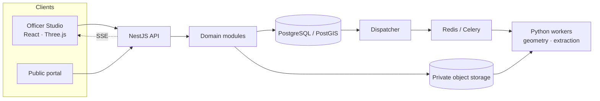

# BhuAayam · 3D ULPIN

**Every floor. Every flat. One verifiable record.**

BhuAayam is an evidence-linked 3D property workbench for India. It gives flats, basements and elevated spaces an identity of their own, ties every fact to the document it came from, and helps officers check, decide and issue a record that anyone can verify.

Smart India Hackathon 2026 · Problem statement SIH26011 · Team Tech Builders

<!-- plan-next-gate: GF0 -->

Agent work starts with the [orchestrator prompt](docs/orchestration/ORCHESTRATOR.md) and [small task queue](docs/orchestration/WORK_ITEMS.md). Product/ML workers are currently paused. See the [review assessment](docs/orchestration/delivery-reset-20261004/README.md) for implemented versus unqualified scope and the [cleanup decisions](docs/orchestration/CLEANUP_20261004.md) for retained history.

## Why it exists

ULPIN gives every land parcel in India a permanent identity, but it stops at the ground. A single parcel can carry a tower of flats, shared stairs, basements, parking and utility lines, and none of them has its own identity in the land record. To check one flat today, an officer reads a deed, a sanctioned plan and a survey that rarely agree, and reconciles them by hand.

BhuAayam works on that gap. It does not replace ULPIN. It adds the vertical layer beneath and above it.

## Identify · Prove · Govern

| Step | What it does |
| --- | --- |
| **Identify** | Each reviewed space (a flat, a duplex across two floors, a basement, a parking level or an elevated corridor) receives a proposed 3D code. The code never changes once assigned. A separate **Location** line shows parcel, structure, level and space, and updates when facts are corrected. The official parcel ULPIN stays as the anchor wherever a state supplies it. |
| **Prove** | Every value opens the exact source behind it: a page of a deed, a region of a drawing, a table row or a survey point. When sources disagree, both stay on the record and the officer's decision is saved with its reason. Unknown and missing values stay marked as such. |
| **Govern** | Sanctioned-versus-observed comparison, RERA carpet-area and undivided-share checks, an underground screening view, and a **3D Property Card** with a QR code that opens the exact revision. Each revision is hash-chained, so a changed record fails verification. |

## What is in the repository

### Officer Studio

A React + Vite + TypeScript app (`apps/studio`) on a Three.js scene engine (`packages/scene`).

- **Batches** shows every import and what needs attention next.
- **Map** streams buildings into a 3D scene that works from one block to a whole city, with search, layers, colour-by and section cuts.
- **Add files** profiles every file before import and shows how it will be read.
- **Register** lists a building's levels, units, shares, history and gaps, with export to CityJSON 2.0, CSV and JSON.
- **Review** shows plan pages and room candidates, and asks the level questions the evidence leaves open.
- **Evidence viewer** opens the retained original (documents, table rows, GeoJSON) behind any value.
- **Findings** compares a sanctioned plan with observed geometry and lets an officer record the finding.
- **Underground** shows mapped spaces and depth uncertainty, and shows **No survey** where coverage is missing.
- **Property Card** and **Verify** issue the card with a QR code and recompute its hash chain.
- **Requests** lets officers work through correction requests raised by citizens.

### Public portal

The same app carries a sign-in-free portal (`/portal`) for released records only: search, building and record pages, a public map, card verification, and a form to request a correction and track it.

### Adaptive ingestion

Officers receive evidence in every format: GIS layers, spreadsheets, scanned deeds, CAD plans, imagery, LiDAR and elevation models.

- Every original is stored unchanged and hashed before anything else happens.
- Each file is profiled for its real format, structure, units and declared reference system.
- For an unfamiliar layout, an AI model **proposes** what each field means. Tested code does the conversion, so the model never writes coordinates or identifiers.
- Large files are split along meaningful boundaries. Committed chunks are announced over server-sent events, and buildings appear on the map while the upload is still running.
- A feature that cannot be converted is quarantined with a reason, and independent work continues.

### Backend

A modular **NestJS** API (`apps/api`) over domain modules (`packages/server`), with visible SQL (`database/`) on **PostgreSQL/PostGIS**, private S3-compatible object storage, Redis/Celery jobs and Python geometry workers (`services/geo`). Shared wire contracts live in `packages/contracts`, and the typed client in `packages/api-client` is generated from the published OpenAPI document.

## Architecture



## Standards and exchange

- **Proposed 3D identity:** the `P3` profile, an opaque check-symbolled code plus a display-only Location line. It is a proposal for the responsible authority, never an official issuance.
- **Exchange:** CityJSON 2.0 with a rights and provenance sidecar and a loss report that lists anything withheld or unsupported.
- **Land administration:** a named conceptual mapping to ISO 19152 (LADM) Part 1 and Part 2.

## Data principles

- **Official sources only.** data.gov.in first, then the responsible authority. Every source keeps its issuer, original URL and bytes, hashes, licence, reference system and limits. A gap is named, never filled with invented data.
- **Unknown is not zero.** Missing depth, coverage, height or rights stay visibly unknown. A dig-screen is a screening report, not clearance.
- **Geometry is not ownership.** A drawn or computed space does not establish title. Physical, legal and illustrative geometry stay separate.
- **Originals are preserved.** Nothing overwrites a source. Every accepted record keeps its lineage.

The [source catalogue](docs/api/real-sources.md) lists every retained dataset with its issuer, hashes and stated limits.

## Getting started

Requirements: Node.js with `pnpm` 9, and Docker (Colima on macOS) for PostgreSQL/PostGIS, object storage and Redis.

```bash
pnpm install --frozen-lockfile
pnpm platform:start        # database, object storage, Redis and workers
pnpm build
API_ALLOWED_ORIGINS=http://127.0.0.1:5188 \
ULPIN_LOCAL_OPERATOR_SUBJECT=<your-operator-id> \
pnpm dev                   # API and dispatcher on http://127.0.0.1:3188
```

In a second terminal:

```bash
pnpm studio:dev            # Officer Studio on http://127.0.0.1:5188
```

Swagger is served at `http://127.0.0.1:3188/api/docs`. Checks for the Studio packages run with `pnpm studio:typecheck` and `pnpm studio:test`.

## Repository layout

| Path | Contents |
| --- | --- |
| `apps/studio` | Officer Studio and public portal (React, Vite, TypeScript) |
| `apps/api` | NestJS API |
| `packages/scene` | Three.js scene engine with 3D Tiles streaming |
| `packages/ui` | Shared components and design tokens |
| `packages/api-client` | Typed client generated from the OpenAPI document |
| `packages/contracts` | Shared wire contracts |
| `packages/server` | Domain modules |
| `database` | Ordered, hash-pinned PostgreSQL/PostGIS SQL |
| `services/geo` | Python geometry and extraction workers |
| `video/reel` | Source of the launch film |

## Documentation

| Document | What it covers |
| --- | --- |
| [API guide](docs/api/README.md) | Endpoints, ingestion events, tiles, and how to connect a client |
| [OpenAPI contract](docs/api/openapi.json) | The published API description |
| [Identifiers and exchange](docs/usp-agent-handoffs/26-identifiers-and-standard-exchange.md) | The P3 profile, the Location line, CityJSON and the LADM mapping |
| [Source catalogue](docs/api/real-sources.md) | Official datasets, issuers, hashes and limits |
| [SQL guide](database/README.md) | Tables, relationships and migration order |
| [Design system](docs/design-system/README.md) | Tokens, components and map styling |

See the [documentation index](docs/README.md) for how these fit together.

## Roadmap

- Concurrent schema learning: a second model that trains on checked results while ingestion runs, and takes over compatible work once it qualifies.
- A public data-request dashboard and phone-based card verification for citizens.
- A grounded assistant over the record, and wider native format support.
- Larger streaming scale rungs for state-level coverage.
