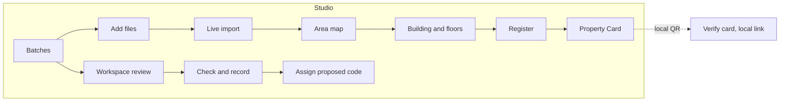
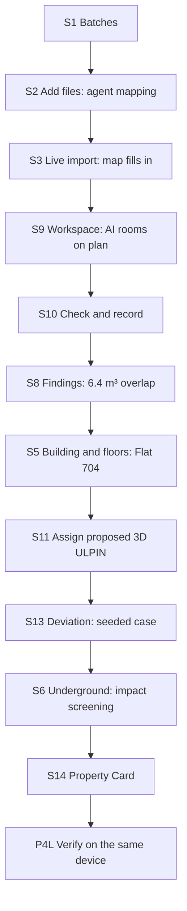

# 3D ULPIN UI & UX Brief

Synced from the "3D ULPIN UI & UX Brief" doc (24 Sep 2026): screen inventory, specimen data, the map look, states and batch prompts for designs built with this system.

## How to use this brief

Give Claude Design this doc plus the 3D ULPIN Design System, then generate the 15 finale screens in four batches (batch 5 is full-product) using the prompts at the end. Reconciled on 24 Sep 2026 with the project's finale handoffs (H99, H26, H17, H10, H97); the same text is in the repository at `docs/design-system/ui-brief.md` for coding agents.

**Rules for every mockup**

- Desktop artboards at 1440 × 900 for the Studio; one 390 × 844 phone view for S1, S5 and P4L. Portal screens (full product) at 1440 × 900 plus 390 × 844.
- Use only design-system tokens and components. Forest green is the one accent; colour appears on the map only when a Colour by mode is on.
- Use the specimen data below on every screen with identical values. Never invent another building, code or number.
- Label demonstration data "Fictional demonstration" in the scope strip. Never draw a government seal, emblem, signature or a real officer's name.
- The project code is "3D ULPIN (proposed)"; the state's code is "Parcel ULPIN". Nothing is "official", "issued", "approved", "cleared" or "verified" unless the handoffs allow it.
- Honest states: estimates hatched and labelled, unknowns as *Unknown*, test fixtures and seeded cases labelled.
- No hero illustrations, stock photos, KPI confetti, emoji or gradient backgrounds.

**Specimen data (use exactly)**

| Item | Value |
|---|---|
| Area | Lake View (fictional demonstration): 214 parcels, 22 buildings, 186 spaces |
| Building | Lake View Residence, 12 Lake View Road; ground plus 8 floors, stilt parking at ground, basements B1 and B2; 55 units; tenure: apartment declaration |
| Parcel ULPIN | MH2507A1B3C4D5 (illustrative); anchor state *Reviewed* |
| Vertical reference | Site datum SD-1 (local benchmark on the gate pillar) |
| Levels | Ground 212.4 m · SD-1; G floor 212.8; 3.0 m storeys; F7 233.8 to 236.8; roof 239.8; B1 209.1; B2 205.8 (estimated) |
| Unit | Flat 704 on F7 |
| 3D ULPIN (proposed) | `P3-7Q4M2R8T6V0W3X5Y9ZAB-R4` |
| Location (display only) | `MH2507A1B3C4D5 / S01 / F07 / R003` |
| Areas | Carpet 69.30 m² from plan components; 72.00 m² declared in the sale deed: +2.70 m² (3.9 %); review threshold 2 % |
| Share | 1.84 % undivided share; declaration population complete (55 of 55 units); total 99.50 % (0.50 % unexplained) |
| Finding | Flat 101 / Flat 201: 6.4 m³ overlap. Flat 101 top 218.90 m, Flat 201 bottom 218.70 m, 0.20 m × 32.0 m² |
| Deviation (seeded test case) | Sanctioned ground plus 8; observed enclosed rooftop structure of 118 m² from 239.8 to 242.8 m; stair cabin and water tank excluded by rule |
| Utility | Water main DN300 under the service lane, 0.9 to 1.2 m deep (source), quality B, tolerance not stated |
| Corridor | Metro corridor 14.4 to 18.4 m below the lane (test fixture) |
| Revision | r3, chain consistent (unsigned) |
| People | Officer R. Iyer, supervisor A. Deshmukh (both fictional) |

## Surfaces and users

The finale builds the Officer Studio; the Portal and Admin Console are full-product scope and keep their rules so the Studio does not block them.

| Surface | Release | Users | What they come to do | Feel |
|---|---|---|---|---|
| Officer Studio | Finale | Land-record officer; GIS and survey specialist | Import evidence, inspect floor by floor, resolve findings, record revisions, assign proposed codes, make Property Cards, screen underground impact | Map-first workbench; compact 15 px text; dense but calm |
| Public Portal | Full product | Flat owner or buyer; utility engineer | Look up a released record, verify a card, request a correction, track it | UX4G government service; 16 px; bilingual; phone-first |
| Admin Console | Full product | Supervisor | Coverage, backlog, AI quality, audit, users | Summary first; tables and charts |

**Design stance by surface**

- Studio: the canvas takes the flexible majority of the width. Panels open on demand beside or over it; one inspector.
- Admin: every number is a link to the list behind it. No decorative charts.
- Portal: search first, one task per page, plain language in English and Hindi, and no personal data on public pages.

## Screen count and site map

The full product has 33 screens: 7 Portal, 19 Studio and 7 Admin. **The finale builds 15:** Studio S1–S14 plus P4L, the local-demonstration mode of P4.

| Surface | Finale | Full product later | Total |
|---|---|---|---|
| Officer Studio | 14 (S1–S14) | 5 (S15–S19) | 19 |
| Public Portal | P4 in local mode only (P4L) | 7 (P1–P7, P4 public mode) | 7 |
| Admin Console | None; counts live on Batches | 7 | 7 |

Dialogs, inspector tabs and the tray are parts of these screens, not extra pages. Empty, loading and error states are variants, covered in the States section.



The officer's main loop runs from Batches through the map and workspace to a recorded space with a proposed code and its Property Card, whose QR opens the local verify page on the same device.

## Screen inventory

Each row is one artboard. Routes are the Studio's existing routes (H99); the release column says when it is built.

| ID | Screen | Route | Purpose | Key components | Release |
|---|---|---|---|---|---|
| S1 | Batches | `/studio/work` | Work items with stage and exact next action; at most three counts; Add files | StudioHeader, Badge, ReadinessMeter | Finale |
| S2 | Add files | `/studio/add-files` | Drop files, detected profiles, mapping questions | ImportStream, Field | Finale |
| S3 | Live import on map | `/studio/imports/:importPackageId` | Map fills in as results are saved | MapStyle, ImportStream | Finale |
| S4 | Area map | `/studio/areas/:areaId` | Whole area, search, select a building | MapToolbar, Legend, Inspector | Finale |
| S5 | Building and floors | same, with `feature` and `record` | Isolate a floor, colour by rights, select Flat 704 | LevelRail, Legend, Inspector | Finale |
| S6 | Underground and impact screening | same, underground mode | Below-ground view, draw a trench, see what lies below | MapToolbar, DigColumn, StrataSection | Finale |
| S7 | Evidence viewer | same, `panel=evidence` | Source region beside the 3D space it supports | EvidenceChip, Inspector | Finale |
| S8 | Findings review | same, findings tray | Findings list, overlap in Volumes, resolve with evidence | FindingCard, Legend | Finale |
| S9 | Workspace: review details | `/studio/properties/:buildingId/workspace` | Plan with AI room candidates, level register, one decision at a time | EvidenceChip, Field, Badge | Finale |
| S10 | Workspace: check and record | same, check stage | Topology, carpet area, shares, change summary, Record | FindingCard, CarpetAreaCheck, ShareLedger | Finale |
| S11 | Assign proposed 3D ULPIN | dialog over S10 or S12 | Code preview, location line, anchor, readiness, confirm | UlpinCode, ReadinessMeter | Finale |
| S12 | Property register | `/studio/properties/:buildingId/register` | Model, floors and units, shares, documents, checks, history | ShareLedger, RevisionTimeline | Finale |
| S13 | Deviation check | register or map comparison panel | Sanctioned against observed, seeded case labelled | MapStyle, FindingCard | Finale |
| S14 | Property Card | register, card preview | Preview, scope, redaction, local QR, export PDF | PropertyCard | Finale |
| P4L | Verify card (local demonstration link) | loopback resolver (H10) | Same-device check of the card's exact revision | UlpinCode, Badge, RevisionTimeline | Finale |
| S15 | Unit page | later | Full page for one space | Inspector, CarpetAreaCheck | Full product |
| S16 | Revision compare | later | Two revisions side by side | RevisionTimeline | Full product |
| S17 | Air-rights envelope | later | Remaining permissible floor area above a building | StrataSection, Legend | Full product |
| S18 | Command palette | later | Search codes, addresses, findings, actions | Field | Full product |
| S19 | Split, merge or boundary adjustment | later | Retire codes and assign successors with lineage | UlpinCode | Full product |
| P1–P7 | Portal: home, results, record, verify, request, my requests, sign in | `/public/*` | Released lookup and citizen requests | PortalHeader, UX4G components | Full product |
| A1–A7 | Admin: overview, imports, coverage, AI quality, audit, users, settings | later | Supervisor views | Tables, charts | Full product |

## How the map should look

A quiet, light-grey model city where only the thing you are asking about has colour: an architect's massing model with a land-records layer on top, not a game or a satellite view.

**Screen zones on the Studio map (1440 × 900)**

| Zone | Position and size | Contents |
|---|---|---|
| Top bar | Full width, 56 px | Wordmark, Batches · Map · Register, search, area switcher, Live or Snapshot, theme, user |
| Scope strip | Top of the map column, 36 px | Area, source classification, revision, "Fictional demonstration", Add files |
| Left panel | 308 px, closed by default | One of Layers, Spaces, Sources, Checks, opened on demand |
| Canvas | Remaining width | The 3D or 2D scene |
| Map toolbar | Floating, top-left | Select, measure, area, section, impact screening, underground; 3D/2D; Model/Volumes; reset |
| Level rail | Floating, right edge | Roof to B2 with "m · SD-1" once at the top; ground line between G and B1 |
| Legend | Floating, bottom-left | Active Colour by legend plus evidence and record keys |
| Readout | Bottom edge | Coordinates, height, frames, scale bar, north |
| Inspector | 360 px right (400 px with an evidence preview) | The one selected thing, with tabs |
| Tray | Bottom, 172 px, collapsible | Import stream or findings list, never both |

**Default look**

- Light grey ground, pale roads, soft green public land, pale blue water. Parcels as thin grey outlines with their ULPIN at the centroid.
- Buildings as grey massing with a thin line at every floor slab, soft shadow from the south-west. No textures or imagery by default (an orthophoto layer can be switched on).
- One selected building in forest green with a white halo; everything else faded to 35 %.
- Dark theme: the same scene on a deep blue-grey ground; selection turns mint green.

**What changes on interaction**

1. Select a building: the camera eases to an oblique view (600 ms), the inspector opens, the level rail appears.
2. Pick a floor on the rail: upper floors become ghost outlines; Colour by Rights turns units blue (exclusive), green (shared) and orange (public) with labels.
3. Select Flat 704: green selection with halo; the inspector shows code, location, areas, share and evidence.
4. Underground: ground turns 35 % transparent, a depth ruler appears, basements and the water main become selectable. The water main shows a quality B badge and "tolerance not stated"; no sleeve.
5. Impact screening: draw a line in the lane; the vertical column highlights and DigColumn lists what lies below.
6. A finding: the view switches to Volumes; the two flats are outlined; the overlap is a small red hatched slab labelled "6.4 m³ overlap".

**The map must never**

- Colour every building by default, or show two Colour by modes at once.
- Show estimated or illustrative geometry as measured (use hatch and ghost).
- Show a green or clear state where no utility survey exists, or turn a utility quality letter into a buffer.
- Lose the selection or camera when switching 2D/3D, Model/Volumes or theme.

## Where each feature lives

Every feature has a home screen and a visible element, so nothing is only a backend claim. Full-product features get a quiet entry point (a disabled menu item marked "Planned") rather than a finale mockup.

| Feature | Screens | UI element | What the user sees and does | Release |
|---|---|---|---|---|
| Proposed 3D ULPIN | S11, then S5, S12, S14, P4L | UlpinCode, assign dialog | A reviewed space shows **Assign proposed 3D ULPIN**; the dialog shows the code, location line, anchor state and readiness | Finale |
| Drafts and lineage | S9, inspector History | UlpinCode states | Drafts have no code ("Code assigned after review"); retired codes list successors | Finale (split/merge UI later) |
| Undivided shares | S12 Shares, S10 | ShareLedger | Units with shares; footer flags "Total 99.50 %, expected 100 %"; tenure regime in the header | Finale |
| Carpet-area check | S10, S8 | CarpetAreaCheck | Component arithmetic against the deed; over threshold becomes *Needs review* | Finale |
| Sanctioned vs observed | S13, S8 | Split compare, FindingCard | Seeded extra rooftop structure highlighted with area and height; "not a legal determination" | Finale |
| Building extraction | S4 layer, S13 | "AI candidates" layer | Dashed outlines over the orthophoto; accept or reject each | Finale |
| Floor segmentation | S9 | Plan overlay | Rooms and walls outlined on the scanned plan; confirm one at a time | Finale |
| Vertical delineation | S9 to S10, S5 | Level register, LevelRail | Reviewed polygons plus levels become unit prisms, floor by floor | Finale |
| Topology validation | S8, S10 | FindingCard, checks list | Overlap, partition, stack, anchoring; deterministic order: blocking, severity, size | Finale |
| Readiness per task | S1, S11 | ReadinessMeter | Six dimensions for a named task; unknown hatched; no single score | Finale |
| Evidence links | Everywhere, S7 | EvidenceChip, evidence viewer | Every value opens its page, row or region beside the 3D space | Finale |
| Constrained intake agent | S2, S3 | ImportStream, mapping rows | Only uncertain mappings ask; **Proposed**, **Reused mapping** or **Manual**; provider down shows "Map manually" | Finale |
| Progressive map | S3 | Tray stream, live badge | Buildings appear as chunks are saved; the camera never jumps | Finale |
| Impact screening | S6 | DigColumn, trench tool | Every band below with depth and quality; **Export screening report**; "not a clearance" | Finale |
| Utilities and quality | S6, Utilities mode | Tubes with quality badges | Sleeve only with a stated tolerance; "No survey" hatched | Finale |
| Corridors | S6, StrataSection | Corridor volume | Metro corridor fixture labelled, burdening two parcels | Finale (fixture) |
| Revision chain | S12 History, P4L | RevisionTimeline | "Chain consistent"; each revision shows its hash and the previous one | Finale |
| Property Card | S14, P4L | PropertyCard | Scope and redaction, export PDF; QR opens the local demonstration link | Finale |
| Standard exports | S12 Export menu | Menu | CityJSON 2.0 plus sidecar; LADM mapping report; CityGML 3.0 as a stretch conversion; 3D Tiles display only; GeoPackage "Planned" | Finale (partial) |
| Offline rehearsal | Scope strip, workspace dialog | Badge | "Replayed from rehearsal" with its date on replayed model answers | Finale |
| Air-rights envelope | S17 | Dashed envelope | Remaining permissible floor area, "not a right" | Full product |
| NAKSHA-style oblique and LiDAR intake | S2 | Source profile | Appears only when a real sample has been qualified; otherwise "Planned" | Full product |
| Gati Shakti layer export | S12 Export menu | Menu item "Planned" | GeoPackage of utility and corridor volumes | Full product |
| Schema learner | A4 | Metrics table | Learner vs recipe reuse vs model mapping on held-out layouts | Full product |
| Public requests | P5, P6, S1 | UX4G stepper and tracker | Citizen request becomes a Batches item | Full product |
| Hindi and accessibility | All | Language switch, accessibility bar | English / हिन्दी, text size, contrast | Portal: full product; Studio: Hindi-ready |

## Key flows

The six-minute hero demo crosses 11 Studio screens and ends on the local verify page; mock up the screens in this order so the artboards tell the story.



Each arrow is one click or one confirmed decision; the officer never retypes data between steps.

**Engineer screens a trench (Studio, read-only role)**

1. S4: searches "Lake View Road service lane".
2. S6: turns on Underground, draws a 12 m trench.
3. Reads the DigColumn: water main at 0.9 to 1.2 m (quality B, tolerance not stated), unknown band 1.2 to 3.0 m, metro corridor fixture from 14.4 m.
4. Clicks **Export screening report**; the report says it is not a clearance or dig permission and lists unknown bands.

**Citizen checks a flat (full product)**

1. P1: types "Flat 704 Lake View" or pastes the code.
2. P2: picks the match; sees the building on a small view-only map.
3. P3: reads level, heights with their reference, carpet area, share and shared spaces; downloads the Property Card.
4. P4: a buyer scans the card's QR and sees "Valid, revision r3" (or "Superseded" with a link).
5. P5 to request a correction with evidence; P6 to track it.

## Screen specs: Studio map screens

All seven share the map layout from How the map should look; only panels, canvas state and inspector change.

### S4 Area map

- **Canvas:** oblique view of the Lake View area, 22 grey buildings, parcels outlined, roads and a small lake; Lake View Residence selected in green with its label.
- **Left panel:** closed.
- **Inspector:** address, Parcel ULPIN, ground plus 8 with stilt parking and B1–B2, 55 units, readiness "Assign proposed 3D ULPIN: 4 of 6 ready", 2 open findings, **Open register** and **Explore floors**.
- **Legend** hidden because no colour mode is on; "Fictional demonstration" in the scope strip.

### S3 Live import on map

- Same as S4 while an import runs: about half the buildings present, the rest fading in (200 ms) without moving the camera.
- **Tray:** ImportStream with parcels.gpkg saved; unit_inventory.xlsx 1 mapping to review; levels.csv 2 lower limits missing; plan_F7.pdf 62 %.
- **Scope strip:** "Importing Lake View bundle · 186 spaces saved"; **Pause** and **Cancel** in the tray.

### S5 Building and floors

- **Canvas:** Lake View Residence close up; level rail with F7 selected and "m · SD-1" at the top; upper floors as ghosts; F7 units coloured by Rights with labels (Flat 701–706, Stair S1, Lift L1, Corridor).
- **Legend:** Rights (exclusive 42, shared 9, public 3, unknown 4) plus evidence and record keys.
- **Inspector:** Flat 704 with code, location line, level limits, carpet 69.30 vs declared 72.00 with evidence chips, share 1.84 %, parking "covered stilt, allotted by association: Needs evidence"; footer **Review area** and **Open in 3D**.
- A small StrataSection can sit under the facts.

### S6 Underground and impact screening

- **Canvas:** ground at 35 %, depth ruler 0–20 m, B1 and B2 under the building, the water main as a blue tube with a "B · tolerance not stated" badge and no sleeve, the metro corridor deeper and labelled "Test fixture". The drawn trench is a dashed rectangle with a highlighted column.
- **Colour by:** Utilities, with a hatched "No survey" entry.
- **Inspector:** DigColumn with **Export screening report** and **Request survey**.

### S7 Evidence viewer

- 960 px overlay over the dimmed map: left, the sanctioned plan PDF page 3 with the Flat 704 region outlined and its dimension text highlighted; right, the 3D space on a small canvas.
- Header: source, page, revision r2, received date, hash; **Open original** and page arrows.
- Footer: the facts this region supports (carpet area 69.30 m², level F7) and **Link to another space**.

### S8 Findings review

- **Tray:** 2 blocking, 3 needs review, ordered blocking first, then severity, then size; filter chips Blocking, Needs review, Info, Not assessed.
- **Canvas:** Volumes; Flat 101 and Flat 201 outlined; the overlap slab in red hatch labelled "6.4 m³ overlap".
- **Inspector:** FindingCard with the arithmetic, two source chips, **Request evidence** and **Apply level evidence** (enabled when levels-r2 arrives).

### S13 Deviation check

- **Canvas split in two, synced cameras:** left "Sanctioned" (ground plus 8 envelope from the approved plan), right "Observed" (drone-derived massing) with the enclosed rooftop structure in red hatch labelled "118 m² · 239.8 to 242.8 m" and a "Seeded test case" badge.
- **Inspector:** storeys sanctioned 9 vs observed 10, height 27.0 vs 30.0 m, setback *Not comparable* (roofprint only), source chips (sanctioned plan, drone survey 12 Sep 2026 with checkpoint RMSE, extraction model and its held-out IoU), **Create finding**.
- Caption under the canvas: "Observed from drone survey; not a legal determination."

## Screen specs: Studio workflow and record screens

These screens are page layouts up to 1600 px wide or dialogs over the map; each has one primary action.

### S1 Batches

- **Header row:** title "Batches", search, filters (Stage, Area, Assigned to me), primary **Add files**.
- **List:** 8 rows with property, area, stage badge (Add files, Review details, Check and record, Recorded), the exact next action ("Review 1 mapping", "Resolve 6.4 m³ overlap", "Assign codes for 12 units"), compact readiness "4 of 6", updated time.
- **Right column (320 px):** at most three counts: 2 imports running, 5 findings need review, 12 units ready.
- Empty state: "No batches yet. Add files to start." with the same button.

### S2 Add files

- 960 px dialog. Steps: Drop files → Check what we found → Confirm.
- Step 2 table: file, detected profile (GeoPackage, Excel inventory, CSV levels, PDF plan), CRS (or "CRS unverified" with **Choose**), rows or pages, status. One inline question: "carpet_sqft looks like carpet area in ft². Convert to m²?" with Yes, No, Choose field.
- Mappings say **Proposed**, **Reused mapping** or **Manual**. Provider unavailable: "Automatic mapping unavailable. Map manually or save for later."
- Primary **Start import**; secondary **Save and continue later**.

### S9 Workspace: review details

- Stage bar: Add files · **Review details** · Check and record.
- **Centre:** scanned F7 plan with AI room and wall candidates in dashed primary, OCR labels and dimensions; the Flat 704 boundary highlighted.
- **Right panel (400 px):** "1 of 6 to review": the candidate with confidence and source chip, **Accept**, **Adjust**, **Reject**; below it the level register (level kind, lower, upper, source, state) with B2 *Estimated* and G marked as stilt parking.
- **Left strip:** document thumbnails; Tools (Measure, Calibrate, Compare).

### S10 Workspace: check and record

- Left: the drafted building in Volumes. Right: checks grouped Blocking, Needs review, Not assessed, Passed: exclusive overlap (1), partition completeness (1 unexplained 3.2 m³ void on F8), stack consistency (passed), carpet area (Flat 704, 3.9 %), shares (99.50 %), anchoring (passed).
- Change summary: 55 units, 11 levels (B2, B1, G as stilt parking, F1 to F8), 4 shared spaces; what changed since r2.
- Primary **Record reviewed details** is disabled while a blocking finding is open, with the reason under it.

### S11 Assign proposed 3D ULPIN

- 760 px dialog. Title "Assign proposed 3D ULPIN for Flat 704".
- UlpinCode large: the code `P3-7Q4M2R8T6V0W3X5Y9ZAB-R4` (before confirm: "A random code is generated on confirm"), then the location line with each segment explained (parcel, structure S01, level F07, residential 003). Anchor state *Reviewed*.
- ReadinessMeter "Assign proposed 3D ULPIN" 6 of 6; lineage "New space; no predecessors"; note "Proposed project code. The state's ULPIN is unchanged."
- Primary **Assign code**; afterwards a toast "Assigned P3-7Q4M…-R4" with **Make Property Card**.

### S12 Property register

- **Identity header once:** Lake View Residence, address, Parcel ULPIN, status badges, **Back to map**, **Export** (CityJSON 2.0 plus sidecar, LADM mapping report; CityGML 3.0 and GeoPackage marked Planned), **Property Card**.
- **Body:** left 55 % the model with the level rail; right 45 % the floors and units table (level, unit, code, carpet m², share %, rights, status).
- **Tabs:** Shares (99.50 % flag), Documents, Checks, History ("Chain consistent").

### S14 Property Card

- Left: A4 preview for Flat 704. Right panel: scope (this unit, this floor, whole building), audience (public, owner, officer), redaction toggles (party names off for public), QR target "Local demonstration link", **Export PDF**.
- Card footer: "Technical record, not a title document", revision r3, hash, "Chain consistent".

## Screen specs: verify page, Portal and Admin

P4L is built for the finale. P1, P3, P4 (public mode) and A1 are full-product specs kept for mockup batch 5: Portal screens are UX4G pages themed with the design system, and the Admin overview is a summary-first dashboard where every number links to its list.

### P1 Portal home and search

- Accessibility bar and PortalHeader. Below, a left-aligned search block (not a centred hero): heading "Find a property record" in `portal-display`, one Field "3D ULPIN, parcel ULPIN or address", **Search** button, and a Hindi line under it.
- Three task links under search: Verify a Property Card, Request a correction, Track my request.
- A short "What this record shows" note: released facts only, no owner names, technical record not title.
- Phone view: search sticky at the top, tasks as a stacked list.

### P3 Public property record

- Breadcrumb, then title "Flat 704, Lake View Residence" with UlpinCode and parcel ULPIN.
- Two columns: left a view-only 3D view (building with F7 highlighted, level rail, no editing tools) and the StrataSection; right the released facts (level, elevations, carpet area, share, shared spaces, last updated) and **Download Property Card**.
- Note bar: "Released details only. Owner names and documents are not public."
- Phone view: facts first, the 3D view below as a static image with **Open 3D**.

### P4L Verify card, local demonstration link (finale)

- Opens on the same device that made the card; labelled "Local demonstration link. Public verification is planned."
- Result at the top in one line: success "Valid: revision r3" (variants: warning "Superseded by r4" with a link; danger "Retired: merged into …").
- Summary: code, location line, level with its vertical reference, carpet area, assignment date, revision hash; RevisionTimeline collapsed to the last 3 entries with "Chain consistent".

### P4 Verify Property Card, public (full product)

- Same layout as P4L, reached by scanning the QR on a phone once a protected public resolver exists.
- Footer: how to request a correction.

### A1 Admin overview

- StudioHeader with Admin navigation (Overview · Imports · Coverage · Users · Audit · Settings).
- **Row 1, four stat tiles:** Open findings 5 (2 blocking); Spaces awaiting review 38; Imports running 2; proposed codes assigned this week 41. Each tile links to its list.
- **Row 2:** a line chart "Spaces recorded per day, last 30 days" and a bar chart "Findings by check type" (overlap, partition, stack, carpet area, shares), one axis each.
- **Row 3:** coverage table by block (parcels, buildings, spaces, ready %, unknown %) with Lake View first; AI quality table (building extraction IoU, floor segmentation boundary error, mapping accuracy) with sample sizes, and a note that numbers come from held-out tests.
- Audit health line: "Revision chain consistent for 186 of 186 records, last check 14:10".

## States every screen needs

Mock up the default state of each finale screen, then these variants for S4, S5, S12 and P4L at least. Judges will click into edge cases; honest states are part of the pitch.

| State | When | Treatment | Example copy |
|---|---|---|---|
| Empty | No data yet | One line on what is missing and one action | "No floors recorded for this building. Add a plan or level schedule." |
| Loading | Fetching records or tiles | Skeleton in the final layout; ground and parcel outlines first | (no text) |
| Progressive | Import running | Saved objects appear; tray shows progress per file | "186 spaces saved · plan_F7.pdf 62 %" |
| Unknown | No evidence | *Unknown* with hatch and a request action | "Parking: Unknown · Request evidence" |
| Estimated | Derived, not measured | Hatch, dashed chip, "est." | "B2 205.8 m est." |
| Not assessed | A check could not run | Grey hatch with the reason; never "no conflict" | "Overlap not assessed: open shell on Flat 305" |
| Not comparable | Different definitions or datums | Neutral badge with the reason | "Carpet area not comparable: deed uses built-up area" |
| Stale | Newer evidence exists | Warning banner with the action | "levels-r2.csv is newer than this model. Rebuild to apply." |
| Blocked | Action not allowed yet | Disabled button with the reason beneath | "Blocked: 1 finding needs review" |
| Error | Import or check failed | Inline danger message with the fix; originals kept | "parcels.shp has no CRS. Choose the coordinate system to continue." |
| CRS unverified | Coordinates look plausible but zone or datum is not proven | Warning with **Choose** and a control-point check | "CRS not verified. UTM zone and datum must be confirmed." |
| Snapshot | Working from saved data | Header badge instead of Live | "Snapshot 24 Sep, 14:10" |
| Replayed | Offline rehearsal profile | Neutral badge on replayed answers | "Replayed from rehearsal 22 Nov" |
| Restricted | Role cannot see a field | "Restricted" with the role needed | "Owner names: Restricted (officer role)" |
| Test fixture or seeded | Authored case | Neutral badge on the object and in the legend | "Metro corridor · Test fixture" |
| No 3D | WebGL unavailable or a phone | 2D plan plus the spaces list, same selection | "3D view unavailable on this device. Showing the plan." |

## Prompts for Claude Design

Paste these one batch at a time with the design system attached and this doc shared; review each batch before the next so fixes carry forward. Batch 1 sets the look for everything else; batch 5 is full-product.

**Batch 1: the map (S4, S5, S5 dark)**

```text
Using the 3D ULPIN Design System and the "3D ULPIN UI & UX Brief", design three 1440x900 Officer Studio artboards: S4 Area map, S5 Building and floors, and S5 in the dark theme. Follow "How the map should look": 56px top bar with Batches · Map · Register, 36px scope strip, left panel closed, canvas, floating toolbar top-left, level rail on the right edge with "m · SD-1" at the top, legend bottom-left, 360px inspector. Calm grey massing; only the selection is forest green; on S5 the F7 units are coloured by Rights (blue exclusive, green shared, orange public) with labels. Use the specimen data exactly: Flat 704, 3D ULPIN (proposed) P3-7Q4M2R8T6V0W3X5Y9ZAB-R4, Location MH2507A1B3C4D5 / S01 / F07 / R003, F7 233.8 to 236.8 m · SD-1, carpet 69.30 vs 72.00 m2. "Fictional demonstration" in the scope strip. No seals, stock images, gradients or emoji.
```

**Batch 2: live import, underground, findings (S3, S6, S8)**

```text
Same style. S3 Live import on map (half the area present, ImportStream in the tray). S6 Underground and impact screening (ground at 35%, depth ruler, water main tube with a "B · tolerance not stated" badge and no sleeve, metro corridor labelled Test fixture, DigColumn in the inspector with Export screening report and the line "Screening only. Not a clearance or dig permission."). S8 Findings review (Volumes, Flat 101 / Flat 201 overlap as a red hatched slab labelled 6.4 m3 overlap, FindingCard with arithmetic, findings ordered blocking then severity then size).
```

**Batch 3: workflow (S1, S2, S9, S10, S11)**

```text
S1 Batches (8 rows with stage badge, exact next action, compact readiness; at most three counts on the right). S2 Add files at "Check what we found" (inline ft2 question; mappings marked Proposed, Reused mapping or Manual; one file with "CRS unverified"). S9 Workspace review details (scanned F7 plan with AI room candidates, one decision at a time, level register with G as stilt parking and B2 estimated). S10 Check and record (groups Blocking / Needs review / Not assessed / Passed; Record disabled with reason). S11 Assign proposed 3D ULPIN dialog (code, location line with segment notes, anchor state, readiness 6 of 6, "The state's ULPIN is unchanged").
```

**Batch 4: records and evidence (S7, S12, S13, S14, P4L)**

```text
S7 Evidence viewer (plan page with the Flat 704 region beside the 3D space). S12 Property register (identity header once, model with level rail, units table, tabs with the 99.50% share flag and "Chain consistent", Export menu with CityJSON 2.0 plus sidecar and LADM report; CityGML 3.0 and GeoPackage marked Planned). S13 Deviation check (sanctioned vs observed, "Seeded test case" badge, 118 m2 at 239.8 to 242.8 m, setback Not comparable). S14 Property Card (A4 card, local QR, scope and redaction). P4L Verify card on the same device labelled "Local demonstration link".
```

**Batch 5 (full product): Portal and Admin (P1, P3, P4, A1)**

```text
Design the Public Portal with UX4G patterns themed by the 3D ULPIN Design System: P1 Home and search, P3 Public property record and P4 Verify Property Card, each at 1440x900 and 390x844, with the accessibility bar, English / हिन्दी switch and an empty department-mark slot (no emblem). Then A1 Admin overview at 1440x900: four stat tiles that link to lists, one line chart and one bar chart with one axis each, coverage and AI quality tables with sample sizes. Released data only on the Portal; no owner names.
```

## Sources

- 3D ULPIN Design System: tokens, map and 3D rules, UX4G alignment, 23 components (version 4, reconciled with the handoffs).
- 3D ULPIN Plan Review: features, specimen values and finale scope.
- Project repository, staging worktree `ulpin-finale-audit`: `docs/usp-agent-handoffs/99-ui-ux-and-integration.md` (routes, selection, V1–V8), `26-identifiers-and-standard-exchange.md` (P3 codes, location line), `17-infrastructure-impact-screening.md` (screening, utility quality), `10-scoped-evidence-packets.md` (card and local QR), `97-review-findings-and-alignment.md` (review), and `docs/design-system/` (repository copy of the design system and this brief).
- Historical design pack `docs/v2-design` (forest green, rail and tray sizes); `design/officer-studio-v3/DESIGN_BRIEF.md` (one inspector, honest specimen).
- UX4G web design system (MIT; 3.1 components, tokens and citizen patterns) and UX4G typography (Noto Sans scale, 16px body, GIGW 3.0 and WCAG 2.1 AA).
- Phosphor Icons (MIT) for the icon set.
