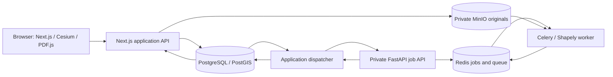

# How the local MVP works

The application owns the case and its history. A private processing service inspects stored originals and computes geometry. The viewer displays persisted results and edits explicit candidate geometry; it does not calculate authoritative model results in the browser.



## State and responsibility

| Component | Owns |
| --- | --- |
| Next.js server | Source receipt/finalization, case/unit revisions, evidence bindings, job records, model snapshots, input fingerprints and history. Every domain database write stays here or in its application dispatcher. |
| PostgreSQL/PostGIS | Durable application records and spatial footprint registry. Local polygons use SRID 0; this does not claim an official geographic CRS. |
| MinIO | Original source objects in private bucket `ulpin`. The application verifies uploads; the worker independently verifies stored byte length and SHA-256 before inspection. |
| Application dispatcher | Reads durable application jobs, submits/polls private processing requests, validates result contracts and original fingerprints, then ingests results transactionally. |
| FastAPI / Redis / Celery | Idempotent private jobs, durable queue and processing state. The Python worker has storage/broker access but **no application DB access**. |
| Shapely | Valid polygon area, prism volume and actual intersection geometry. Building/parcel context does not become a competing ownership solid. |
| Cesium / SVG / PDF.js | Linked selection and viewing, plan reference rendering and manual calibration/tracing. Floor separation and camera changes are display transforms. |

**Upload → inspect → prepare → build → apply revised evidence → rebuild** is deliberately explicit. Preparation assembles unit footprints, supported elevations and labelled draft hints; it does not create a computed model. A build freezes its inputs. Later edits/rebinding make older results stale; a late worker result is retained without replacing a newer current model. Immutable source and unit revisions explain how each result was obtained.

The worker computes `footprint area × (upper − lower)` and intersects footprint polygons across a positive shared elevation interval. Positive volume is an overlap finding; face/edge/point contact is informational. Unverified elevations receive independent warnings even when their numbers happen to be right. Results preserve IDs, revisions, source locators, the input fingerprint and processing-method version.

## Start and connect

Run these from the repository root after the dependencies described in `docs/PLATFORM.md` are installed:

```sh
pnpm platform:start
pnpm db:migrate
pnpm dev
```

`pnpm dev` runs the Next.js server **and** `pnpm dispatcher`. For a production rehearsal, stop the development process, run `pnpm build`, then `pnpm start`; `start` also runs the dispatcher. Leaving out the dispatcher means uploads/builds remain queued even while the UI is reachable.

| Process | Local address | Command / internal address |
| --- | --- | --- |
| Web UI/API | `http://127.0.0.1:3000` | `pnpm dev` or production `pnpm start` |
| Geometry HTTP | `http://127.0.0.1:18000` | `uvicorn geo.api:app --host 0.0.0.0 --port 8000`; container `geo:8000` |
| Celery worker | No public port | `celery -A geo.tasks:celery_app worker --loglevel=INFO --concurrency=2` |
| PostgreSQL | `127.0.0.1:15432` | Container `postgres:5432` |
| Redis | `127.0.0.1:16379` | Container `redis:6379`, database 0 |
| S3 / MinIO console | `127.0.0.1:19000` / `:19001` | Containers `minio:9000` / `:9001` |

Published services bind to localhost. Root `.env` contains private local credentials; never copy its contents into screenshots, docs or commits. Compose supplies container-specific S3/Redis addresses. Named volumes preserve DB, originals and Redis state across service restarts. `pnpm platform:stop` preserves those volumes. On this Apple Silicon machine, PostGIS runs through AMD64 emulation while the Python worker runs natively.

## Interfaces, verification and recovery

Public application operations live under `/api/v1`: cases, source uploads/originals, preparation, unit edits, applying levels, builds and retries. Shared TypeScript shapes and the exact endpoint contract live in `packages/contracts/src/index.ts` and `docs/IMPLEMENTATION_CONTRACT.md`.

The private service accepts `POST /internal/jobs {jobId,operation,input}` and serves `GET /internal/jobs/:jobId`, both authenticated with `GEO_SERVICE_TOKEN`. The same ID/input returns the existing state; changed input returns 409. A failed processing retry gets a new ID. Temporary queue submission failures can safely resubmit the same ID. `/health` checks process liveness; authenticated `/internal/ready` checks Redis and an actual Celery worker ping and returns `{ok,redis,worker}`.

Verified checks are repeatable:

```sh
pnpm platform:health
python3 scripts/platform-smoke.py
cd services/geo
.venv/bin/python -m pytest
```

The **46 Python tests passed locally and in Python 3.12**: the original 42 processing checks plus four readiness checks. They cover both fixtures, actual source parsing, malformed inputs, checksum/size rejection, exact overlap regions, correction, evidence changes, authentication, idempotency and queue recovery. `platform-smoke.py` additionally passed the real HTTP → Redis → Celery path, independently checking **96 / 102.4 m³** unit volumes and **6.4 m³** overlap; it does not substitute a fake worker result.

Application-level commands are `pnpm test:demo` and `pnpm exec tsx scripts/api-regression.ts`; their evidence and the controlled stale-result race are recorded separately in `docs/API_TEST_EVIDENCE.md`. Full UI rehearsal remains a distinct check from service/unit tests. Keep originals and existing volumes when recovering a failed job, correct the indicated input or restart its service, then retry and rebuild explicitly.

This is a local, single-operator MVP: there is no formal review/acceptance, official identity issuance, Android/offline workflow or automated image extraction. The current demo does not need a Nous API key or any paid/free model dependency.
