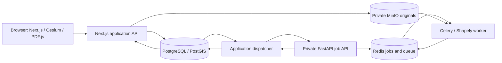

# Canonical backend architecture

> **26 September scope:** Backend architecture and API compatibility only. [H00](usp-agent-handoffs/00-README.md) and H01 govern active planning; feature implementation needs a separate assignment. The user owns the UI.

The application owns the case and its history. A private processing service inspects stored originals and computes geometry. The viewer displays persisted results and edits explicit candidate geometry; it does not calculate authoritative model results in the browser.

```mermaid
flowchart LR
  UI[Browser: Next.js / Cesium / PDF.js] --> API[Next.js application API]
  API --> DB[(PostgreSQL / PostGIS)]
  API --> S3[(Private MinIO originals)]
  DB --> D[Application dispatcher]
  D --> G[Private FastAPI job API]
  G --> R[(Redis jobs and queue)]
  R --> W[Celery / Shapely worker]
  S3 --> W
  W --> R
  G --> D
  D --> DB
  DB --> API
```

## State and responsibility

| Component | Owns |
| --- | --- |
| Next.js server | Source receipt/finalization, case/unit revisions, evidence bindings, job records, model snapshots, input fingerprints and history. Every domain database write stays here or in its application dispatcher. |
| PostgreSQL/PostGIS | Durable application records and spatial footprint registry. Local polygons use SRID 0; this does not claim an official geographic CRS. |
| MinIO | Original source objects in private bucket `ulpin`. The application verifies uploads; the worker independently verifies stored byte length and SHA-256 before inspection. |
| Application dispatcher | Reads durable application jobs, submits/polls private processing requests, validates result contracts and original fingerprints, then ingests results transactionally. |
| FastAPI / Redis / Celery | Idempotent private jobs, durable queue and processing state. The Python worker has storage/broker access but **no application DB access**. |
| Shapely | Valid polygon area, prism volume and actual intersection geometry. Building/parcel context does not become a competing ownership solid. |
| Cesium / SVG / PDF.js | Linked selection and viewing, plan reference rendering and manual calibration/tracing. Floor separation and camera changes are display transforms. |

**Upload → inspect → prepare → build → apply revised evidence → rebuild** is deliberately explicit. Preparation assembles unit footprints, supported elevations and labelled draft hints; it does not create a computed model. A build freezes its inputs. Later edits/rebinding make older results stale; a late worker result is retained without replacing a newer current model. Immutable source and unit revisions explain how each result was obtained.

The worker computes `footprint area × (upper − lower)` and intersects footprint polygons across a positive shared elevation interval. Positive volume is an overlap finding; face/edge/point contact is informational. Unverified elevations receive independent warnings even when their numbers happen to be right. Results preserve IDs, revisions, source locators, the input fingerprint and processing-method version.

## Startup ownership

Follow [the current startup boundary](OFFICER_STARTUP.md). Obsolete repository/Uttam snapshot restoration and synthetic seeding are retired. Inspect the live package/service configuration before an explicitly assigned run; this documentation cleanup starts no service. The dispatcher remains necessary for queued work. Keep private services loopback/internal, credentials outside logs/Git and existing volumes intact.

## Interfaces, verification and recovery

Public application operations live under `/api/v1`: cases, source uploads/originals, preparation, unit edits, applying levels, builds and retries. Shared TypeScript shapes and the exact endpoint contract live in `packages/contracts/src/index.ts` and `docs/IMPLEMENTATION_CONTRACT.md`.

The private service accepts `POST /internal/jobs {jobId,operation,input}` and serves `GET /internal/jobs/:jobId`, both authenticated with `GEO_SERVICE_TOKEN`. The same ID/input returns the existing state; changed input returns 409. A failed processing retry gets a new ID. Temporary queue submission failures can safely resubmit the same ID. `/health` checks process liveness; authenticated `/internal/ready` checks Redis and an actual Celery worker ping and returns `{ok,redis,worker}`.

Verification follows the affected backend seam and the current source policy. Use current commands and isolated services only after an explicit execution assignment. Historical Python/service smoke numbers and synthetic-case API runs belong to their recorded revision, not the current cleanup. Do not execute deleted seed/replay checks to reproduce them.

Preserve privacy, exact source hashes, immutable revisions, stale-result retention, idempotency and queue-recovery semantics when changing routes. Backend completion is distinct from user-owned browser/rendering acceptance, official-source accuracy, provider permission, performance and deployment. Use [H99](usp-agent-handoffs/99-ui-ux-and-integration.md) for consumer API contracts; no screen implementation is planned here.
