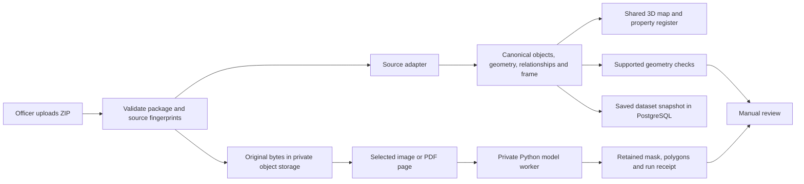

# Presentation briefing — 3D ULPIN prototype

This describes the implementation, not a claim of government approval or a finished national platform. The hosted demo is intentionally public at the user's request; officer authentication is future work.

## A 45-second explanation

“We built a prototype for reviewing property records in three dimensions. An officer uploads a supported area package. Our adapters normalize its building, parcel, floor and source records into a common model, preserving the original files. The same records drive the block map, property register and source review. We highlight supported geometric conflicts for manual investigation. Separately, pretrained models suggest building regions from aerial images and room regions from floor plans. Those suggestions require calibration and review; they do not determine ownership. Our two demonstration datasets are synthetic. Large-scale mixed-source reconciliation and official identity issuance are not completed.”

## Demonstration order

1. Open the Map directory. Show separately saved Lake View and Shiv Vihar.
2. Import a complete ZIP through Import → Choose dataset file. Show receipt counts and source formats. Review on map, then Save dataset. Reimporting identical bytes reuses its saved dataset.
3. Open Lake View, pan/orbit and inspect B01. Show the red building and two findings: parcel overshoot and road overlap, each 21.6 m². They describe the same strip, so do not add them.
4. Search a displayed building/floor identifier; inspect floor records and the property register. Residents and rights are supplied records, not ML predictions.
5. Open source processing. Show classified aerial imagery vs floor plans, actual PDF page count, then run a selected extraction. Show actual source → predicted mask → outlines. A fresh hosted import has no copied local extraction history; a result exists only after a hosted run completes.
6. Open Shiv Vihar. Explain that missing floor geometry, residents and official parcel IDs stay unavailable rather than being invented.

## What each source actually contributes

| Input | What this demonstration does | What it does not establish |
|---|---|---|
| Lake View complete package | 49 buildings, 184 floors, 189 spaces, 50 declared sources; reads supplied geometry/schedules | It is not a reconstruction of a surveyed Delhi neighbourhood |
| Shiv Vihar MASTER package | 32 buildings, 5 supplied floor records, 26 schedule spaces, 5 declared sources; different source adapter | It does not infer floors or boundaries absent from the source |
| GeoJSON / supported normalized JSON | Polygon footprints, parcels, floors, roads and relationships enter the common model | Arbitrary coordinate systems or every JSON schema are not accepted automatically |
| CSV schedules | Supported fields join through declared IDs: floors, residents, parties, rights, controls | Occupancy is not evidence of title; conflicting records are not silently resolved |
| Plan PDF / image | Original retained; selected page rendered; room model suggests pixel regions | No automatic metric scale, ownership, floor elevation or legal apartment division |
| Aerial image | Original retained; building model suggests regions | No unseen interiors, authoritative parcel boundaries, storey counts or ownership |
| LAS/LAZ, DEM/DSM, GeoTIFF, GPKG, DOCX | Package originals and attribution retained; specific other intake paths may inspect some formats | Complete package rendering does not mean every one of these files generated geometry; raw point-cloud/terrain reconstruction is unfinished |

Lake View's full map comes from supplied vectors and schedules. Its small synthetic aerial preview is 220 × 230 pixels; the retained local building runs found 10 regions. About five rows were visible at once, not five total predictions. Misses/merged roofs must be acknowledged. The new host starts without those local run records.

## Data flow and storage

- **Next.js / React**: officer UI and application APIs. Shared Three.js/R3F map consumes normalized records; display styling is separate from measurements. Existing Cesium workflows are compatibility paths.
- **PostgreSQL/PostGIS**: relational records and spatial services. Saved area packages use `spatial_datasets`: canonical input, normalized source, manifest/digest, source bindings, diagnostics and counts as JSONB/columns. `cases` and `sources` retain source metadata and revision/hash links. Saved package snapshots are candidate data, not automatically published registry records.
- **S3-compatible MinIO**: original ZIP, every member, documents and derived artifacts. Original bytes are fingerprinted and verified on readback. PostgreSQL stores references, not a fictional claim that every file is a database polygon.
- **Redis + Celery + dispatcher + private Python service**: queued processing. ONNX models run on the server; model artifacts are hash-pinned. A failed job is distinct from a damaged source.
- **Source revisions / geometry revisions / receipts**: preserve provenance in supported workflows. The saved package importer currently stores immutable revision 1; it does not implement general merging of later overlapping datasets.
- **Coordinates**: named local metre frame plus vertical benchmark. Local display zero is not sea-level elevation. Pixels require documented calibration before claiming metres. Two control pairs provide a similarity transform, not a correction for arbitrary perspective distortion.
- **Identities**: building/floor IDs are demo/internal identifiers. A display floor ID can use `buildingId:floorNumber`; it is not a government-issued 3D ULPIN standard. Preserve stable identity independently of changes in labels and geometry; complete cross-dataset lifecycle handling remains work.

## The bulk-data answer you should give

Do not say “we did not build bulk import because real data may have another format.” We do have **bounded multi-building package upload**, server validation, normalization and saving. We do not have production-scale arbitrary-source bulk processing.

Say: “We implemented two source profiles and a canonical schema so the renderer is independent of the source format. A new supported source requires an adapter, field mapping, coordinate validation and tests. We need representative official samples to qualify those mappings and matching rules. We have not claimed an automatic universal importer or city-scale reconciliation.”

### Two files describe the same building, one contains more information

Separate three questions:

1. **Is it the same uploaded file?** Implemented: SHA-256 identifies exact package replay and reuses the existing receipt. Different ZIP bytes can have identical meaning, so byte deduplication is not semantic matching.
2. **Is it the same real building?** Proposed extension: match authoritative parcel/building identifiers first; use location, footprint intersection, address and parent parcel as supporting candidate evidence. One 2D parcel can contain several buildings, so a shared parcel ID alone is insufficient. A coordinate-system mismatch must be resolved before spatial matching. Ambiguous candidates require human review. This complete cross-dataset entity-resolution workflow is not implemented.
3. **Which attributes should survive?** Proposed extension: attach assertions to the same stable entity with source, date, unit and authority; add non-conflicting fields, preserve unknowns, and flag competing assertions. More fields or a newer file do not automatically mean greater authority. Do not union footprints or average disputed heights blindly. Splits/merges require explicit lineage.

Concrete example: file A says B12 has footprint P and 3 floors; file B has the same asserted building ID, a changed footprint and owner details. Owner details may be supplemental assertions. The footprint and floor discrepancy are review items. Neither file silently replaces the other. Today separate non-identical packages remain separate saved datasets; do not demonstrate an automatic merge that does not exist.

## Likely judge questions and honest answers

| Question | Short answer |
|---|---|
| Did you build everything in statement 26011? | No. This is a working subset: supported source normalization, 3D inspection, records, conflict checks and reviewed ML assistance. Raw multimodal reconstruction, national scale and official issuance remain gaps. |
| Why 3D instead of a normal map? | It distinguishes vertically stacked spaces and their lower/upper extents, while retaining the parent parcel and source evidence. |
| Are these actual Delhi buildings? | No. Lake View and the supplied Shiv Vihar package are synthetic demonstration datasets, separately labelled. |
| Is all the visible detail measured? | No. Facade styling is display decoration. Use source geometry and evidenced dimensions for measurements; missing geometry is explicitly unavailable. |
| Which data made the map? | Supplied vector footprints and floor geometry/schedules through supported adapters. Not the aerial image alone and not every retained file. |
| Why upload files you do not process? | To retain complete evidence and provenance. The receipt distinguishes parsed inputs from retained originals. Retention is not extraction. |
| Can you upload any government format? | No. Named formats/profiles are supported. A new schema needs mapping and qualification; unsupported data must fail clearly. |
| Is this really bulk import? | It is a multi-building package import. The detailed preview is bounded to 100 buildings, 1,000 geometry records, 2 km extent and a 20 MB compressed package. It is not a proven city-scale ETL service. |
| What if a city has a million buildings? | Partition and stream geometry, process jobs in batches, index spatial/identity queries and qualify performance. That complete production path is future work, not today's benchmark. |
| Does changing formats mean rewriting the app? | Usually a new adapter and tests; the canonical schema and renderer can remain. New semantics may require schema evolution, so we do not promise zero changes. |
| How do you avoid duplicate buildings? | Exact package replay is deduplicated. Cross-source building matching is not complete; use reviewed authoritative-ID and spatial candidate matching as the planned approach. |
| Same parcel ID but two buildings? | Model parcel-to-building relationships; do not treat parcel ID as globally unique building identity. |
| No official ID in a file? | Preserve a scoped source/internal identifier and mark official identity unavailable. Never invent an official ULPIN. |
| Two sources disagree? | Preserve both source assertions and review the discrepancy; more complete does not automatically mean more correct. General automated reconciliation is not built. |
| What happens if a building is demolished or subdivided? | It needs retained historical identity/revisions and explicit successor relationships. Do not claim the demo has a complete lifecycle workflow. |
| Is `building:floor` an official standard? | No; it is the requested demo identifier convention. Official issuance/interoperability needs the applicable authority's specification. |
| How do you know who lives there? | Supplied occupant records. ML cannot infer residents from a roof or floor plan. |
| Does resident mean owner? | No. Occupancy, parties, asserted rights and geometry are separate. |
| Can your system settle ownership disputes? | No. It can expose evidence and potential geometric inconsistencies for authorized review. |
| Why not fix overlaps automatically? | They can reflect digitization error, coordinate mismatch, legitimate vertical separation or competing source assertions. We flag findings; we do not choose an ownership boundary. |
| Do adjacent buildings count as overlap? | Shared edges without intersection area are excluded by supported checks. |
| What if one structure is above another? | Known compatible vertical intervals help distinguish separated volumes. Missing elevations leave uncertainty. This is not a full arbitrary-solid/legal topology engine. |
| What does the red building mean? | A supported computed finding requiring review, not proof of illegal occupation. |
| Is zero findings proof the data is correct? | No. Only supported checks ran on usable inputs; unavailable geometry and unsupported checks remain limits. |
| Is conflict detection ML? | Current displayed checks are deterministic geometry rules. Do not call them a trained topology model. |
| What exactly is the ML? | RF-DETR suggests building regions in overhead images; CubiCasa5K segments floor-plan regions. Both are pretrained integrations, not models we trained. |
| How are rooms identified? | The floor model predicts a class for pixels based on learned plan patterns. Connected regions become candidate outlines; it does not read legal room boundaries or know occupants. |
| Does a room equal a flat? | No. Rooms are image regions; legal units require grouping, plans, rights and review. |
| Can a roof image tell floors or underground rooms? | Not reliably in this implementation. Separate plans, levels and survey evidence are needed. |
| Is the ML result accurate? | Small feasibility checks exist, not representative Indian cadastral validation. Show actual misses and avoid claiming general accuracy percentages. |
| Does model confidence mean survey accuracy? | No. It is an uncalibrated model score, not centimetre accuracy or a probability of correct title. |
| Why does the Lake View image miss buildings? | It is a tiny synthetic preview unlike the model's real aerial training domain. Full vector-map coverage and image prediction coverage are different. |
| How do pixels become metres? | Documented control pairs/calibration in a named frame. Without calibration, measurements remain pixels. |
| Where do height and floor levels come from? | Supplied schedules, plans or separately reviewed measurements. The room/building models do not invent them. |
| What about LiDAR and DEM/DSM? | Originals are supported as retained package evidence, but automatic full reconstruction and vertical reconciliation are unfinished. |
| What about underground infrastructure? | The model can display supplied below-ground records/alignments. A utility line is not automatically a surveyed ownership volume. |
| Are models paid/cloud APIs? | These two spatial models run privately with retained ONNX weights. No paid fallback is needed for them. Other document-assistance integration is separate and not claimed as verified here. |
| Did you train these models? | No. We integrated pretrained models, preprocessing, retained outputs and review workflows. |
| What about licences? | The manifest records model/source licences and attribution. CubiCasa's retained checkpoint is noncommercial; commercial deployment needs licence review or replacement. |
| Can results be reproduced? | Supported runs retain source/model hashes, processing profile, rendered raster, outputs and receipt. Hardware/numerical differences can still matter. |
| What if the job fails? | Source receipt and job state are separate; show failure/retry instead of pretending a valid result exists. |
| Are local previous results on the new server? | No. We deliberately imported originals through the hosted UI, not the old database. New hosted runs create new processing history. |
| Where are files stored? | Private S3-compatible object storage; metadata, snapshots and relations in PostgreSQL/PostGIS; jobs use Redis/Celery. |
| Are data publicly protected? | This hackathon demo is intentionally open and synthetic. Officer login, roles and production access controls are deferred; do not call it production-secure. |
| Can the original file be recovered? | Supported retained sources preserve original bytes and hashes, independent of derived geometry. |
| What does Save dataset mean? | A persisted candidate snapshot and originals, not legal approval or publication into the authoritative registry. |
| Does reupload overwrite reviews? | Identical package replay reuses its saved dataset. A changed package is separate; general dataset update/merge is unfinished. |
| What is new compared with a 3D viewer? | The prototype connects source receipts, identity/relationships, register views, issue review and retained ML suggestions. Avoid unsupported claims about competitors. |
| Did you write it yourself? | I defined the problem, workflow and iterations and used AI coding assistance. I can explain the implemented architecture, demonstrate it and acknowledge its limits. Do not claim unaided authorship. |
| What would you do next? | Get representative official samples; qualify adapters/CRS; build reviewed cross-source matching and revision updates; evaluate models; add officer access; benchmark scale and volumetric checks. |

## Five claims to avoid

- “All buildings were generated by AI.”
- “Any file format works.”
- “These are officially issued 3D ULPINs.”
- “Red means illegal, and overlaps resolve automatically.”
- “Saved means approved, and zero findings means survey-accurate.”

Code anchors: `features/spatial/reference-import/browser.ts`, `lib/server/spatial-datasets.ts`, `lib/server/spatial-dataset-db.ts`, `lib/server/dataset-ml.ts`, `services/geo/ml-models.json`, and `docs/local-spatial-extraction.md`. Paths under `features`/`lib` are relative to `apps/web`. Detailed dated implementation evidence is in `docs/engineering-plan/tasks/T083_RESULT.md` through `T088_RESULT.md`; older audits may predate durable saving and later ML integration.
