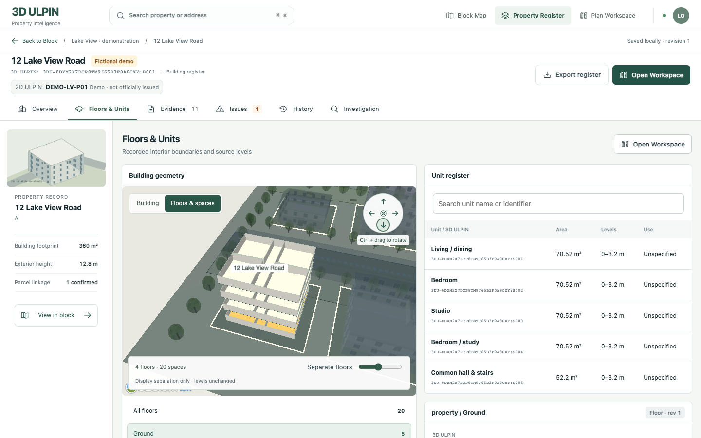
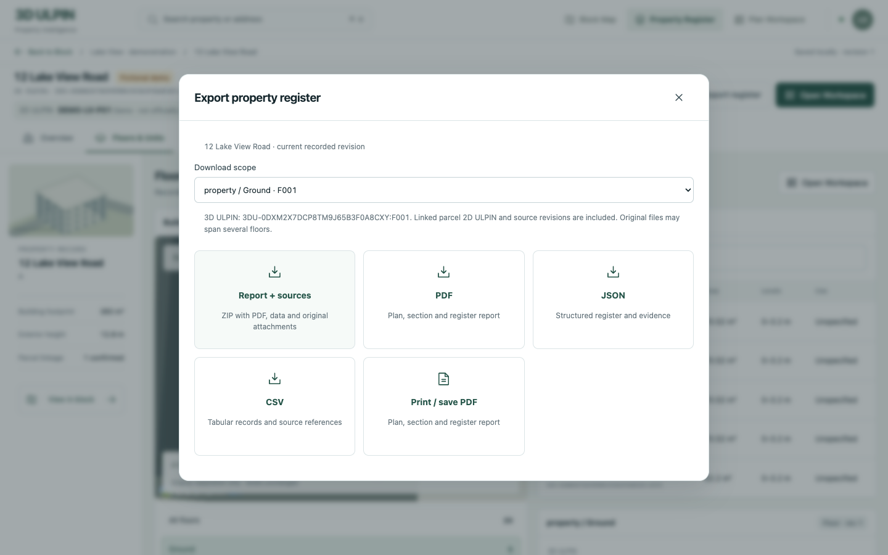
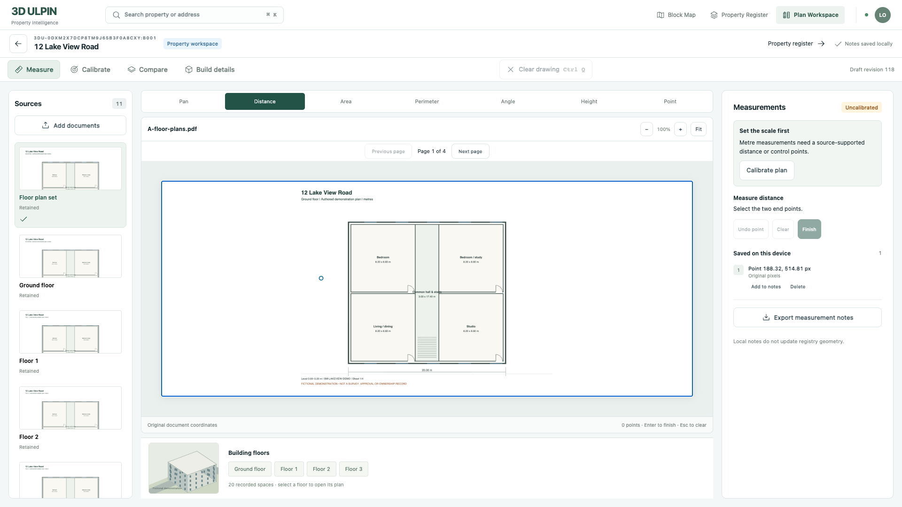

# Register controls and scoped downloads

Verified locally on 15 September 2026 on `feat/reference-ui-rebuild`, extending `643c44f`. This change does not mutate stored geometry, source originals, identities or review history.

## Use it

1. Open **Block Map → Lake View · demonstration → 12 Lake View Road → Property Register → Floors & Units**.
2. Use the circular control at the upper right of the scene: left/right orbit horizontally, up/down change viewing elevation, and the centre button restores building framing. Hold **Ctrl + left mouse button** and drag to orbit. Buttons also work with keyboard focus and Enter. Surrounding buildings remain visible; floor separation only changes display.
3. Select a floor or unit. Its **3D ULPIN** appears in the details; the linked parcel's **2D ULPIN** appears alongside it. **Export register** defaults to the selected record. Choose the whole building or another floor in **Download scope**. Selected records also have direct PDF and original-source bundle buttons.
4. In the block's **Export** dialog choose **Download block PDF**, **Block report + original sources**, or **Block register JSON**.
5. In **Plan Workspace**, use **Clear drawing** or **Ctrl+Q** to cancel current drawing/calibration points and their current error. Completed measurements, saved calibration, originals and registry geometry remain intact. The shortcut ignores text inputs and open dialogs; use the button if the operating system intercepts the shortcut. Completed notes have their existing individual Delete action.

## What downloads contain

| Scope | Records and identity | Formats |
|---|---|---|
| Saved block | Block application ID, buildings, parcels, roads/context, all available floor/unit records and parcel IDs | PDF, JSON, ZIP |
| Building | Building 3D ULPIN and all its recorded floors/units | PDF, JSON, CSV, print HTML, ZIP |
| Floor | Its own 3D ULPIN and only its linked spaces, with parent building and parcel context | PDF, JSON, CSV, print HTML, ZIP |
| Unit | Its own 3D ULPIN and recorded geometry, with parent building and parcel context | PDF, JSON, CSV, print HTML, ZIP |

Property PDFs include plan/section views, recorded levels, areas, volumes, revisions, building findings and source references. Block PDFs include a local plan, feature/parcel identities, floor/unit records, check status and source revisions. No missing floor bounds or legal attributes are inferred.

ZIPs contain `register.pdf`, `register.json`, `sources.json`, a README and unchanged originals under `sources/<source-id>/`. Every original is verified against its retained SHA-256 before inclusion. A source may cover several floors; scoping the register never crops or rewrites an original. Building-wide findings remain explicitly labeled as building context. Source locators, revisions and hashes remain available in the manifest and structured register.

`3DU-…` values are existing application identifiers, not official national issuance. `DEMO-LV-P01`–`P08` are explicitly fictional 2D ULPIN examples backed by the retained demonstration identity schedule. Real sources retain their own assertions; absent identifiers remain unavailable.

## Startup and repeatable checks

Use the existing local service configuration described in [COMPLETE_DEMO.md](COMPLETE_DEMO.md). Do not reset storage volumes.

```sh
pnpm install --frozen-lockfile
pnpm platform:start
pnpm db:migrate
pnpm --filter @ulpin/web exec playwright install chromium
pnpm build
pnpm start
```

For a fresh local installation, in a second terminal:

```sh
pnpm demo:seed
pnpm demo:complete
```

Open `http://127.0.0.1:3000/blocks`. Installed canonical IDs are recorded in the ignored `fixtures/reference-neighborhood/installed.json`; the verification scripts read that file rather than inventing IDs.

```sh
pnpm typecheck
pnpm test:ui
pnpm test:register-scope
REFERENCE_SNAPSHOT_PATH=docs/evidence/register-controls/reference-persistence.json pnpm test:reference
pnpm test:register-exports
pnpm test:register-controls
```

Run the two export/browser scripts sequentially: the local exporter allows one source bundle at a time. The browser uses real Chromium/WebGL, real source previews and real services. `ULPIN_TEST_BASE_URL` and `PLAYWRIGHT_CHROMIUM_EXECUTABLE` can override local defaults. Browser notes remain in its isolated browser context; no registry review is mutated by these checks.

## Evidence

- Production build and type check passed: [build](evidence/register-controls/build.txt), [types](evidence/register-controls/typecheck.txt).
- All 20 existing UI/state/measurement checks and 3 focused scope tests passed: [UI](evidence/register-controls/ui-tests.txt), [scope](evidence/register-controls/scope-tests.txt).
- [9 actual browser checks](evidence/register-controls/browser-report.json) passed at 1440×900, 1920×1080 and 800×844, including camera movement, keyboard control, every floor's visible identity, in-progress clearing, preservation of a completed pixel-point note and actual ZIP downloads. No page errors.
- [8 real-service export checks](evidence/register-controls/export-report.json) passed: all floors scoped correctly; unit scope excludes siblings; a foreign building's floor returns 404; each property bundle has 11 original attachments; the complete block bundle has 48. All attachment hashes match originals. Block data includes 22 features, 9 buildings, 8 parcel identities and 60 recorded spaces.
- [Original-source integrity](evidence/register-controls/reference-integrity.txt) passed after the web restart, including retained real-source bytes. This change does not reseed or modify stored records.
- All 19 pages across the [block](evidence/register-controls/block-register.pdf), [building](evidence/register-controls/building-register.pdf), [floor](evidence/register-controls/floor-register.pdf) and [unit](evidence/register-controls/unit-register.pdf) PDFs were rendered and visually inspected. [PDF text/visual report](evidence/register-controls/pdf-report.json).







Additional captures: [1920 px register](evidence/register-controls/floors-1920.png), [800 px controls](evidence/register-controls/floors-800.png), [Ctrl-drag result](evidence/register-controls/floors-ctrl-drag.png), [block export](evidence/register-controls/block-export.png).

## Limits and remaining external dependencies

Source bundles are limited to 128 MiB of originals, one active bundle per local process; block registers are limited to 250 buildings. Oversized scopes, missing originals, checksum failures and concurrent bundles return explicit errors instead of incomplete ZIPs. PDF creation requires the local Chromium runtime. Floor records without their own computed geometry remain labeled “Not supplied”; linked space measurements remain available.

No blocker remains for the requested local controls and scoped downloads. Authorized real Indian parcel/interior/utility evidence and live assistance credentials remain separate external dependencies, as recorded in the existing delivery documents. No official ULPIN issuance, live AI run, merge or public deployment is claimed.
