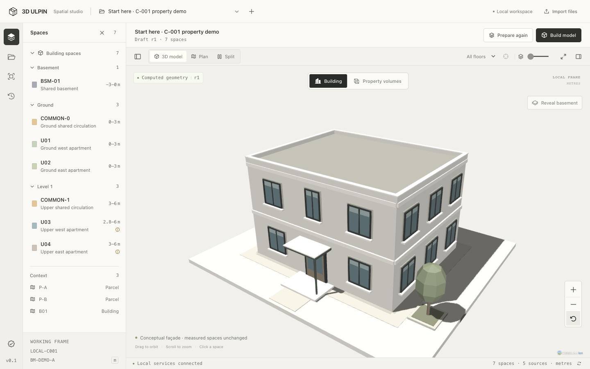

# Architectural workbench redesign

The user requested a calmer site interface and a 3D model that reads as a building. The implementation retains Next.js, Cesium and the measured model. Architectural presentation is generated separately from the stored geometry.

## Skills selected and installed

Only these three upstream skills were installed for this work, using the Codex skill installer on 12 September 2026:

| Source                                                                                                | Installed skill             | Use in this project                                                                                                             |
| ----------------------------------------------------------------------------------------------------- | --------------------------- | ------------------------------------------------------------------------------------------------------------------------------- |
| [Appllama](https://github.com/Appllama/appllama-skills) at `dd5caaec3d5d50ad7fc0324da238119c6b7c3707` | `appllama-app-design-skill` | Study existing products; consistent controls, semantic states, press feedback, keyboard/modal behavior and browser verification |
| [Taste](https://github.com/Leonxlnx/taste-skill) at `ccbc15639c97057cbfcf32ecebc38ef716e4bb37`        | `redesign-skill`            | Audit the existing interface and improve it while preserving working flows                                                      |
| Same Taste revision                                                                                   | `minimalist-skill`          | Warm neutral palette, clear typography, Phosphor icons, restrained surfaces and spacing                                         |

Existing personal skills were preserved. Appllama's native platform defaults are adapted to this existing web application; this work does not claim iOS or Android simulator verification. Its MCP research connector is not connected, and no paid research service was used.

## Reference patterns and audit

[SketchUp's modeling interface](https://help.sketchup.com/en/sketchup-web/navigating-sketchup-web) informed the compact model toolbar, contextual panels and emphasis on the viewport. [BIMx's cutting plane interaction](https://bimx-webviewer-help.graphisoft.com/en/BIMx_Web_Viewer/BIMx_Web_Viewer/BIMx_Web_Viewer-10.htm) informed temporary display controls that expose a building's internal spaces.

The previous interface repeated the workspace title in a large heading, gave a permanent guide panel substantial width and used low-contrast green text throughout. The model showed equally solid pastel prisms down to the basement, without a ground plane at grade, windows, floor edges, an entrance or a roof treatment.

The design direction is an architectural tool: a prominent interactive model, compact commands, optional panels, warm bone surfaces and charcoal text. Color identifies properties, selection and findings. The façade is conceptual. Source evidence continues to determine the footprints, elevations and computed quantities.

## Implementation

- The pure `building-scene.ts` helper derives exposed wall spans from polygon occupancy at each storey. Shared walls do not receive exterior windows. Render meshes are grouped by material and property so selection still identifies the measured space.
- The ground presentation follows the model's vertical benchmark. A translated benchmark moves the full scene consistently. Basement visibility, floor separation, façade details and planting never write back to the model.
- Property-volume mode retains exact prisms and overlap geometry. Selecting a finding opens that view; returning to Building and selecting the same finding again works.
- The interface uses contextual inspectors, collapsible floor groups and a focus mode. Primary actions, source revision handling, tracing, editing and their accessible labels are preserved.
- Phosphor icons are imported from individual files. The package's advertised `/lib` entry did not contain its JavaScript target; the context uses the actual `dist/lib/context` entry. Both development and production use webpack, preserving the existing Cesium minifier workaround.

## Verification

- Production webpack build `tA-r6-W7-TZbLfnzngm5t` and TypeScript checking passed.
- **7 scene tests passed**, covering shared/partially shared walls, ring winding, different storeys, concave boundaries, measured-data preservation and translated elevation benchmarks.
- **8/8 production browser workflows passed** in 268.539 seconds, without retries or skips. [Exact results, persisted IDs and recordings](BROWSER_TEST_EVIDENCE.md).
- The prepared showcase retains its original case, source and model data. [Full comparison](../test-results/redesign/showcase-preserved.json).
- Clicking the façade selected U04 and opened its linked inspector; pointer orbit and camera reset were also verified. [Picking result](../test-results/redesign/production-showcase.json) · [orbited view](../test-results/redesign/production-picked-and-orbited.png).
- Final desktop and narrow captures were visually inspected. The façade uses cast shadows and the site receives them, avoiding self-shadow striping on thin details. Directional material lighting remains enabled.

The façade, planting and entrance are conceptual presentation details. The Property volumes view and findings use measured geometry. Cold startup under software WebGL and the approximately 17.8 MB uncompressed client bundle remain performance limits; the browser evidence records the initial timeout and the readiness condition used for final workflow verification.
