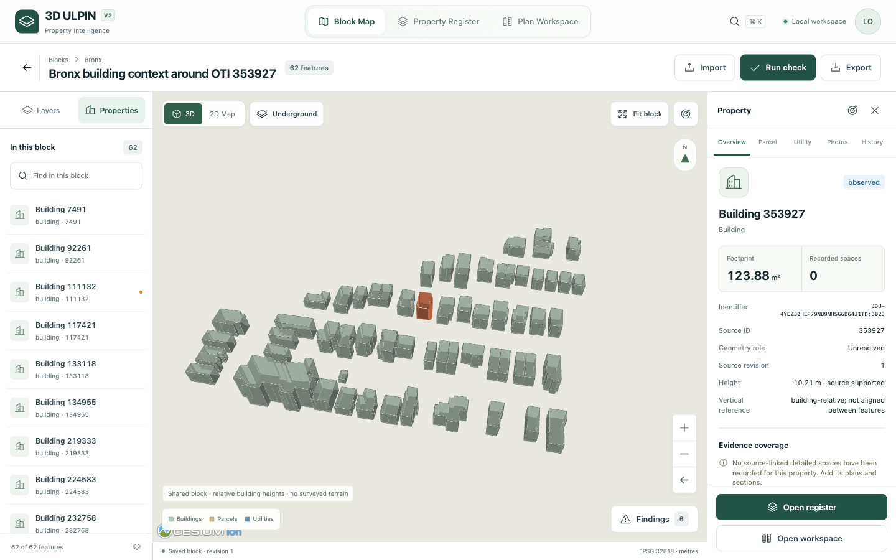
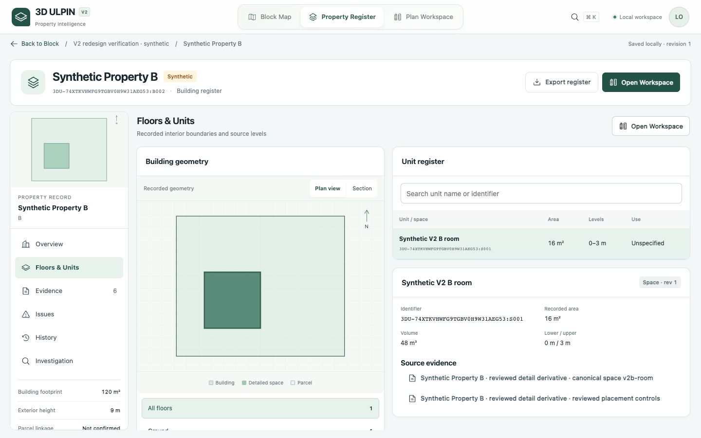
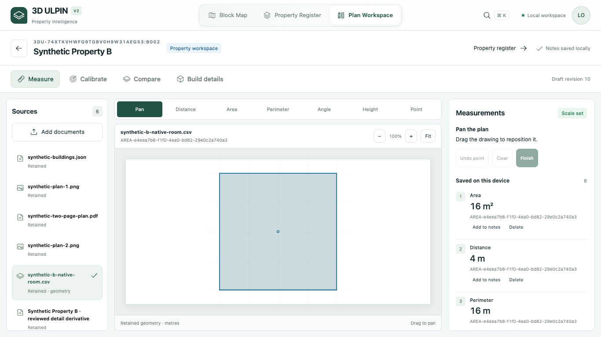

# V2 officer interface delivery

Verified locally on 15 September 2026. Branch: `feat/v2-officer-redesign`, based on `feat/real-block-officer-workflow` at `f0603349c3bc261efda8663289226b1a265f123f`. This is a stacked redesign of that implementation, not a replacement for its data/worker stack. Nothing was merged or publicly deployed.

## Start and navigate

```sh
pnpm demo
```

Open [V2](http://127.0.0.1:3000/v2). The launcher installs locked dependencies, recovers the local platform, migrates the database, builds and starts the web server plus job dispatcher. If another web terminal is running, stop it before rebuilding. Development uses `pnpm dev` after platform startup and migrations.

| Exact route | Purpose |
| --- | --- |
| `/v2` | Block home, saved areas and source import |
| `/v2/blocks/[areaId]` | Shared geographic block with 3D/2D, contextual rails and findings |
| `/v2/register` | Register search and recent/loaded properties |
| `/v2/properties/[buildingId]/register` | The selected property's six register tabs |
| `/v2/workspace` | Workspace start; `?case=` resumes an unassigned draft |
| `/v2/properties/[buildingId]/workspace` | The selected property's document canvas and preparation |

The old interface is at [/legacy](http://127.0.0.1:3000/legacy), with `/legacy/areas`, `/legacy/properties/[id]`, `/legacy/properties/[id]/prepare`, `/legacy/registry`, `/legacy/registry/[identifier]`, `/legacy/workbench` and `/legacy/sites/[siteId]`. Former paths redirect without losing repeated queries. Old root `?case=` bookmarks keep their workbench context. API/source URLs, original bytes, canonical IDs and history are retained.

## Five-minute local demonstration

1. Open the saved **Bronx building context around OTI 353927**, or use Import → saved source snapshot on a fresh database. Search `353927` with the header search. Select **Building 353927** in its surrounding 62-feature block. Toggle Layers, 2D Map and 3D.
2. Open its register, then Floors & Units. The UI reports that interiors were not supplied. Evidence opens the actual original; it does not invent floors or recast this foreign dataset as Indian coverage.
3. On this retained local database, open [new synthetic B's register](http://127.0.0.1:3000/v2/properties/f29b8566-fe5f-4a46-85d0-8754a6fccf3e/register?area=e4eea7b8-f1f0-4ea0-bd82-29e0c2a740a3&record=5143128b-05e0-4f1d-b7cd-e2be16c9509e). Its real worker-generated test record is **16 m², 0–3 m, 48 m³**. Inspect the original PNG/PDF/CSV evidence, section and source history.
4. Open its Plan Workspace and Build Details to inspect the retained recorded result. For a new measurement demonstration, choose a PNG/PDF, set its calibration and measure on the source. Notes are browser-local; they do not transfer with the database or automatically become registry geometry. The authored [test documents](../demo-data/synthetic-v2-workspace) explicitly state that they are software fixtures.
5. Return to Block Map. On the earlier synthetic officer block, select A → Parcel and its **20 m²** outside-parcel finding. Utility opens the evidenced **24 m** profile. These are synthetic engineering checks. Use the Investigation tab to inspect the separate C test case's request, review, closure and intentional reopen history.

A fresh database does not contain the retained verification IDs. Import the saved real snapshot through the UI, or create a clearly named synthetic test area and preparation from the bundled fixtures. Do not present synthetic documents as the missing real Indian plans. The two synthetic test blocks reuse authored coordinates, so current global checks can also show coincident test-copy overlaps; their findings are not a legal or real-world claim.

## Implemented behavior and observed evidence

| Flow | Actual result |
| --- | --- |
| Shared block and search | Real source ID `353927` opened canonical building `7ca4fba1-6c6a-44aa-89c8-d17b97bf159f` in area `9e77c608-bac7-4d56-9ac7-3032cc49074d`; register/workspace navigation retained that property and validated block. |
| Preservation | Bronx remains at area revision 1 with 62 features and identifier `3DU-4YEZ30HEP79NB9NHSG6B64J1TD:B023`. Original source `eb33f3ab-ea9c-412e-a510-260c6a1f9bc3` read back as 41,792 bytes with unchanged SHA-256 `869c5dc4fb50d71be4f62f4a2936c29bd95ade14c712bdf4f51986841d82771a`. |
| Import | Actual UI upload of the authored ArcGIS JSON → CRS/field/role mapping → three-feature preview → review → acknowledgement → recorded new synthetic area `e4eea7b8-f1f0-4ea0-bd82-29e0c2a740a3`. No API shortcut was used for this journey. |
| Parcel and findings | Current check displayed the exact 20 m² outside-parcel strip and its participants. Filtering and individual quantities remain separate; overlapping findings are not summed. Full explanations expand with selection. |
| Stale state | Nine historical finding buttons were disabled and labeled Out of date before rerunning a current check. Stale geometry is excluded from map overlays. |
| Utility / photos / history | Retained 24 m alignment, circular 0.8 m section, source levels and named benchmark displayed; unsupported exact volume is explicit. Absent photos show a no-data state; history shows the committed source revision. Utility metadata uses its profile benchmark, not an unrelated building-height reference. |
| Exports | UI downloaded selected-feature geographic GeoJSON, visible 2D SVG and check/evidence JSON. JSON/XML were parsed and IDs checked. Attempting SVG export while 3D is visible is refused with an instruction to switch to 2D. |
| Register | All six tabs use actual dossier/source/investigation APIs. Exact new B room selection and plan/section values agree with the worker record. Wrong area and record queries are rejected, including header navigation. |
| Preparation | Actual UI created an unassigned draft, uploaded PNG/PDF originals, assigned copies with reason and lineage, reviewed five native CSV facts, placed the plan, built with the worker, reviewed three proposed records and recorded B's floor/room. Originals and earlier A/B evidence were preserved. |
| Measurement / calibration / comparison | All six measurement tools exercised; authored PNG rectangle produced 60 m² after calibration. Metric drawing is blocked when uncalibrated. PDF page/source changes isolate calibration and clear unapplied form fields. Overlay, split, side-by-side and pixel-difference comparisons are visual tools. |
| Investigation | Separate synthetic C case `26cd8466-7140-4971-a3aa-0032fd58cf4f` required an evidence response before review, then completed review → close → reopen. Reload retained OPEN revision 7 and prior decisions. |
| Recovery | An absent area returned “Map area not found.” with retry and Choose another block. No substitute geometry was shown. Escape closes dialogs; reselecting the same file no longer closes its parent import dialog. |

## Verification results

| Command / check | Result |
| --- | --- |
| `pnpm typecheck` | Pass on final source |
| `pnpm build` | Pass; baseline Cesium client-minification exception remains |
| `pnpm test:v2` | **22 passed**: route/CSS isolation, Zustand hydration/validation, coherent navigation and search, actual React stale-request handling, large/mixed geometry, calibration/measurement math |
| `pnpm test:officer` | Pass: exact 20 m², three dossiers, native reviewed facts through worker recording, investigations and exports; actual AI configuration only |
| `pnpm test:block-membership` | Pass: canonical identity, explicit membership, utility projection, stale invalidation and 2,001-feature limit |
| `pnpm test:case-document-copy` | Both live integration groups passed: native originals/lineage/idempotency and atomic rejection gates |
| Python geometry suite | **163 passed** against the changed native parser |
| `pnpm platform:health` | PostGIS, Redis, private S3 write/read/delete and access denial, geo service and Celery passed |
| Browser | Real Chromium sessions against local dev and production. Final normal journeys had no application console errors; Next's unused CSS preload warnings remain. Intentional missing-ID checks produced expected 404s; blocked review produced expected 409. Development Fast Refresh interruptions were retested on production. |
| Layout | 1920×1080, 1440×900, 1366×768, 1093×614 and 390×844 inspected. Document width did not exceed viewport width. Narrow layouts use internal scrolling/drawers. |

The reduced 1093×614 viewport is approximately the space available at 125% of 1366×768. **Native 125% browser zoom is not claimed**: shortcut verification did not change the headless viewport, and native screenshot capture was unavailable. This remains a verification gap, separate from the responsive checks above.

## Actual UI captures

The screenshots below are from the running application, not generated reference images. Real-source captures show the Bronx block; preparation/register examples are labeled synthetic.







Additional captures and exact scoped journeys: [Block evidence](evidence/v2/block), [Register verification](V2_REGISTER_VERIFICATION.md), [Workspace verification](V2_WORKSPACE_VERIFICATION.md), [legacy and document assignment](V2_LEGACY_AND_DOCUMENT_ASSIGNMENT_VERIFICATION.md). Test logs and parsed UI exports are retained in `docs/evidence/v2/checks`.

## Remaining limits

- **External real-data gate:** a permitted coherent Indian block, matching genuine plans/sections and surveyed utilities remain unavailable. [Exact source-access findings](../demo-data/real-block/SOURCE_ACCESS.md) and the earlier T00–T10 blockers still apply.
- **AI:** no authorized verified free Nous route or permitted ten-document evaluation set was available. No live inference was claimed. The existing bounded assistance remains in the previous preparation interface; V2 has no new Nous extraction panel.
- **Measurement authority:** browser-local notes and visual/pixel comparison are not surveyed placement, calibrated discrepancy volumes or automatically published geometry. Build/record still requires supported reviewed facts, a named frame and benchmark, placement and worker review.
- **Existing geometry limits:** unsupported multipart/courtyard detailed prisms, automatic arbitrary scan/CAD reconstruction and exact circular/sloping utility collision volumes remain unavailable. Missing source evidence is explicit.
- **Verification/delivery:** native 125% browser zoom and non-Chromium browsers remain unverified. This is the local single-operator build; the retained baseline client bundle/minification exception and lack of production multi-user controls need separate work before public delivery.

See [V2 architecture](V2_ARCHITECTURE.md) for reusable components, state ownership, route validation, scoped styling and extension conventions.
