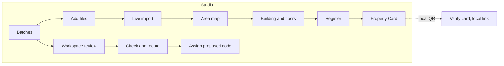
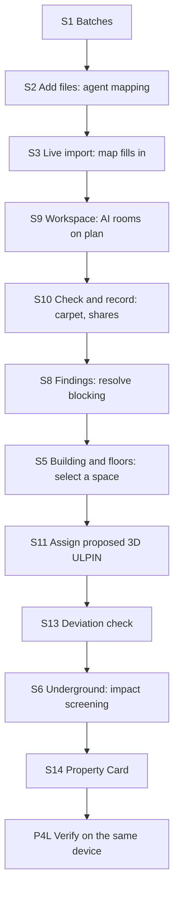

# 3D ULPIN UI and UX brief

Which screens exist, what goes on each, how the map looks and where every feature lives. Repository copy of the team's UI brief, reconciled on 24 September 2026 with the finale handoffs ([H99](../usp-agent-handoffs/99-ui-ux-and-integration.md) Z, [H97](../usp-agent-handoffs/97-review-findings-and-alignment.md)). Use it with the [design system](README.md) and the [Officer Studio mockup reference](mockups/officer-studio/README.md), which shows every screen assembled, to build and check screens.

## Rules for every screen

- Desktop at 1440 × 900 for the Studio; 390 × 844 phone views for S1, S5 and P4L. Portal screens (full_product) at 1440 × 900 plus 390 × 844.
- Use only design-system tokens and components. Forest green is the one accent; colour appears on the map only when a Colour by mode is on.
- **No sample data.** Every name, code, number, level, file and date on a screen is bound to a record through the [view model schema](mockups/officer-studio/view-model.schema.json). Screens accept whatever the loaded data holds, in any source format, and show *Unknown*, *Not assessed* or an Empty state where it holds nothing.
- The scope strip shows the dataset's recorded classification. Badges such as *Test fixture* or *Seeded test case* appear only when the record's provenance says so; no screen hard-codes a disclaimer. Never draw a government seal, emblem or signature.
- The project code is "3D ULPIN (proposed)"; the state's code is "Parcel ULPIN". Nothing is "official", "issued", "approved", "cleared" or "verified" unless the handoffs allow it.
- Honest states: estimates hatched and labelled, unknowns as *Unknown*, fixtures and seeded cases labelled from their records.
- No hero illustrations, stock photos, KPI confetti, emoji or gradient backgrounds.

## Surfaces and users

| Surface | Release | Users | What they come to do | Feel |
| --- | --- | --- | --- | --- |
| Officer Studio | finale_v1 | Land-record officer; GIS and survey specialist | Import evidence, inspect floor by floor, resolve findings, record revisions, assign proposed codes, make Property Cards, screen underground impact | Map-first workbench; compact 15 px text; dense but calm |
| Public Portal | full_product | Flat owner or buyer; utility engineer | Look up a released record, verify a card, request a correction, track it | UX4G government service; 16 px; bilingual; phone-first |
| Admin Console | full_product | Supervisor | Coverage, backlog, AI quality, audit, users | Summary first; tables and charts |

## Screen count

33 screens in the full product: 7 Portal, 19 Studio, 7 Admin. **The finale builds 15:** Studio S1–S14 plus P4L, the local-demonstration mode of P4.

| Surface | Finale | Full product later | Total |
| --- | --- | --- | --- |
| Officer Studio | 14 (S1–S14) | 5 (S15–S19) | 19 |
| Public Portal | P4 in local mode only (P4L) | 7 (P1–P7, P4 public mode) | 7 |
| Admin Console | none; counts live on Batches | 7 | 7 |

Dialogs, inspector tabs and the tray are parts of these screens. Empty, loading and error states are variants (see States).

## Screen inventory

| ID | Screen | Route (H99) | Purpose | Key components | Release |
| --- | --- | --- | --- | --- | --- |
| S1 | Batches | `/studio/work` | Work items with stage and exact next action; at most three counts; Add files | StudioHeader, Badge, ReadinessMeter | finale |
| S2 | Add files | `/studio/add-files` | Drop files, detected profiles, mapping questions | ImportStream, Field | finale |
| S3 | Live import on map | `/studio/imports/:importPackageId` | Map fills in as results are saved | MapStyle, ImportStream | finale |
| S4 | Area map | `/studio/areas/:areaId` | Whole area, search, select a building | MapToolbar, Legend, Inspector | finale |
| S5 | Building and floors | same, with `feature` and `record` | Isolate a level, colour by rights, select a space | LevelRail, Legend, Inspector | finale |
| S6 | Underground and impact screening | same, underground mode | Below-ground view, draw a trench, see what lies below | MapToolbar, DigColumn, StrataSection | finale |
| S7 | Evidence viewer | same, `panel=evidence` | Source region beside the 3D space it supports | EvidenceChip, Inspector | finale |
| S8 | Findings review | same, findings tray | Findings list, overlap in Volumes, resolve with evidence | FindingCard, Legend | finale |
| S9 | Workspace: review details | `/studio/properties/:buildingId/workspace` | Plan with AI room candidates, level register, one decision at a time | EvidenceChip, Field, Badge | finale |
| S10 | Workspace: check and record | same, check stage | Topology, carpet area, shares, change summary, Record | FindingCard, CarpetAreaCheck, ShareLedger | finale |
| S11 | Assign proposed 3D ULPIN | dialog over S10 or S12 | Code preview, location line, anchor, readiness, confirm | UlpinCode, ReadinessMeter | finale |
| S12 | Property register | `/studio/properties/:buildingId/register` | Model, floors and units, shares, documents, checks, history | ShareLedger, RevisionTimeline | finale |
| S13 | Deviation check | register or map comparison panel | Sanctioned against observed, seeded case labelled | MapStyle, FindingCard | finale |
| S14 | Property Card | register, card preview | Preview, scope, redaction, local QR, export PDF | PropertyCard | finale |
| P4L | Verify card (local demonstration link) | loopback resolver (H10) | Same-device check of the card's exact revision | UlpinCode, Badge, RevisionTimeline | finale |
| S15 | Unit page | later | Full page for one space | Inspector, CarpetAreaCheck | full product |
| S16 | Revision compare | later | Two revisions side by side | RevisionTimeline | full product |
| S17 | Air-rights envelope | later | Remaining permissible floor area above a building | StrataSection, Legend | full product |
| S18 | Command palette | later | Search codes, addresses, findings, actions | Field | full product |
| S19 | Split, merge or boundary adjustment | later | Retire codes and assign successors with lineage | UlpinCode | full product |
| P1–P7 | Portal: home, results, record, verify, request, my requests, sign in | `/public/*` | Released lookup and citizen requests | PortalHeader, UX4G components | full product |
| A1–A7 | Admin: overview, imports, coverage, AI quality, audit, users, settings | later | Supervisor views | Tables, charts | full product |

## How the map should look

A quiet, light-grey model city where only the thing you are asking about has colour: an architect's massing model with a land-records layer on top, not a game or a satellite view.

| Zone | Position and size | Contents |
| --- | --- | --- |
| Top bar | Full width, 56 px | Wordmark, Batches · Map · Register, search, area switcher, Live or Snapshot, theme, user |
| Scope strip | Top of the map column, 36 px | Area, recorded source classification, revision, Add files |
| Left panel | 308 px, closed by default | One of Layers, Spaces, Sources, Checks, opened on demand |
| Canvas | Remaining width | The 3D or 2D scene |
| Map toolbar | Floating, top-left | Select, measure, area, section, impact screening, underground; 3D/2D; Model/Volumes; reset |
| Level rail | Floating, right edge | Every recorded level, top to bottom, with the named vertical reference once at the top; ground line between the last above-ground and first below-ground level |
| Legend | Floating, bottom-left | Active Colour by legend plus evidence and record keys |
| Readout | Bottom edge | Coordinates, height, frames, scale bar, north |
| Inspector | 360 px right | The one selected thing, with tabs |
| Tray | Bottom, 172 px, collapsible | Import stream or findings list |

**Default look.** Light grey ground, pale roads, soft green public land, pale blue water; parcels as thin grey outlines with their ULPIN at the centroid; grey massing with a thin line at every floor slab and soft south-west shadow; no textures or imagery by default (an orthophoto layer can be switched on); one selected building in forest green with a white halo, everything else at 35 %. Dark theme: the same scene on a deep blue-grey ground, selection in mint green.

**What changes on interaction.**
1. Select a building: the camera eases to an oblique view (600 ms), the inspector opens, the level rail appears.
2. Pick a floor on the rail: upper floors become ghost outlines; Colour by Rights turns units blue (exclusive), green (shared) and orange (public) with labels.
3. Select a space: green selection with halo; the inspector shows code, location, areas, share and evidence.
4. Underground: ground turns 35 % transparent, a depth ruler appears, below-ground levels and utilities become selectable. Each utility shows its quality level and, when the source gives none, "tolerance not stated" and no sleeve.
5. Impact screening: draw a line in the lane; the vertical column highlights and DigColumn lists what lies below.
6. A finding: the view switches to Volumes; the participants are outlined; the finding's own geometry is a red hatched solid labelled with its quantity.

**The map must never:** colour every building by default or show two Colour by modes at once; show estimated or illustrative geometry as measured; show a green or clear state where no utility survey exists; convert a utility quality letter into a buffer; lose selection or camera when switching 2D/3D, Model/Volumes or theme.

## Where each feature lives

| Feature | Screens | UI element | What the user sees and does | Release |
| --- | --- | --- | --- | --- |
| Proposed 3D ULPIN | S11, then S5, S12, S14, P4L | UlpinCode, assign dialog | A reviewed space shows **Assign proposed 3D ULPIN**; the dialog shows the code, location line, anchor state and readiness | finale |
| Drafts and lineage | S9, inspector History | UlpinCode states | Drafts have no code ("Code assigned after review"); retired codes list successors | finale (split/merge UI later) |
| Undivided shares | S12 Shares, S10 | ShareLedger | Units with shares; footer flags a total that differs from the expected 100 %; tenure regime in the header | finale |
| Carpet-area check | S10, S8 | CarpetAreaCheck | Component arithmetic against the deed; over threshold becomes *Needs review* | finale |
| Sanctioned vs observed | S13, S8 | Split compare, FindingCard | Difference geometry highlighted with its area and height range; seeded cases badged from their records; "not a legal determination" | finale |
| Building extraction | S4 layer, S13 | "AI candidates" layer | Dashed outlines over the orthophoto; accept or reject each | finale |
| Floor segmentation | S9 | Plan overlay | Rooms and walls outlined on the scanned plan; confirm one at a time | finale |
| Vertical delineation | S9 to S10, S5 | Level register, LevelRail | Reviewed polygons plus levels become unit prisms, floor by floor | finale |
| Topology validation | S8, S10 | FindingCard, checks list | Overlap, partition, stack, anchoring; deterministic order: blocking, severity, size | finale |
| Readiness per task | S1, S11 | ReadinessMeter | Six dimensions for a named task; unknown hatched; no single score | finale |
| Evidence links | Everywhere, S7 | EvidenceChip, evidence viewer | Every value opens its page, row or region beside the 3D space | finale |
| Constrained intake agent | S2, S3 | ImportStream, mapping rows | Only uncertain mappings ask; **Proposed**, **Reused mapping** or **Manual**; provider down shows "Map manually" | finale |
| Progressive map | S3 | Tray stream, live badge | Buildings appear as chunks are saved; the camera never jumps | finale |
| Impact screening | S6 | DigColumn, trench tool | Every band below with depth and quality; **Export screening report**; "not a clearance" | finale |
| Utilities and quality | S6, Utilities mode | Tubes with quality badges | Sleeve only with a stated tolerance; "No survey" hatched | finale |
| Corridors | S6, StrataSection | Corridor volume | Corridor volumes with their provenance badge and the parcels they burden | finale (fixture) |
| Revision chain | S12 History, P4L | RevisionTimeline | "Chain consistent"; each revision shows its hash and the previous one | finale |
| Property Card | S14, P4L | PropertyCard | Scope and redaction, export PDF; QR opens the local demonstration link | finale |
| Standard exports | S12 Export menu | Menu | CityJSON 2.0 plus sidecar; LADM mapping report; CityGML 3.0 as a stretch conversion; 3D Tiles display only; GeoPackage "Planned" | finale (partial) |
| Offline rehearsal | Scope strip, workspace dialog | Badge | "Replayed from rehearsal" with its date on replayed model answers | finale |
| Air-rights envelope | S17 | Dashed envelope | Remaining permissible floor area, "not a right" | full product |
| NAKSHA-style oblique and LiDAR intake | S2 | Source profile | Appears only when a real sample has been qualified; otherwise "Planned" | full product |
| Gati Shakti layer export | S12 Export menu | Menu item "Planned" | GeoPackage of utility and corridor volumes | full product |
| Schema learner | A4 | Metrics table | Learner vs recipe reuse vs model mapping on held-out layouts | full product |
| Public requests | P5, P6, S1 | UX4G stepper and tracker | Citizen request becomes a Batches item | full product |
| Hindi and accessibility | All | Language switch, accessibility bar | English / हिन्दी, text size, contrast | Portal: full product; Studio: Hindi-ready |

## Key flows

**Hero demo (six minutes, H24).**

Each arrow is one click or one confirmed decision; the officer never retypes data.

**Engineer screens a trench (Studio, read-only role).** S4: search for a street or place → S6: Underground on, draw a trench → DigColumn lists every band below with its depth, quality and tolerance, and each unsurveyed band as *Unknown* → **Export screening report**, which says it is not a clearance and lists the unknown bands.

**Citizen checks a flat (full product).** P1 search by code or address → P2 pick the match → P3 released facts and card download → P4 verify by QR ("Valid" with the revision, or "Superseded" with a link) → P5 request a correction → P6 track it.

## Screen specs

Each screen's layout, components and data bindings are in the [mockup reference screens](mockups/officer-studio/screens.md), grouped by the gate that builds them. They describe fields, not values: build every screen against the records the gate's qualified data provides ([H28](../usp-agent-handoffs/28-data-acquisition-and-finale-tests.md)).

## States every screen needs

Build the default state of each finale screen, then these variants for S4, S5, S12 and P4L at least. Each variant is triggered by the data, as listed in the [mockup reference](mockups/officer-studio/README.md#states).

| State | When | Treatment | Example copy |
| --- | --- | --- | --- |
| Empty | No data yet | One line on what is missing and one action | "No floors recorded for this building. Add a plan or level schedule." |
| Loading | Fetching records or tiles | Skeleton in the final layout; ground and parcel outlines first | none |
| Progressive | Import running | Saved objects appear; tray shows progress per file | "<n> spaces saved · <file> <percent>" |
| Unknown | No evidence | *Unknown* with hatch and a request action | "Parking: Unknown · Request evidence" |
| Estimated | Derived, not measured | Hatch, dashed chip, "est." | "<level> <elevation> m est." |
| Not assessed | A check could not run | Grey hatch with the reason; never "no conflict" | "Overlap not assessed: open shell on <space>" |
| Not comparable | Different definitions or datums | Neutral badge with the reason | "Carpet area not comparable: deed uses built-up area" |
| Stale | Newer evidence exists | Warning banner with the action | "<file> is newer than this model. Rebuild to apply." |
| Blocked | Action not allowed yet | Disabled button with the reason beneath | "Blocked: 1 finding needs review" |
| Error | Import or check failed | Inline danger message with the fix; originals kept | "<file> has no CRS. Choose the coordinate system to continue." |
| CRS unverified | Coordinates look plausible but the zone or datum is not proven | Warning with **Choose** and a control-point check | "CRS not verified. UTM zone and datum must be confirmed." |
| Snapshot | Working from saved data | Header badge instead of Live | "Snapshot <date>, <time>" |
| Replayed | Offline rehearsal profile | Neutral badge on replayed answers | "Replayed from rehearsal <date>" |
| Restricted | Role cannot see a field | "Restricted" with the role needed | "Owner names: Restricted (officer role)" |
| Test fixture / seeded | The record's provenance marks it as a fixture or seeded case | Neutral badge on the object and in the legend | "<object> · Test fixture" |
| No 3D | WebGL unavailable or a phone | 2D plan plus the spaces list, same selection | "3D view unavailable on this device. Showing the plan." |

## Sources

- [Officer Studio mockup reference](mockups/officer-studio/README.md): the assembled screens, imported from the team's Claude Design project on 25 September 2026.
- Finale handoffs: [H99](../usp-agent-handoffs/99-ui-ux-and-integration.md), [H26](../usp-agent-handoffs/26-identifiers-and-standard-exchange.md), [H17](../usp-agent-handoffs/17-infrastructure-impact-screening.md), [H10](../usp-agent-handoffs/10-scoped-evidence-packets.md), [H27](../usp-agent-handoffs/27-domain-ai-and-cadastral-checks.md), [H97](../usp-agent-handoffs/97-review-findings-and-alignment.md).
- Retired v2 design pack, kept in [Git history](https://github.com/Vinayak1337/3d-ulpin/blob/7472730980fd3d79e7364b5cac3e6c7ebff7dd3d/docs/v2-design/README.md) (forest green, rail and tray sizes).
- [UX4G web design system](https://github.com/ux4g-negd/web_design_system) (MIT) and [Phosphor Icons](https://github.com/phosphor-icons/core) (MIT).
