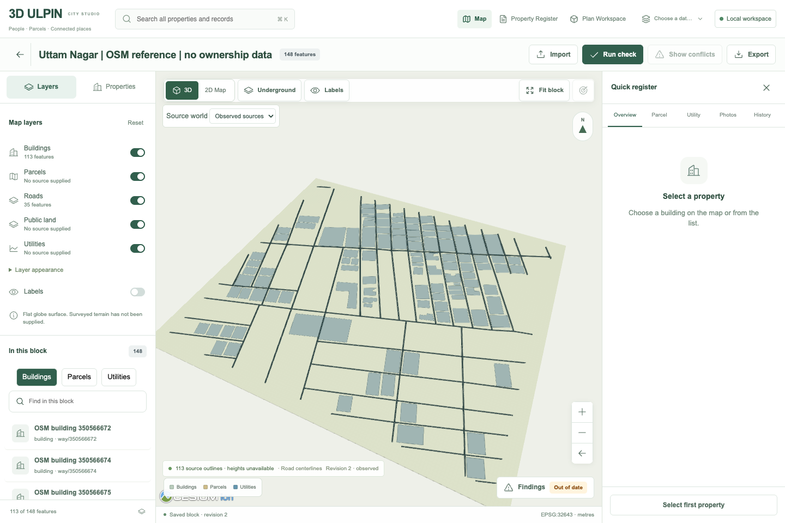

# Saved Uttam final display verification

Actual saved area `9bb67cbc-9773-4cee-ad1a-df29fc6c23a5`, observed source world, at `/studio/areas/9bb67cbc-9773-4cee-ad1a-df29fc6c23a5`. Run with `node scripts/spatial/uttam-display-verify.mjs` against the local production server. No response mocks or source writes.

- 113 loaded and shown Cesium building features match the saved descriptor. All 113 heights remain unavailable and their display representations remain flat.
- All 35 recorded road LineStrings have visible finite Cesium polyline overlays, matching source vertex counts. Their width is two screen pixels, not an inferred physical road width.
- The Roads checkbox changes actual visible overlays **35 → 0 → 35**, without changing the camera, viewer instance or the 113 building features. Canvas captures also change.
- Both source revision identities, source count 2, building/road counts, complete area-context hash, descriptor hash and read digest remain identical before/after. No API writes, page errors or failed local requests occurred.
- The final unknown-height caption is readable above the legend. DOM rectangles prove no overlap and both fit the 1440×960 viewport. The earlier overlap remains preserved in `pre-caption-fix/`.
- Browser reported WebGL 2.0 with ANGLE Metal / Apple M3. This is a local browser check, not a cross-device performance benchmark.

[Full receipt](results.json) · [Roads on](01-roads-on.png) · [Roads off](02-roads-off.png) · [Final restored view](03-roads-restored.png)

