# 3D ULPIN — step-by-step visual guide

Open `index.html` in a browser. No server or installation is needed. Click any image to enlarge it. Use Left/Right to change guides and Escape to close. Each PNG can also be opened or shared separately.

From the project root, you can also run `pnpm guide`, then open
http://127.0.0.1:3011 in a browser or Codex's in-app browser. This command needs
Python 3 and serves only the guide; the main application does not need to be
running. Keep the terminal open and press Ctrl+C to stop it. The guide is a
separate local page, not a route in the main application.

## Workspace modes

- **Calibrate:** set the page scale using a source-supported known distance.
- **Measure:** draw and save local measurement notes.
- **Compare:** visually compare source documents.
- **Build details:** prepare proposed 3D geometry for inspection and review.

Ctrl + left-drag rotates the register scene. Clear drawing or Ctrl + Q clears only the current drawing, preserving saved notes.

## 01. Start here — Choose a block

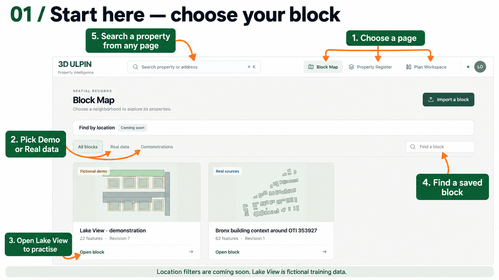

Use Block Map, Property Register or Plan Workspace in the header to open a directory. Choose the demo or real dataset, then explicitly open a block. Search finds a property; the location filters marked coming soon are a preview.

1. Open Block Map.
2. Choose Lake View for the fictional demonstration.
3. Open the saved block, or search for a property.

## 02. Block Map — Select and check

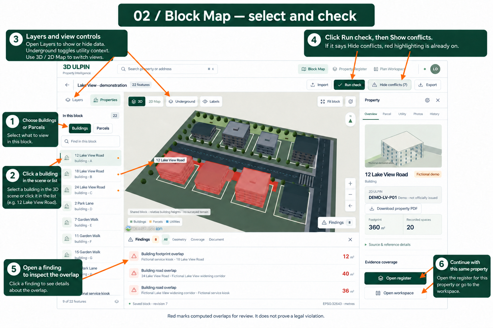

Select a building in the scene or property list. The inspector belongs to that selection. Run check computes findings; Show conflicts turns on highlighting. When the button says Hide conflicts, highlighting is already on.

1. Choose Buildings or Parcels in the left rail.
2. Select an item in the scene or list.
3. Run check and open a finding to inspect its overlap.
4. Open register or workspace for the selected property.

## 03. Import — Bring in spatial data

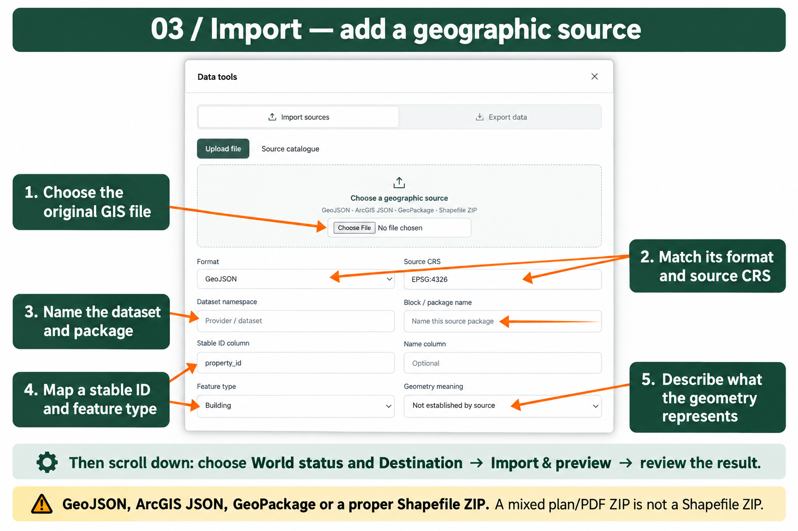

Use the import form to identify the file format, coordinate reference system, namespace, stable identity and geometry meaning. Scroll down for destination, world status and the import preview. Shapefile inputs need their companion files in a ZIP.

1. Choose the source file and its actual format.
2. Confirm the CRS and source namespace.
3. Map stable identifiers and feature types.
4. Check geometry meaning and the preview before importing.

## 04. Property Register — Explore floors and units

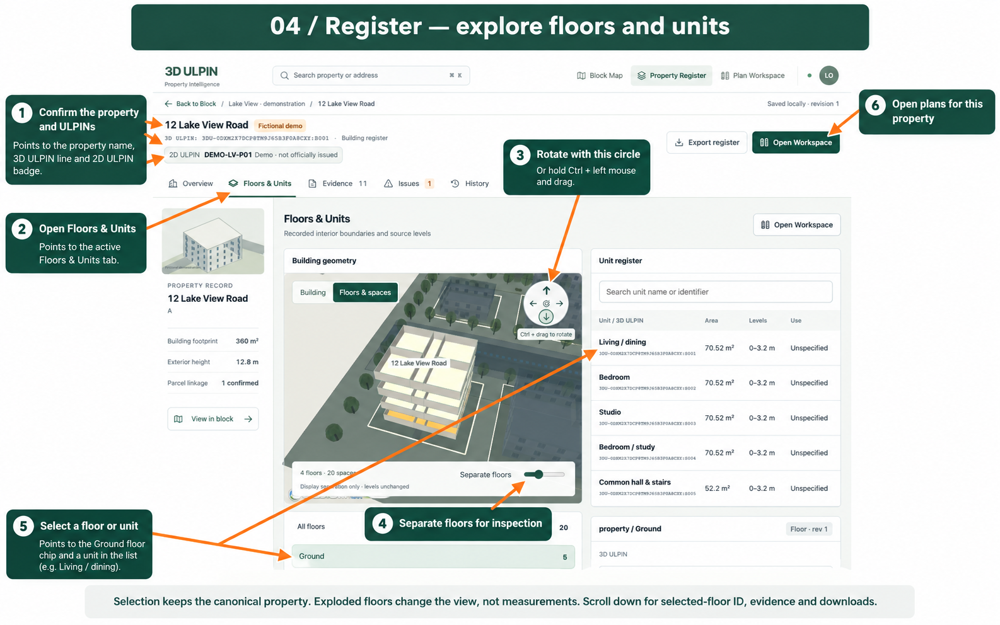

Choose a floor or unit to synchronize its record and 3D selection. The circular controller rotates the view; Ctrl + left-drag orbits horizontally and vertically. Separate floors changes the display only.

1. Open Floors & units.
2. Choose a floor, then a unit if needed.
3. Rotate with the circular controller or Ctrl + left-drag.
4. Inspect its identifiers and evidence, then open its workspace.

## 05. Calibrate — Set the plan scale

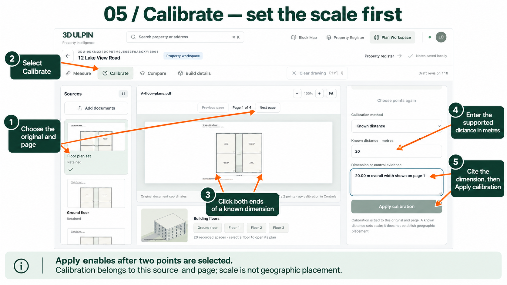

Calibration tells the viewer how many metres a known line represents. Use a dimension supported by the original plan. Calibration belongs to the selected source and page; do not guess a distance.

1. Select the original document and correct page.
2. Open Calibrate.
3. Click both endpoints of a known dimension on the plan.
4. Enter the real distance in metres and its source/reason.
5. Apply calibration once the required inputs are complete.

## 06. Measure — Draw, save or clear

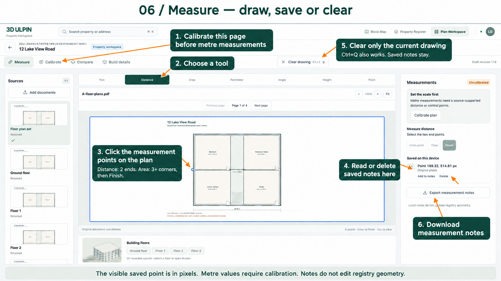

Calibrate the page before metre measurements. Choose a tool and click its points, then Finish. Saved measurement notes are local annotations; they do not change registered geometry. A point can be shown in original pixels without a metre calibration.

1. Choose Distance, Area or another measurement tool.
2. Click two endpoints for Distance; use at least three corners for Area.
3. Finish and inspect the saved note.
4. Use Clear drawing or Ctrl + Q to discard only the current drawing.
5. Export measurement notes when needed. Saved notes remain after Clear drawing.

## 07. Compare — Compare two sources

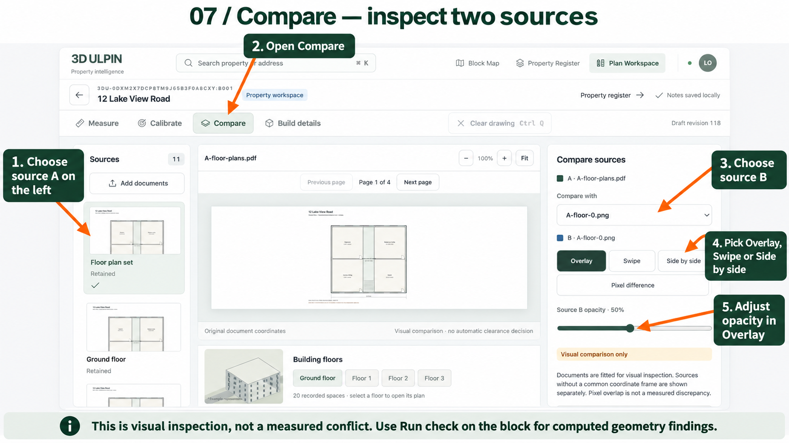

Compare is a visual document comparison. Choose the second source and page, then use the available comparison modes and opacity. An overlay is not a computed conflict finding.

1. Open Compare with the first source selected.
2. Choose the comparison source and its page.
3. Switch between side-by-side and overlay views.
4. Adjust opacity and inspect the same feature in both documents.

## 08. Build details — Prepare a reviewed proposal

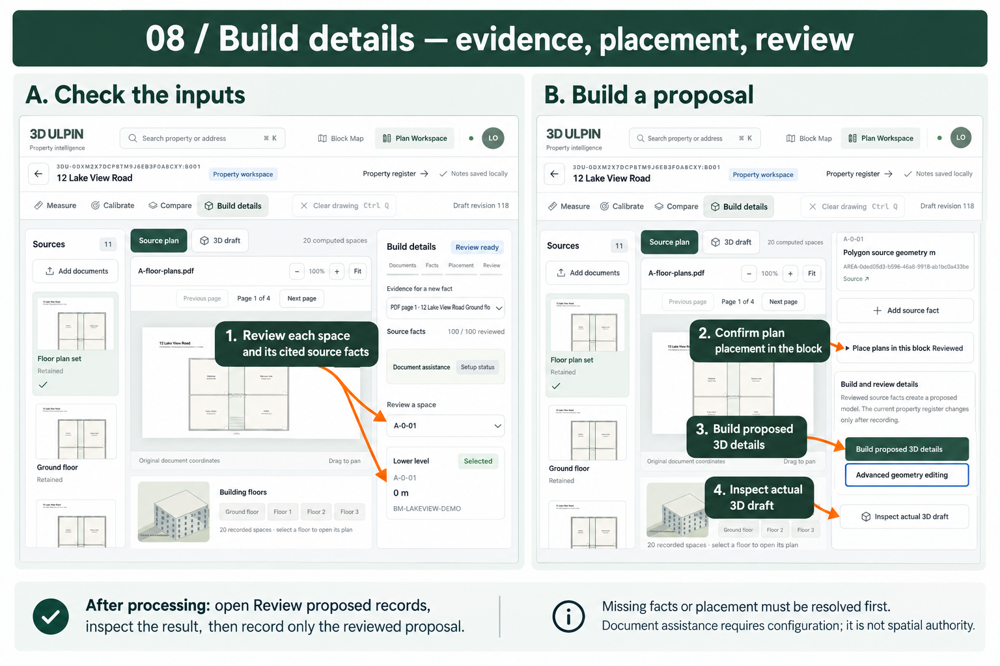

Build details uses recorded source facts and plan placement to prepare proposed 3D geometry. Missing facts or placement must be resolved. Inspect and review the proposal before recording it; assistance is not spatial authority.

1. Review each space and its cited source facts.
2. Confirm plan placement in the block.
3. Build proposed 3D details.
4. Inspect the actual 3D draft after processing.
5. Open Review proposed records and record only the reviewed proposal.

## 09. Evidence — Inspect originals and revisions

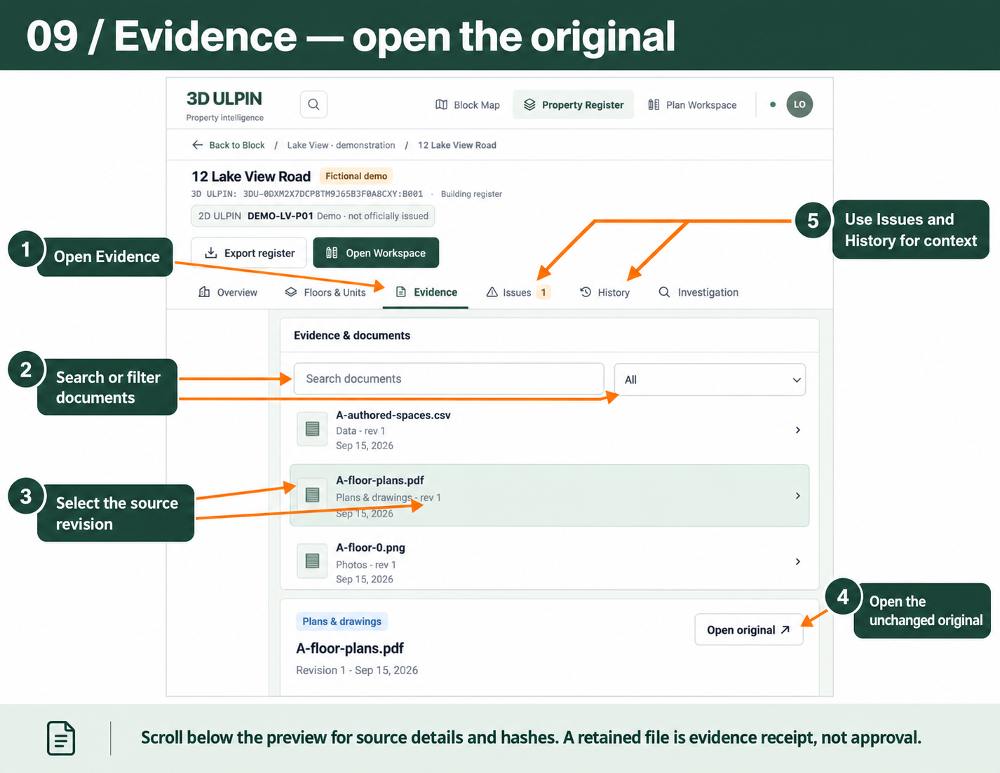

The Evidence tab links records to source documents. Select a source revision and open the original. Use Issues and History to understand unresolved inputs and changes. Receipt of a document is not approval of its geometry.

1. Open Evidence in the register.
2. Search for or select the relevant source.
3. Inspect its revision and source details.
4. Open original to examine the actual document.
5. Review Issues and History for context.

## 10. Investigation — Document a local case

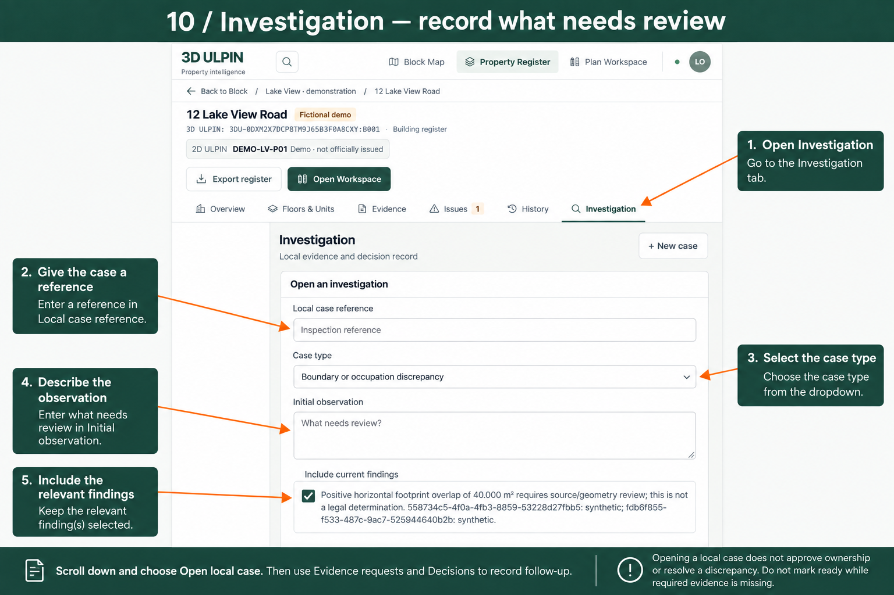

An investigation connects findings and evidence requests to a review decision. Use the actual finding and missing inputs; do not treat a demonstration conflict as a legal determination.

1. Open a new investigation for the selected property.
2. Describe the case and select its relevant finding.
3. Complete the required fields and scroll to Open local case.
4. Manage evidence requests and decisions in the saved case.

## 11. Downloads — Choose exactly what to export

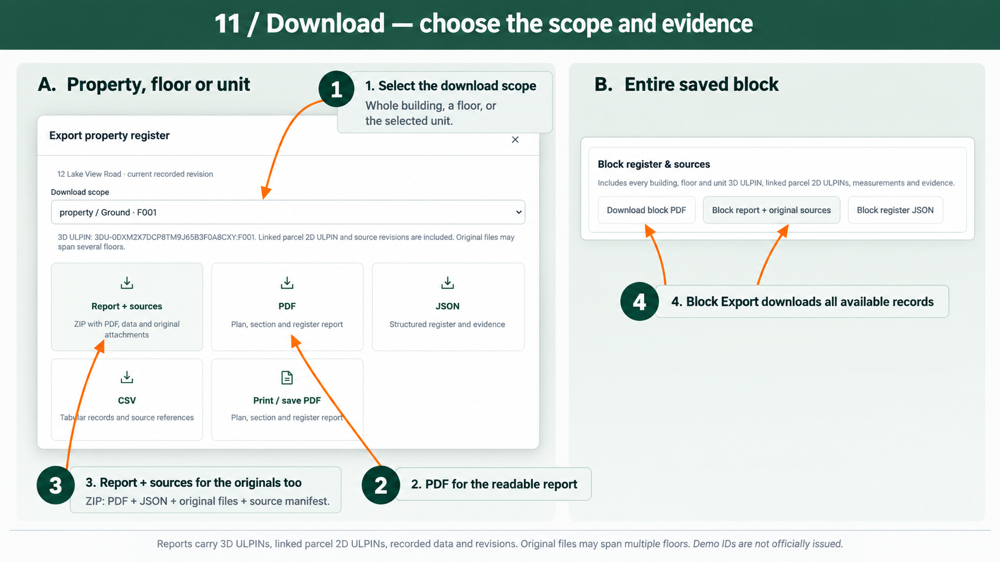

Exports support the selected block, building, floor or unit. Check the scope and identifiers before downloading. PDF presents the data; the source package includes attached originals. One original may support several floors.

1. Select the block, property, floor or unit.
2. Open Export and confirm the scope.
3. Choose PDF for a readable report.
4. Choose the source package when the original documents are needed.
5. Check the 2D parcel identifier, 3D identity and source references in the output.

## 12. Plan Workspace — Open or create a workspace

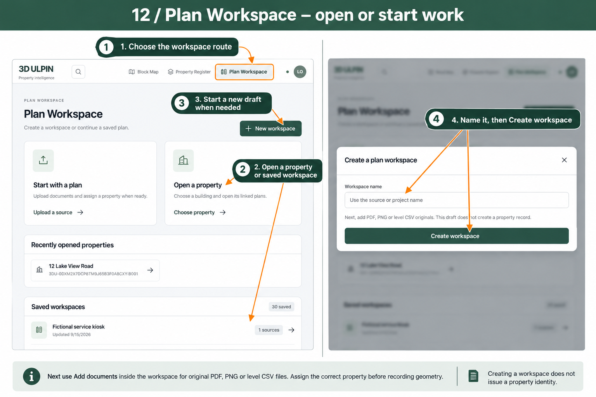

The global Plan Workspace link opens its directory. Open a saved workspace or explicitly create one. A new workspace needs documents and a property association before property-specific preparation.

1. Open a saved workspace or a property workspace.
2. For a new preparation, choose New workspace.
3. Enter a name and Create workspace.
4. Add documents and assign the intended property.

## 13. Parcels & identifiers — Read the parcel context

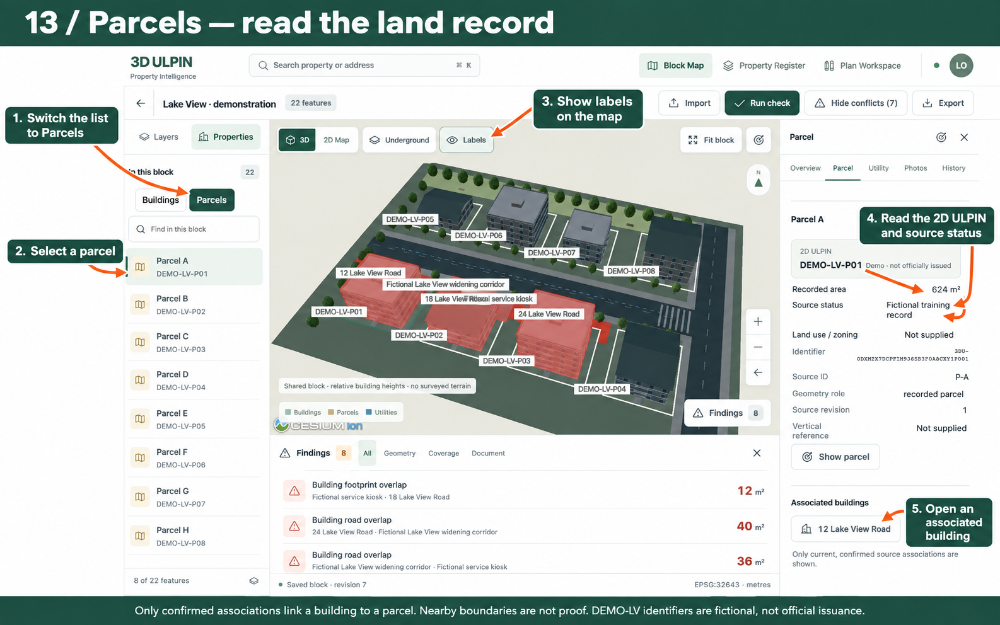

Choose Parcels to inspect parcel geometry and labels. The inspector shows its 2D identifier, area and source details when recorded. Follow the associated building to its register. Demo identifiers are fictional, not officially issued.

1. Select Parcels in the left rail.
2. Choose a parcel and enable Labels when needed.
3. Read its 2D ULPIN and source details in the inspector.
4. Open the associated building to inspect its 3D identity and floors.

Created 15 September 2026. Built-in image generation added tutorial annotations to actual application captures. The images are instructional illustrations, not evidence or a substitute for the original plan. Lake View is fictional demonstration data.
