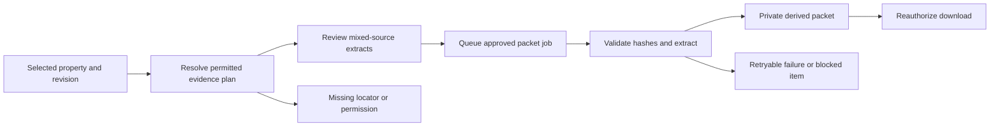

# 10 · Property-scoped evidence packets

Owner **PACK** · Priority **P1** · Baseline `main@f623cff897f91bb3ebd4c225f700ac263f7beb72` · Prerequisites [F0/F1 contracts](01-shared-contracts-and-ownership.md). All additions below are proposed, not existing functionality.

## A. User outcome and product value

Allow an officer or otherwise authorized user to select a building, floor or unit and obtain a traceable compilation containing **only the relevant, permitted property material**, including applicable shared clauses, without downloading a neighbourhood-wide registry source. This strengthens an existing export workflow and is a differentiator when combined with exact vertical-space evidence.

Synthetic example: a PDF contains Flat 101 on page 2, Flat 102 on page 3 and a common-stair clause on page 8. A Flat 101 packet includes its approved page/region and the applicable stair clause, but excludes Flat 102 and its parties. The common clause is explicitly contextual evidence, not evidence that Flat 101 owns the staircase.

## B. Current implementation and gap analysis

[selectRegisterScope](../../apps/web/lib/register-scope.ts) limits records and detailed scene objects to a selected floor/space. It does not narrow all source bytes. [exportRegister](../../apps/web/lib/server/officer-investigations.ts) preserves building findings/context and gathers related source revisions. [sourceBundle](../../apps/web/lib/server/source-bundle.ts) deliberately attaches whole byte-identical originals, with a 128 MiB bound and a warning that originals may concern other floors. Preserve this archival capability; it is **not** the new scoped packet.

[registerPdf](../../apps/web/lib/server/register-pdf.ts) already prints escaped report HTML in a network-isolated browser. [validateLocators](../../apps/web/lib/server/officer.ts) checks property-associated parts/features. [CoreLocator](../../packages/contracts/src/spatial/core/source-schema.ts) supports pages, regions, rows, features, JSON pointers and verbatim locators. These are reusable ingredients; an existing locator alone is not proof that every item on that page is relevant or releasable. [pdf-pages.ts](../../apps/web/lib/server/pdf-pages.ts) counts pages; it does not provide a qualified redaction engine.

Missing: an explicit packet selection plan, structured inclusion reasons, review of shared/mixed-source extracts, independently authorized derived assets, durable generation jobs and leakage tests. No production multi-user permission enforcement is assumed; use FND's access port.

## C. Scope and non-goals

Required first release: packet plan/preview, exact target/revision pinning, selective CSV/text/JSON extracts and PDF/image excerpts, generated summary PDF plus manifest ZIP, retained originals, explicit omissions, retryable jobs and secured downloads. One building/floor/unit at a time; maximum initial packet input is a configurable bounded profile, not an unlimited archive.

Keep two visibly different actions: **Property packet** (derived, scoped) and **Original archive** (existing full-source export, separately permitted). Never silently fall back from the former to the latter. Whole assets may enter a packet only when an explicit reviewed scope decision establishes that the entire asset is relevant and releasable.

No certified-copy claims, title verification, AI-decided legal relevance, arbitrary document-format conversion or automatic public release. Unsupported extracts remain omitted with an actionable reason. OCR/translation and signed external certification are optional future extensions.

## D. HLD and end-to-end flow

Select target in quick/full register → create a revision-pinned selection plan → inspect included extracts/shared context/omissions → confirm generation → existing durable worker executes approved extraction → private derivative and manifest are stored → authorized user downloads or returns to resolve missing locators.

The plan reads one consistent snapshot through FND. Original assets are immutable. A changed property/source-link revision invalidates an unexecuted plan; generation never silently switches to current data. A finished historical packet remains tied to its snapshot and still requires current access checks.

## E. Targeted LLD

### Selection, storage and state

Proposed `PacketPlan` contains `id`, `version`, `TargetPin`, `UspScope`, policy version, creator, expiry, entries and omissions. Each entry has the exact `EvidencePointer`, target relation path, inclusion kind (`direct`, `shared_context`, `exclusive_asset`), extraction recipe, reviewed release decision if needed and source hash. Use a stable entry hash of these fields for deduplication. Never infer source association from matching filenames.

Resolve direct links first. Traverse only explicitly supported context relationships from core policy or a RIGHTS adapter, with cycle detection and bounded depth. Do not expand a parent building to every sibling unit's evidence. When RIGHTS is unavailable, include only existing validated direct/inherited links; report unassessed additional context rather than guessing.

Proposed tables `usp_packet_plans`, `usp_packet_jobs`, `usp_packet_assets` store references, immutable plan JSON, entitlement/policy version, input fingerprint, output hash, status and timestamps. PACK owns `migrations/10-packets.ts` under its feature directory; FND registers it. Job states: `planned → awaiting_review | queued → running → ready | blocked | failed`; `expired` applies to unused plans. Explicit retry reuses the approved fingerprint; it does not duplicate assets or weaken checks.

### Extraction rules

| Input/locator | Required handling |
| --- | --- |
| CSV rows | Parse with the source's approved schema; keep header/units and selected complete records. Escape formula-leading values in spreadsheet-oriented output. Include no unrelated rows. |
| Text lines / JSON pointer | Extract exact bounded data with sufficient approved context; preserve source offsets/pointers. A free-text locator requires clarification. |
| PDF page or region | Validate against actual page tree and normalized bounds. A page containing several properties is not automatically releasable. Produce a flattened derivative containing only reviewed regions; avoid copying the underlying page objects/text layers. |
| Image region | Decode within pixel limits; crop reviewed region, remove metadata, then re-encode. The crop is a derivative, never a replacement source. |
| Whole asset | Require explicit exclusive-scope/release decision and all-source access; otherwise omit and request precise locators. |
| Model element / feature | Export only a supported complete element/feature with frame and relationship context; unsupported binary models are retained-only, not attached wholesale. |

PDF/image rendering must use a qualified local renderer selected by the agent and pinned by FND if an extra dependency is needed. Reuse existing image-derivative processing where compatible; do not claim page counting implements rasterization. Deny remote fetches, active content and embedded attachments. Pixel-based output must not retain a hidden original text layer, annotations, file attachments, links or metadata that leak excluded information. Small excerpts may destroy legal context: mark them incomplete until the required context is reviewed. A model can suggest a locator, never approve its release.

Initial proposed limits: 100 entries, 50 rendered pages, 128 MiB total source bytes, 40 million decoded pixels per image/page and a 120-second generation budget. Treat these as tunable engineering defaults, return 413 for explicit limit failures and test boundary values. Do not raise existing runtime limits globally to fit this feature.

### API and access

All endpoints are proposed under `/api/v1/usp/packets` with shared envelopes:

| Endpoint | Contract |
| --- | --- |
| `POST /plans` | `{target, scope, purpose, format:'pdf'|'zip'}` + idempotency key; returns plan with counts, inclusion reasons and authorized preview references |
| `PATCH /plans/:id` | Expected plan version plus explicit inclusion/exclusion and reviewed-context decisions; new immutable plan version |
| `POST /plans/:id/jobs` | Expected plan version/snapshot; confirms the displayed plan; returns 202 job reference |
| `GET /jobs/:id` | Status, safe blocked reasons and derivative availability; no private storage keys |
| `GET /jobs/:id/download` | Rechecks principal, all contributing evidence grants and derivative policy; streams validated bytes |

Preview, extraction and original permissions are separate. A caller allowed to see a property summary may still be denied its packet. Reauthorization must also cover worker execution and previews. A revoked grant blocks existing downloads even if the packet was generated earlier. Return non-enumerable errors for other users' packet IDs. Do not disclose withheld source filenames in omissions to unauthorized viewers.

Manifest includes target identities/revisions, classification, snapshot, source revision/hash, locators, inclusion purpose, derivation version and output hashes. No personal values are placed in filenames or event payloads. Labels say **Generated evidence compilation; not a certified original** and show unresolved context. Artifact SHA proves consistency with stored bytes, not document truth.

## F. Exact implementation map

| Existing or proposed file | Required change | Reason | Owner | Shared dependency |
| --- | --- | --- | --- | --- |
| [register-scope.ts](../../apps/web/lib/register-scope.ts), [officer-investigations.ts](../../apps/web/lib/server/officer-investigations.ts) | Reuse selected-record semantics through a read adapter; no independent rewrite | Correct parent/child scope | FND adapter; PACK consumer | Target resolver |
| [source-bundle.ts](../../apps/web/lib/server/source-bundle.ts), [register-pdf.ts](../../apps/web/lib/server/register-pdf.ts) | Preserve original archive; reuse isolated summary rendering | Avoid regression and source rewriting | PACK read-only reuse | Access-qualified storage |
| Proposed new `packages/contracts/src/usp/packets.ts` | Strict plan/job/entry schemas | Stable UI/worker interface | PACK | F0 common refs |
| Proposed new `apps/web/lib/server/usp/packets/{selector,service,extract,routes}.ts` | Plan selection, generation orchestration and leaf endpoints | Scoped real backend path | PACK | FND ports/mount |
| Proposed new `apps/web/lib/server/usp/packets/migrations/10-packets.ts` | Packet metadata tables | Durable recovery | PACK | FND registration |
| Proposed new `services/geo/geo/usp_packets.py` | Bounded local PDF/image extraction as needed | No hidden-source leakage | PACK | FND worker hook/dependency pin |
| Proposed new `apps/web/features/usp/packets/{PacketAction,PacketPreview,PacketStatus}.tsx` | Scoped action, review and progress | Reusable quick/full register flow | PACK | UI slots |
| [QuickRecords.tsx](../../apps/web/features/studio/product/QuickRecords.tsx), [RegisterPage.tsx](../../apps/web/features/officer/register/RegisterPage.tsx), [ScopedExport.tsx](../../apps/web/features/officer/shared/ScopedExport.tsx) | Mount separate packet action | Shared parents have one writer | UI | PACK leaf components |
| Proposed new `tests/usp-packets.test.ts`, `tests/usp-packets-integration.ts`, `services/geo/tests/test_usp_packets.py`, `tests/e2e/usp-packets.spec.ts` | Selector, leakage, jobs and browser tests | Verify actual artifacts, not just UI | PACK | Isolated fixture services |

## G. UI placement and interaction

On `/studio/areas/:areaId`, choose building → quick register → floor/unit → **Evidence** → **Property packet**. A contextual drawer shows selected scope, included material, shared clauses and unresolved items. An authorized **Original archive** remains a separate secondary action. Full `/studio/properties/:buildingId/register` uses the same leaf components with more room for the evidence table.

Loading keeps the selected unit header visible. Empty shows “No scoped evidence linked” and an evidence-request action when CITIZEN is available. Incomplete shows excluded entries and “Choose source region”; denied shows a safe explanation without source names. Failure preserves the plan and offers the permitted retry. Success shows snapshot/revision and download; switching units never silently changes the plan being confirmed. Keyboard focus returns to the triggering action; mobile uses one full-height drawer, not stacked dialogs. UI owns parent mounts and route state; PACK owns drawer contents.

## H. Agent ownership and dependencies

Use isolated `feat/usp-packets`. PACK may edit only its proposed feature files/tests and its own migration. It consumes F0 target/evidence/access/job ports, can build the pure selector with fixtures immediately after F0, and cannot claim completion until F1 storage/worker/routes are connected. UI applies parent integration; FND applies shared registry/job/dependency changes. Public downloads additionally require F2/DEPLOY. Do not edit the shared map, central router, global store, base migrations or existing source archive semantics.

## I. Implementation sequence

1. Build synthetic mixed-property source fixtures and exact target/evidence pointers; test selection before rendering.
2. Implement plan schemas, inclusion/omission reasons and idempotent persistence. Wire one text/CSV packet end to end.
3. Add qualified PDF/image extraction with mixed-page review, metadata removal and output inspection.
4. Register durable job hooks through FND, add retry/revocation checks and immutable manifest hashing.
5. Deliver leaf UI and request UI mounting in quick/full register. Test source-revision changes during preview/generation.
6. Run packet artifact leakage tests, existing export regressions and a live local browser demonstration.

## J. Acceptance criteria and verification

Synthetic fixture: one source contains Flat 101, Flat 102 and a shared stair clause with unique sentinel names. Generate Flat 101's packet through the real API/worker/storage path; inspect every ZIP member, PDF text/object metadata and rendered image. Flat 102's sentinel must not appear in any output or preview, including hidden layers. Required approved stair context must appear with its purpose. Original source hash must remain unchanged.

Test cross-building record IDs, mixed-page insufficient locators, cycles, corrupt source hash, missing original, expired plan, concurrent duplicate generation, source-link change, worker restart, revoked access and denied direct download. An unsupported extractor returns an omission/block—not a whole-original fallback. A packet with missing required context cannot be labelled complete. Existing original archives must still work for their permitted scope.

Run `pnpm typecheck`, `pnpm test:register-scope`, `pnpm test:register-exports`; run proposed unit tests with `pnpm exec tsx --tsconfig apps/web/tsconfig.json --test tests/usp-packets.test.ts`, integration via `pnpm exec tsx tests/usp-packets-integration.ts`, Python test via `python -m pytest services/geo/tests/test_usp_packets.py`, and browser via `pnpm exec playwright test tests/e2e/usp-packets.spec.ts`. Service tests require isolated running services and a qualified local renderer. Return artifact manifest/hash and screenshots; do not commit private packets.

## K. Copy-paste agent assignment

> Implement PACK on `feat/usp-packets`. Read `00-README.md`, `01-shared-contracts-and-ownership.md`, this handoff, `register-scope.ts`, `source-bundle.ts`, `register-pdf.ts`, core source locators and the linked tests. Build the property-only plan/preview/worker/download path in the proposed PACK files; preserve the separate full-original archive and immutable sources. Use FND target/access/revision/job ports and UI-owned mounts, not new shared routers or maps. Reject or omit uncertain scope; never attach an entire mixed-property source as fallback. Follow sections E–J for schemas, limits, permissions and tests. Return commits, real artifact/leakage and retry/revocation test evidence, browser screenshots, shared integration requests and remaining extractor qualifications. Fixtures alone do not complete the feature; do not merge main without authorization.
