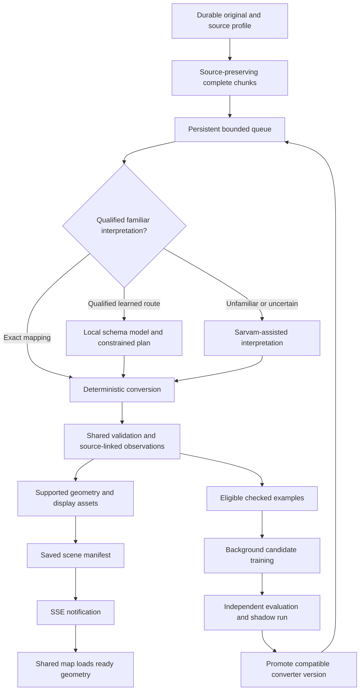

# 14 — Source-preserving chunks, progressive maps and learned handover

**Rewritten 24 September 2026. Owner: INGEST; shared APIs/jobs/contracts: FND; learner: LEARN; map: UI.** This replaces H14's earlier exclusion of concurrent learning. Read H00/H01/H21/H22/H23. Finale GF2 implements the qualified direct/exact and governed interpretation path with durable chunks/SSE. The learning branches, section G and learner-specific acceptance belong to `full_product` FP-LEARN; they cannot block finale ingestion. All new capabilities remain requirements until supported by execution evidence.

## A. User outcome

Upload a large unfamiliar supported dataset. Inspect an early, useful region while the remaining records are still processing. The AI agent helps interpret new patterns; a smaller trained model can take over compatible pending work after qualification. Known formats and familiar schemas still use the same progressive path. No artificial delays are inserted to make a progress animation look impressive.

## B. One pipeline, different conversion routes

The raw source → chunk stage precedes semantic conversion. Profiling reads only what is needed to recognize the encoding, access dependencies and sample the layout. It does not normalize the entire dataset first. Some formats need a directory/header scan or qualified pre-extraction before independent chunks exist; report this real preparation stage rather than promise immediate rendering for every encoding.

The agent calls allowlisted tools: inspect source, propose partition policy, request a mapping, submit bounded jobs and inspect exceptions. Readers, copying, arithmetic and geometry execute as deterministic code. The agent must not rewrite millions of coordinates in a chat response or execute generated shell/SQL/parsers. Familiar mappings are executed immediately; never keep calling Sarvam solely to create training examples or manufacture a later speedup.

## C. Chunk contract and practical splitting

A source chunk keeps original field names, nesting, identifiers, nulls, quantities and declared units. It retains or explicitly references shared metadata; a self-contained derivative need not be byte-identical to the original. Original bytes are immutable and separately retained. Record the splitter/version, source hash, complete-record locators, dependency closure, chunk hash, source schema/semantics fingerprint and reference metadata. Raw upload byte parts are not semantic chunks.

| Source family | Partition method | Boundary that must survive |
| --- | --- | --- |
| CSV / JSON / GeoJSON | Complete logical rows/features, initially 100–500 objects subject to tighter byte/vertex limits | Multiline quoted fields, original keys, complete rings/holes, metadata and literal IDs |
| CityJSON / other relationship-rich 3D | Whole building/part groups with referenced vertices and semantics | Local index remapping trace, shared transform exactly once, parent/child closure; oversized single objects need a qualified display derivative |
| Shapefile / FileGDB / GeoParquet | Qualified reader emits bounded feature subsets and metadata sidecars | Encoding, CRS, original typed columns, source feature/row identity; multipart companion files stay associated |
| GeoTIFF / DEM / DSM | Windows/tiles with overlap where the algorithm needs neighbours | Pixel-to-world transform, nodata, resolution, vertical meaning and neighbour dependencies |
| LAS / LAZ | Spatial blocks with required processing overlap | Point attributes, source CRS, boundary ownership and no duplicate canonical objects |
| Plans / document bundles | Page/section groups with original locators and cross-page context | Rotation, scale, applicable level, references; document-only rows can remain unplaced |

Unqualified formats are preserved as unsupported. They are not silently pre-renamed into our schema for an adaptation test. Add a new reader as a bounded module, not a second ingestion system. Initial implementation starts with existing qualified structured inputs and one native 3D reader; finale modality qualification follows H27/H28. Heavy reconstruction uses separately qualified resumable processor jobs and resource limits, not an unbounded exception to these interactive child caps.

## D. Shared types and stage ownership

FND extends actual versioned contracts rather than copying these illustrative names verbatim into competing stores:

- `SourceProfile`: encoding/parser, raw layout hash, declared semantics hash, source family/release, data role, CRS/units, geography/purpose policy and supported capabilities.
- `SourceChunk`: source revision/hash, raw asset ref, locators, complete-object keys, dependencies, bounds, estimated work and observed integrity state.
- `ConverterBinding`: route kind, exact mapping/model/executor versions, eligible source profile, decision epoch and qualification receipt.
- `NormalizedObservation`: source-linked facts plus per-field known/absent/null/conflicting state and authority. No ownership or coordinate defaults merely to satisfy a schema.
- `ChunkReceipt`: accepted attempt/fence, binding, input/output hashes, disposition counts, diagnostic refs and persisted asset refs.
- `DraftSceneManifest`: immutable version, data-snapshot pin, entity-index pages, asset refs, replacements/removals and coverage. It is separate from a data snapshot and an SSE event.

States: received → partitioned → queued → converting → validated → asset_ready → published. Independent needs_input/failed/cancelled states retain originals and accepted results. Parsed, placed, displayable, analytically eligible and reviewed are distinct. Source-only evidence is useful even when no geometry can be built.

## E. Durable queue, fairness and recovery

Reuse the existing dispatcher/Celery/Redis and SQL job authority. FND supplies the existing lease/fence/attempt and same-client transaction primitives. Do not create a separate ML broker or browser-owned job queue.

Every stage has bounded in-flight work, storage/CPU/byte limits and downstream backpressure. Conversion pauses admission when geometry preparation or publication is saturated. Prioritize a coherent visible region and its roads/terrain, while reserving fair capacity for older nonvisible chunks. Source dependencies override camera priority. Independent chunks may finish out of order; a failed chunk must not unnecessarily block every other part of the map.

Retain existing admission ceilings until measured changes are approved: initial structured upload profile 64 MiB / 128 MiB expanded / 20,000 records; child work at most 500 complete records, 50,000 positions and 60 seconds, or a smaller parser limit. A large corpus can consist of many admitted assets and jobs. Large originals use durable bounded reads or a separately qualified multipart/object-storage receipt, not a raised in-memory constant. The acquisition/download endpoint is not load-tested.

Persist output bytes/hash before SQL accepts the current worker fence and advances the manifest. Duplicate completion returns the old receipt; stale, cancelled or expired work cannot overwrite a newer result. Pause stops new claims, cancel fences subsequent application, and restart replays durable accepted receipts. Never reset an existing populated dataset. Immutable referenced assets outlive event retention; garbage collection removes only unreferenced temporary outputs after a grace period.

## F. Real progressive rendering

Publish a ready chunk's display assets and update the manifest before emitting its notification. SSE carries compact events and asset references, not GLBs or every original row. Start with `chunk.validated`, `scene.manifest_published`, `learning.status_changed`, `converter.promoted`, `batch.needs_input` and `batch.completed`.

Read status + manifest + event cursor consistently. Use a durable ordered outbox, reconnect/replay, deduplication and explicit cursor reset. When SSE is unavailable, poll the same saved status. The browser fetches authorized assets with bounded concurrency, ignores stale selection/manifest generations, adopts complete updates on animation frames and disposes replaced resources.

The map may add buildings and road segments in a short, natural reveal; reduced-motion disables transitions. Never withhold already useful data for theatrical timing. Keep camera/selection stable, show genuine received/converted/visible counts and distinguish unknown total from 0%. Processing chunks and rendering tiles may differ in size; both retain the same object identities.

## G. Same-import model handover — full_product

H21 supplies `CandidateModel`, `QualificationReceipt` and an immutable promoted model artifact. FND changes the family-specific dispatch binding using a version/CAS-protected transaction. LEARN cannot mutate the queue or property tables directly.

1. Completed chunks keep their exact converter and output history.
2. Running chunks finish under the binding assigned at claim time.
3. Unclaimed compatible chunks acquire the new binding and epoch.
4. Out-of-family, contradictory or low-confidence cases retain the teacher/manual exception route.
5. Rollback changes future bindings, not accepted history. Suspect already accepted outputs are marked for targeted revalidation and superseding revisions; recorded data requires normal review.

Model promotion does not authorize unbounded conversion or rendering. All remaining work stays chunked. The effect to measure is less interpretation work and faster useful throughput, not instantaneous display of the entire dataset.

## H. Modules and APIs

Extend `packages/contracts/src/usp/ingestion.ts`, `apps/web/lib/server/usp/ingestion/`, `services/geo/geo/usp_ingestion.py` and the shared scene adapter. Existing source-cases/area-routes/registry services remain authorities. Suggested leaves: profile, partition, route, convert, reconcile, manifests and events. Upload, auth, reference transforms, source hashing, job fences and provider calls remain shared utilities.

Use H01 envelopes under `/api/v1/usp/ingestion`: batch receipt/status, upload parts/finalize, profile, start/pause/resume/cancel, retry, manifests/assets and review groups. Add learner status and dispatch-binding reads, not a public endpoint for training arbitrary code. Every mutation uses expected version/request key. Confirm/review/record remains distinct from preview publication.

## I. Acceptance, not promises

Preserve old H14 loss/replay/permission tests and add:

- Finale uses the bounded admitted cohort in H28 and proves early preview before completion. Full-product scale adds the million-record target; familiar inputs are still partitioned.
- Source chunks preserve original schema and every accepted/rejected/unresolved record has a disposition.
- An unfamiliar supported schema works without application-code edits; a new parser is reported separately.
- A learner actually changes trained parameters, passes untouched evaluation and takes over pending chunks in the same import. A mapping cache alone fails this claim.
- Two workers racing with promotion/cancel/retry cannot duplicate or lose identity; training failure cannot erase the map.
- Known shape/identity, roads, holes and tile-seam selection survive rapid navigation, restart and late arrivals.
- Registry documents added later update only affected evidence/review state, not all map geometry.

Report cold/warm first useful preview, stage time/throughput, teacher calls, learning cost, peak worker/client memory, frame/selection p50/p95 and exact recovery counts. Compare parser+mapping baseline, teacher-assisted route and learned route on identical cohorts. Larger real-data rungs remain 10k/100k/1M unique buildings, not repeated copies. Hardware-specific targets are defined in H22/H23. No new benchmark has run in this planning task.

## Z. Hardening addendum (H97)

Added 24 September 2026 by the cross-family review in [H97](97-review-findings-and-alignment.md). Where this section conflicts with text above in this file, this section wins. Task cards: [H29](29-agent-task-cards.md) INGEST-01 to INGEST-03. Test: GF-AGENT in [H28](28-data-acquisition-and-finale-tests.md) Z2.

### Z1. Hostile-input contract for every reader

Uploaded files are untrusted. Every reader, existing or new:

- Reuses the archive validator in `services/geo/geo/native_gis.py` (member count, expanded size, zip-slip, symlinks) for all archives, including nested archives against the 128 MiB expanded cap.
- Opens GDAL/OGR only on extracted local paths, with network and virtual drivers disabled (`GDAL_SKIP`/`OGR_SKIP` for VRT and `/vsicurl/`-style drivers, `GDAL_DISABLE_READDIR_ON_OPEN=EMPTY_DIR`, `GDAL_VRT_ENABLE_PYTHON=NO`) and no network egress from the worker.
- Parses XML (GML, KML, CityGML) with external entities disabled (`defusedxml` or `resolve_entities=False`).
- Treats any embedded reference (GDAL VRT source, KML NetworkLink, OBJ `mtllib`, glTF `uri`, CityJSON texture URL, 3D Tiles external content, DXF XREF) that is absolute, contains `..`, uses `/vsi*` or a URL scheme as `unsupported_external_reference`.
- Checks header-declared dimensions and point counts before decoding (LAZ, GeoTIFF, JPEG2000) and rejects decompression bombs.
- Validates CityJSON vertex indices and rejects a zero or negative transform scale.

Each rule gets a GF-RECOVERY negative fixture.

### Z2. The model proposes mappings; code does everything else

- The ingestion orchestrator is **deterministic server code with fixed steps**. The model is called only for "propose a mapping", through structured output, with tools disabled ([H20](20-model-gateway-and-budget-pools.md) bounded request profiles). A model response that names a tool is rejected.
- `MappingPlan` operations may reference only source paths and conversion IDs from a versioned registry (for example `ft_to_m@1`, `sqft_to_m2@1`). Reject any numeric literal, CRS code, coordinate or ID string that does not appear verbatim as a source path. Parent-key links are validated by referential integrity.
- **Data minimisation before egress:** send headers, types, value-shape statistics and masked exemplars only. Mask Aadhaar (12 digits passing Verhoeff) to the last four digits, PAN (`[A-Z]{5}[0-9]{4}[A-Z]`) and Indian mobiles (`(\+91)?[6-9]\d{9}`) before any provider call and in every derivative (preview, index, logs).
- Mappings derived from model output stay `proposed` until an officer approves the recipe. The model can never promote a recipe, and a saved recipe records who approved it.
- Caps per batch: at most N distinct unfamiliar layouts sent to the model and at most ₹X reserved (both set in config and shown in the batch receipt). Over the cap, layouts go to `needs_input`.

### Z3. A no-model route that works in the finale

Add `manual_mapping` to GF2: the officer maps columns to concepts in Batch review using the same constrained plan schema and conversion registry. "Provider unavailable" produces `needs_input`, never a stalled batch. The learner events (`learning.status_changed`, `converter.promoted`) and section G stay full_product.

### Z4. Size, duplicates and revisions

- Over the per-batch record limit, return 413 with split guidance rather than silently truncating.
- The same bytes (same SHA-256) in the same workspace return the existing receipt.
- A revised file becomes a new source revision reconciled by source-row key, with each row marked `changed`, `added` or `removed`.

### Z5. Deliverables an agent can check

| Path (proposed) | Purpose |
| --- | --- |
| `packages/contracts/src/usp/ingestion.ts` | `MappingPlan`, conversion registry IDs, `SourceProfile` |
| `services/geo/geo/usp_ingestion.py` | Reader dispatch using the Z1 guards |
| `apps/web/lib/server/usp/ingest/redact.ts` | Z2 masking, shared with PACK and ASSIST |
| `tests/usp-ingestion-hostile.test.ts`, `tests/usp-ingestion-agent.test.ts` | GF-RECOVERY negatives and GF-AGENT cases |

Section I acceptance bullets that mention learner training are FP-LEARN, not GF2.
