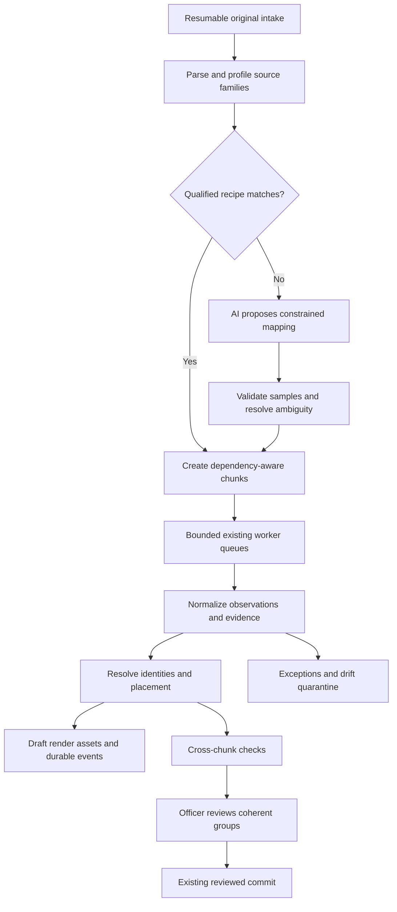

# 14 · Adaptive ingestion with progressive, reviewable results

Owner **INGEST** · Priority **P1** · Baseline `main@f623cff897f91bb3ebd4c225f700ac263f7beb72` · Consume [F0/F1 contracts](01-shared-contracts-and-ownership.md) and [DEPLOY's model boundary](19-india-contained-deployment.md).

## A. User outcome and product value

Allow an officer to import an unfamiliar **supported** source delivery, clarify its mapping once, and inspect valid draft objects before the entire batch finishes. Reuse the qualified transformation for remaining matching records and later deliveries. This is an enabling differentiator: less repeated AI interpretation and less waiting for useful review, without inventing evidence.

Synthetic example: a department sends buildings with `plot_no`, `roof_ht_ft` and `parent_plot`. A proposed recipe preserves IDs as text, converts explicitly confirmed feet to metres and resolves parent keys. A rare row changes the unit convention: that row is quarantined as drift rather than silently normalized under the earlier mapping. Already accepted draft chunks remain inspectable, but are not automatically recorded.

## B. Current implementation and gap analysis

[source-normalizer.ts](../../apps/web/features/spatial/reference-import/source-normalizer.ts) currently requires `ulpin-source-package/1`, synthetic classification, declared local frame, fixed role families and source fingerprints. It caps 90 files, 30 MB accumulated source data, 5,000 CSV rows and 1,500 GeoJSON features per relevant file. It retains binary evidence and does not fabricate missing unit polygons. This is a qualified manifest profile, not arbitrary-format ingestion.

[saved spatial datasets](../../apps/web/lib/server/spatial-datasets.ts) validates and persists immutable synthetic packages separately from registry publication. Do not remove that separation. [source-cases.ts](../../apps/web/lib/server/source-cases.ts), [area-routes.ts](../../apps/web/lib/server/area-routes.ts) and existing import packages are the proper production-workflow seams for proposed adaptive intake.

[processing.ts](../../apps/web/lib/server/processing.ts) already dispatches durable application jobs and prevents stale build results replacing current snapshots. [geo/tasks.py](../../services/geo/geo/tasks.py) uses Celery late acknowledgement, bounded execution, lease ownership through JobStore and result persistence. Application dispatch currently polls a bounded selection and has operation-specific timeout behavior; it is not yet a complete large-batch chunk scheduler. [officer-ai-provider.ts](../../apps/web/lib/server/officer-ai-provider.ts) currently targets Nous, uses bounded calls and validated structured proposals. A Sarvam provider is new work, not a switch already present.

Missing: source-family profiling, qualified reusable recipes, independent processing/render partitions, persistent chunk dependency/retry state, resumable upload, SSE replay and final cross-chunk reconciliation. Few initial chunks do not establish ML generalization or reliable online reinforcement learning.

## C. Scope and non-goals

Required first release: resumable intake; deterministic parsing for CSV, JSON/GeoJSON and existing native supported profiles; reusable typed mapping recipes; explicit unknown/unsupported receipts; bounded parallel normalization; progressive draft-map assets; replayable status events; exception handling and scoped reviewed commit.

Use existing document/LiDAR/raster/plan processors only where their capability is actually qualified. File retention is not reconstruction. Arbitrary unknown binary formats, general CAD/BIM reconstruction, automatic rights inference, automatic publication, synthetic factual completion and per-import model fine-tuning are out of scope. Optional future work includes additional parser plugins, 3D Tiles delivery and separately evaluated supervised models.

## D. HLD and end-to-end flow

SSE announces committed progress and asset availability; it is neither the job queue nor the geometry payload. The browser retrieves bounded assets for its viewport and keeps a stable recorded snapshot beside the evolving **draft**. Completing a mapping does not prove entity associations or authorize recording.

## E. Targeted LLD

### 1. Receipt, capability and budgets

Proposed `IngestBatch` pins submitting principal, scope or explicitly unassigned scope, original upload manifest, policy/budget version and status. Store explicit `caseId` and nullable `importPackageId` bindings supplied by FND's intake adapter. An ingest batch ID is not interchangeable with an existing import-package ID. Before that binding exists, show progress in the add-files receipt; afterward open `/studio/imports/{importPackageId}` and resolve its linked batch server-side. Each source has independent capability states: `retained`, `parsed`, `normalized`, `placed`, `validated`; use booleans/results per stage rather than implying one successful file extension means all stages passed.

Initial proposed profile: 256 MiB uploaded per batch, 512 MiB total expanded bytes, 100 files, maximum archive depth one, 100,000 structured records total; smaller existing parser/core limits still apply to each invoked unit. These are engineering defaults to benchmark, not performance promises. Enforce bytes, expanded bytes, members, records, vertices, pixels, pages, nesting, worker seconds, model tokens/calls and concurrent jobs independently. Publish the active limits before upload. Pause with a clear budget receipt rather than silently increasing spend or dropping rows.

Resumable upload uses server-issued upload ID, numbered parts, part hashes and final whole-file hash. Exact repeated part is idempotent; same part number/different bytes is 409. Finalize only when all expected parts and checksums agree. Bound pending-part storage and expire abandoned uploads without deleting accepted originals. Never trust uploaded filenames as storage paths; reject traversal, symbolic links, encrypted unsupported archives and expansion bombs. Original bytes and provenance survive all later transformations.

### 2. Source-family profiling and mapping recipes

Unknown schema and unknown encoding/format are separate. Deterministic parsers report fields/types, record counts, geometry roles, provided frame/unit metadata, null patterns and candidate identifier keys. Unsupported formats stay retained with an explicit capability explanation. Do not send entire opaque binaries to a language model hoping for coordinates.

Proposed `MappingRecipe` includes ID/version, parser/version, schema fingerprint, semantic scope/source-family constraints, target schema version, allowed transforms, unit/CRS decisions with evidence, join rules, null policies, examples, held-out tests, author/reviewer and qualification state `proposed|needs_input|qualified|retired`.

The allowed transform language supports explicit field copy/rename, enum mapping, safe numeric/date parsing, named unit conversion, selected nesting and exact-key joins. No arbitrary JS/Python, shell, network fetch, SQL, dynamic module loading or model-provided code execution. Preserve leading zeros and literal identifier values. Geometry transformations use the qualified CRS/vertical-reference adapter, not an LLM formula. Missing CRS/height semantics requires clarification; do not guess from coordinate magnitudes.

An AI mapper receives bounded source metadata/examples, target schemas and relevant approved recipes through `modelGateway`. Output is a recipe proposal plus unresolved questions and cited sample fields. One bounded repair is allowed; validation failure falls back to manual mapping. Qualification requires deterministic assertions about field meaning, units, ID preservation, relationship keys and geometry validity. Valid JSON alone is insufficient.

Start with representative samples from different source regions/record types, including nulls, rare geometry types and outliers; a suggested 3–10 initial samples is only bootstrap, not an accuracy threshold. Reserve independent held-out examples. Approval can be manual for semantic ambiguities; known mappings can be reused only when fingerprint **and semantic applicability** match. Continue per-record validation and drift checks after qualification. An unchanged header does not guarantee unchanged units or meaning.

### 3. Processing chunks versus render tiles

Proposed `ChunkManifest`: immutable source revision/hash, parser/recipe versions, source slice locator, complete-record boundaries, schema reference, frame/reference pins, dependency refs, record count, content hash and stable chunk ID. Each chunk must be independently parseable with declared shared context, not necessarily a miniature copy of every whole source file.

| Source family | Processing partition | Rendering consequence |
| --- | --- | --- |
| Tables / GeoJSON | Complete records/features plus schema; never split a quoted CSV record or polygon ring | Partition normalized representations by spatial index only after placement |
| Documents | Page/logical section with document context and exact locators | Some chunks have no geometry and remain evidence-only |
| Point clouds / rasters | Existing qualified spatial tiles/windows with required border overlap | Terrain/height observations only when supported; no internal rights inference |
| Relationship-rich models | Existing supported elements plus dependency closure | If parser/closure unsupported, retain and report unsupported; do not invent IFC support |

Canonical object IDs derive from stable source identity mappings, never chunk order. Render tiles may clip or simplify display geometry but reference the same target/representation IDs. Keep holes, multipart geometry and cross-floor memberships in analytical data. A building crossing two tiles is still one building. Shared context can be referenced once rather than duplicated in every normalized object.

### 4. Scheduling, failure recovery and reconciliation

Proposed tables `usp_ingest_batches`, `usp_ingest_uploads`, `usp_ingest_recipes`, `usp_ingest_chunks`, `usp_ingest_dependencies`, `usp_ingest_assets`. Feature-local migration owns these only. FND connects new operation handlers to existing application jobs and Celery; do not introduce a second broker. Use atomic claims, worker lease/heartbeat, bounded retries and idempotent result application. Reuse existing JobStore where compatible rather than replacing it.

Chunk states `pending → eligible → queued → running → normalized | needs_input | failed | cancelled`; placement and validation results remain separately tracked. Pin input hash, recipe and attempt ID. Late results from expired attempts cannot overwrite newer output; acceptance checks current lease/attempt and fingerprint. Acknowledge job completion only after durable result registration. Distinguish queue waiting time from execution budget so a large queue does not time out before it starts.

Start with two lightweight workers and one heavy spatial worker as configurable defaults. Process independent chunks concurrently, prioritize one representative visible area for time-to-first-valid-preview, and maintain fairness across batches. “All chunks at once” is not a safe default. Pause/resume stops future claims while retaining accepted output; cancellation is explicit and never removes originals or recorded history.

Resolve entities after normalization using exact identifiers and evidenced associations. Ambiguous document/property matches enter exception review. Run cross-chunk pair checks through FIND once required neighbour/relationship context is ready. Persist a reconciliation manifest with expected/received/assessed counts and missing dependencies. Coherent commit groups use existing revision-checked review/commit services; do not record one side of a mutually dependent change. Independent valid groups may proceed while others remain unresolved, but global coverage remains explicit.

### 5. SSE and progressive display

The [HTML server-sent events standard](https://html.spec.whatwg.org/multipage/server-sent-events.html) defines `text/event-stream` and reconnect `Last-Event-ID`. Durability, authorization and replay are application requirements. Use FND's commit-ordered per-stream outbox, not current process memory or Redis pub/sub alone.

Proposed events: `batch.profiled`, `mapping.needs_input`, `mapping.qualified`, `chunk.normalized`, `chunk.needs_input`, `tile.ready`, `assessment.updated`, `batch.review_ready`, `batch.paused`, `batch.failed`. Common envelope carries schema version, stream/sequence, batch/scope refs, snapshot/manifest version and safe counts. Do not include source text, credentials or full meshes.

Use same-origin HttpOnly session authentication for browser EventSource; never put access tokens in URLs. Check scope at subscription and replay, periodically recheck grant/session validity, and stop on revocation. Send heartbeat comments, disable proxy buffering for the stream, bound connection duration and support reconnect. A 15-second heartbeat and 10-minute renewable connection are proposed defaults to qualify with DEPLOY.

On initial load, fetch a consistent status snapshot with outbox cursor, then replay strictly after that cursor. Event IDs encode stream plus decimal sequence. Duplicate events are harmless; an expired/unknown cursor emits a `stream.reset_required` control event and closes, prompting a new snapshot. No silent event skipping. Retain a configurable event window (initially seven days) independently of durable batch state. Publish counts only for authorized scopes.

`tile.ready` names a revision-pinned asset reference and bounding box; client fetches via an access-checked asset endpoint. Batch viewport updates on animation frames, keep selection stable by entity ID, limit in-flight asset fetches and evict out-of-view display resources. Do not fetch/render every completed chunk simultaneously or create a second Canvas. Render coarse supported geometry first and refine details when available, without creating invented heights or analytical shapes. Synthetic decorations are display-only and excluded from checks/evidence.

### 6. Proposed API and learning boundary

Under `/api/v1/usp/ingestion`: `POST /batches`; `POST /batches/:id/uploads`; `PUT /uploads/:id/parts/:number`; `POST /uploads/:id/finalize`; `GET /batches/:id`; `POST /batches/:id/profile`; `POST /recipes/:id/qualify`; `POST /batches/:id/start`; explicit `/pause`, `/resume`, `/cancel`; `POST /chunks/:id/retry`; `GET /batches/:id/events`; `GET /assets/:assetId`. Mutations require the shared expected version and idempotency conventions. Start returns 202; invalid/ambiguous mapping returns a typed needs-input receipt rather than apparent success. FND mounts routes; INGEST owns leaf handlers.

Recipe memory is the initial learning mechanism. Later reviewed corrections may form a permission-qualified, versioned evaluation/training set; AI outputs are not automatically ground truth. Fine-tuning/active learning belongs outside the import's critical path, with held-out source-family tests, calibrated error measures, promotion and rollback. Do not promise a model learns alien schemas after a fixed chunk count. Specialist building/plan ML remains separately evaluated through existing reviewable proposal paths.

## F. Exact implementation map

| Existing or proposed file | Required change | Reason | Owner | Shared dependency |
| --- | --- | --- | --- | --- |
| [source-normalizer.ts](../../apps/web/features/spatial/reference-import/source-normalizer.ts), [browser.ts](../../apps/web/features/spatial/reference-import/browser.ts) | Preserve qualified package path; reuse known validation recipes only | Do not weaken synthetic showcase contract | INGEST read-only reuse | FND adapter |
| [source-cases.ts](../../apps/web/lib/server/source-cases.ts), [area-routes.ts](../../apps/web/lib/server/area-routes.ts), [spatial-datasets.ts](../../apps/web/lib/server/spatial-datasets.ts) | Add narrow intake/review bridge via FND; no global rewrite | Explicit workflow authorities | FND | INGEST manifests |
| [processing.ts](../../apps/web/lib/server/processing.ts), [dispatcher.ts](../../scripts/dispatcher.ts), [geo/tasks.py](../../services/geo/geo/tasks.py), [geo/store.py](../../services/geo/geo/store.py) | Register operations, attempt fencing and appropriate deadlines | Existing queue/recovery remains canonical | FND | INGEST worker interface |
| Proposed new `packages/contracts/src/usp/ingestion.ts` | Batch/upload/recipe/chunk/event schemas | Compatible stages | INGEST | Common/outbox contracts |
| Proposed new `apps/web/lib/server/usp/ingestion/{uploads,profile,recipes,chunks,reconcile,events,assets,routes}.ts`, `migrations/14-ingestion.ts` | Adaptive intake/scheduler/replay services | Durable progressive processing | INGEST | FND jobs/access; DEPLOY gateway |
| Proposed new `services/geo/geo/usp_ingestion.py` | Deterministic parser/transform operations with bounded inputs | No arbitrary generated code | INGEST | Existing parsers/FND hooks |
| Proposed new `apps/web/features/usp/ingestion/{BatchReceipt,MappingReview,ProgressiveReview,useBatchEvents}.tsx` | Needs-input mapping and progressive review UI | Time-to-useful-result | INGEST | UI shared viewport/selection |
| [ImportWork.tsx](../../apps/web/features/officer/work/ImportWork.tsx), [AddFiles.tsx](../../apps/web/features/officer/workspace/AddFiles.tsx) | Mount progressive receipt/review leaves | Preserve Batches workflow | UI | INGEST components |
| Proposed new `tests/usp-ingestion.test.ts`, `tests/usp-ingestion-integration.ts`, `tests/usp-ingestion-stream.test.ts`, `services/geo/tests/test_usp_ingestion.py`, `tests/e2e/usp-ingestion.spec.ts` | Mapping/drift/resume/events/browser tests | No fake streaming completion | INGEST | Isolated services |

## G. UI placement and interaction

`/studio/add-files` → receipt with Retained / Recognized / Needs input counts → one mapping question when needed → start → `/studio/imports/:id` shows draft objects and an exception queue beside the existing map → select a chunk's issue → source and proposed mapping → review coherent selection → existing Check & record.

Do not create a developer-style log console as the primary UI. Show “38 of 120 records placed; 4 need input,” plus a small expandable diagnostics view. When total is unknown, say so instead of a fake percentage. Missing coordinates remain in a list. Failed chunks do not erase successful draft tiles. Reconnection shows “Reconnecting; recorded data unchanged”; resetting replay reloads authoritative state. Unknown mapping uses a source-to-target comparison, not an empty 3D map. UI owns map/route changes; INGEST owns receipt/review/event hook contents.

## H. Agent ownership and dependencies

Use `feat/usp-ingestion`. F0 unlocks deterministic recipes, chunk manifests and tests; F1 unlocks real uploads/jobs/review. DEPLOY must authorize any external AI; no key means manual mapping remains functional. FIND provides cross-chunk check projection. FND alone changes shared dispatch/DB/provider wiring; UI alone changes map/parent components. Do not change `classification='synthetic'` or revision-one constraints in saved-package tables to satisfy production intake.

## I. Implementation sequence

1. Qualify one CSV/GeoJSON end-to-end path with exact source retention, receipt and deterministic mapping before adding AI.
2. Add resumable uploads, per-stage budget enforcement, immutable chunks and source-family mapping reuse.
3. Implement constrained AI recipe proposal through gateway, independent validation and needs-input fallback.
4. Register bounded workers, attempt fencing, restart/pause/retry and accepted-result persistence.
5. Add commit-ordered SSE replay and access-checked draft assets; UI integrates progressive rendering into the shared viewport.
6. Reconcile neighbouring/relationship dependencies; connect scoped review/commit and stale-result handling.
7. Benchmark and document actual time-to-first-valid-preview, total time, cost, peak memory and mapping error, then extend supported profiles cautiously.

## J. Acceptance criteria and verification

Repeatable synthetic demo: import multiple source families containing preserved leading-zero IDs, feet/metres with explicit metadata, an unknown CRS, one malformed record, a cross-chunk building and one contradictory parent link. Observe valid draft tiles before the final chunk; unresolved rows stay visible and unrecorded. Approve a mapping and reuse it on matching records without per-record model calls. Change semantics with the same header and verify drift/qualification rules prevent silent misuse.

Kill/restart a worker, repeat an upload part, disconnect/reconnect SSE, expire its cursor, revoke access, return a stale attempt late and exhaust a budget. Final records and event replay must have no duplicates or lost accepted results. Unknown frames never receive guessed coordinates; synthetic appearance never changes analytical measurements. Recording waits for coherent dependencies and preserves partial-batch limitations.

Run `pnpm typecheck`, `pnpm test:api`, `pnpm test:studio`; existing normalizer regression via `pnpm exec tsx --tsconfig apps/web/tsconfig.json --test tests/t076-source-normalizer.test.ts`; proposed tests similarly with `tests/usp-ingestion.test.ts tests/usp-ingestion-stream.test.ts`; integration via `pnpm exec tsx tests/usp-ingestion-integration.ts`; Python via `python -m pytest services/geo/tests/test_jobs.py services/geo/tests/test_usp_ingestion.py`; browser via `pnpm exec playwright test tests/e2e/usp-ingestion.spec.ts`. Return timings with dataset/hardware/method, not an unmeasured “faster” claim.

## K. Copy-paste agent assignment

> Implement INGEST on `feat/usp-ingestion`. Read the index/shared contracts, this handoff and linked source-normalizer, intake, processing, JobStore and AI provider code. Build deterministic resumable intake and qualified recipe reuse first, then bounded AI suggestions and durable progressive events/assets in the proposed INGEST files. Preserve original bytes, declared frames, existing synthetic-package restrictions and separate reviewed recording. FND owns shared job/API/migration hooks; UI owns the map and route mounts; DEPLOY governs external inference. Do not train a model during each import, execute generated code, fabricate heights or send all finished geometry at once. Run section J mapping/drift/restart/replay/live-review tests and return measured performance, fixture truth, commits and explicit supported/unsupported capability matrix. No main merge without authorization.
